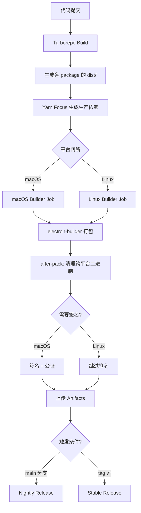

# TX-5DR 多平台打包和发布架构重构计划

**版本**: v1.0
**日期**: 2025-10-25
**状态**: 设计阶段 - 待实施

---

## 📋 目录

1. [项目背景](#项目背景)
2. [现状分析](#现状分析)
3. [设计目标](#设计目标)
4. [技术方案](#技术方案)
5. [实施计划](#实施计划)
6. [风险评估](#风险评估)
7. [验收标准](#验收标准)

---

## 项目背景

### 项目概述

TX-5DR 是一个基于 Electron 的数字电台应用，采用 Yarn 4 Workspaces + Turborepo 管理的 Monorepo 架构。项目包含原生音频处理模块(naudiodon2)和 FT8 解码模块(wsjtx-lib)，需要支持 macOS 和 Linux 多平台打包。

### 核心依赖关系

```
shared-config ← contracts ← core ← {web, electron-preload, server}
                                 ↑
                            electron-main
```

**关键原生依赖**:
- `naudiodon2`: 低延迟音频 I/O (需编译)
- `wsjtx-lib`: FT8 解码引擎 (含 Fortran 库)
- `hamlib`: 电台控制
- `serialport`: 串口通信

**运行时架构** (生产环境):
- `server`: Fastify 后端 (端口 4000)
- `web-proxy`: 静态服务器 + 反向代理 (端口 5173)
  - 服务 `web/dist` 静态文件
  - 代理 `/api` 请求到 server
  - 代理 WebSocket 连接
  - 解决跨域问题

---

## 现状分析

### 现有架构问题

#### 1. 打包工具混乱 ⚠️

**问题描述**:
- 同时存在 **electron-forge** 和 **electron-builder** 两套打包系统
- `package.json` 中混杂 forge 和 builder 命令
- 配置文件冲突，维护成本高

**影响**:
- 开发者困惑，不知道使用哪个工具
- CI/CD 配置复杂，容易出错
- 依赖冗余，增加项目体积

**当前配置**:
```json
{
  "devDependencies": {
    "@electron-forge/cli": "^7.8.1",              // ❌ Forge
    "@electron-forge/maker-*": "...",             // ❌ Forge
    "electron-builder": "26.0.12"                 // ✅ Builder
  },
  "scripts": {
    "package": "electron-forge package",          // ❌ Forge
    "make": "electron-forge make",                // ❌ Forge
    "dist": "yarn build && electron-builder",     // ✅ Builder
    "dist:mac": "...",                            // ✅ Builder
  }
}
```

#### 2. 依赖管理方式不规范 ⚠️

**问题描述**:
- `electron-builder.json` 未使用 Yarn 4 的 `focus` 机制
- `after-pack.js` 手动复制整个 `node_modules` 目录
- 没有生成生产依赖，打包体积大

**当前流程** (非最佳实践):
```javascript
// scripts/after-pack.js
execSync(`rm -rf "${nm}"`);
execSync(`rsync -a "${sourceNm}/" "${nm}/"`);  // 复制整个 node_modules
// 然后手动删除开发依赖...
```

**符合最佳实践的流程** (electron_monorepo_build_guide.md):
```bash
# 1. 构建所有包
yarn workspaces foreach -A -t run build

# 2. 为独立运行的包生成生产依赖
yarn workspaces focus @tx5dr/server --production

# 3. 打包（electron-builder 直接使用现有文件）
yarn workspace @tx5dr/electron-main electron-builder
```

#### 3. ASAR 配置不一致 ⚠️

**当前配置**:
```json
{
  "asar": false
}
```

**用户决策**: ✅ **维持 `asar: false`** (不使用 ASAR 打包)

**理由**:
1. 项目包含大量原生模块(naudiodon2, wsjtx-lib)，有复杂的二进制依赖链
2. 避免原生模块路径解析问题和 asarUnpack 配置复杂度
3. server 和 web-proxy 包需要子进程动态加载，ASAR 会增加复杂性
4. 保持文件系统直接访问，简化调试和问题排查

**权衡**:
- ✅ 更好的稳定性和可维护性
- ✅ 简化打包配置
- ⚠️ 应用包体积略大(可接受)
- ⚠️ 源码直接可见(开源项目无需担心)

#### 4. GitHub Actions 不完善 ⚠️

**当前支持**:
- ✅ macOS ARM64 (macos-latest)
- ✅ Linux x64 (ubuntu-latest)
- ✅ Linux ARM64 (ubuntu-24.04-arm)
- ❌ macOS x64 (未配置)
- ❌ Windows (未配置)

**问题**:
- 平台架构硬编码在 workflow 中
- 没有 Windows 构建流程

**用户决策**:
- ✅ 只支持 macOS ARM64 和 Linux (x64/ARM64)
- ❌ 不支持 macOS x64
- ❌ 不支持 Windows
**原因**: 专注于当前主流平台,简化维护成本

#### 5. 命令行接口混乱 ⚠️

**当前命令**:
```bash
# Forge 命令
yarn package              # ❌ electron-forge package
yarn make                 # ❌ electron-forge make
yarn publish              # ❌ electron-forge publish
yarn build:package        # ❌ yarn build && yarn package
yarn build:make           # ❌ yarn build && yarn make

# Builder 命令
yarn dist                 # ✅ electron-builder
yarn dist:mac             # ✅ electron-builder --mac
yarn dist:win             # ✅ electron-builder --win
yarn dist:linux           # ✅ electron-builder --linux
yarn dist:all             # ✅ electron-builder -mwl
```

**问题**:
- 命令名称不统一，有的用 `build`，有的用 `dist`
- Forge 和 Builder 命令混杂
- 没有平台+架构的精确命令(如 `build:mac-arm64`)

#### 6. 脚本复杂度过高 ⚠️

**`scripts/after-pack.js` 问题**:
- 230+ 行代码，逻辑复杂
- 手动复制 node_modules (应由 Yarn focus 处理)
- 手动删除开发依赖 (维护困难)
- 平台特定清理逻辑硬编码

**应该简化为**:
- 只做平台特定的二进制文件清理
- 不再手动管理 node_modules
- 使用 Yarn focus 自动生成生产依赖

---

## 设计目标

### 核心原则

1. **简单明确**: 一套工具、一种方式、清晰的命令结构
2. **符合最佳实践**: 遵循 `electron_monorepo_build_guide.md` 的推荐方案
3. **可维护性**: 减少手动维护的脚本，利用工具链自动化
4. **一致性**: 本地构建和 CI 使用相同流程
5. **透明性**: 清晰的文档和日志，便于调试

### 具体目标

#### 1. 统一打包工具链

- ✅ **完全移除 electron-forge**
- ✅ **统一使用 electron-builder**
- ✅ 符合 Yarn 4 + Turborepo 的 Monorepo 最佳实践

#### 2. 规范依赖管理

- ✅ 使用 **Yarn focus** 生成生产依赖
- ✅ 删除 `after-pack.js` 中的 node_modules 手动复制逻辑
- ✅ 简化脚本，只保留必要的平台特定处理

#### 3. 优化配置结构

- ✅ 维持 `asar: false` (不使用 ASAR 打包)
- ✅ 精简 `electron-builder.json` 配置
- ✅ 明确 `extraResources` 和文件过滤规则

#### 4. 完善 GitHub Actions

- ✅ 保持 macOS ARM64 + Linux x64/ARM64
- ❌ 不支持 macOS x64 (用户决策)
- ❌ 不支持 Windows (用户决策)
- ✅ 使用矩阵策略统一配置

#### 5. 统一命令接口

- ✅ 移除所有 Forge 相关命令
- ✅ 移除所有过时的脚本引用
- ✅ 统一使用 `build:` 前缀
- ✅ 添加平台+架构精确命令
- ✅ 不保留任何遗产命令

**新命令结构**:
```bash
# 基础构建
yarn build                    # 构建所有 packages
yarn build:focus              # 生成生产依赖 (新增)

# 打包命令 (统一 build: 前缀)
yarn build:dist               # 当前平台打包
yarn build:mac-arm64          # macOS ARM64
yarn build:linux-x64          # Linux x64
yarn build:linux-arm64        # Linux ARM64

# 工具命令
yarn clean                    # 清理构建产物
yarn clean:focus              # 清理 focus 生成的 node_modules (新增)

# Docker 命令 (保持不变)
yarn docker:build             # Docker 快速构建
yarn docker:build-multi       # Docker 多平台构建
```

---

## 技术方案

### 整体架构



### 依赖管理方案

#### 问题分析

TX-5DR 项目的特殊性在于 **多个包作为子进程被 electron-main 嵌入运行**，需要独立的完整依赖树。

**当前架构**:
```
electron-main/
  ├─ dist/main.js                    # 主进程代码
  └─ node_modules/
      ├─ @tx5dr/server -> ../../server/       # Workspace 符号链接
      └─ @tx5dr/web-proxy -> ../../web-proxy/

server/
  ├─ dist/                           # 编译后的代码
  ├─ package.json
  └─ node_modules/
      ├─ naudiodon2 -> .yarn/cache/  # PnP 符号链接
      ├─ wsjtx-lib -> .yarn/cache/
      └─ ... (其他依赖都是符号链接)

web-proxy/
  ├─ src/proxy.js                    # 纯 JS，无需构建
  └─ package.json                    # 无依赖
```

**打包后的目标结构**:
```
TX-5DR.app/Contents/Resources/
  ├─ app/
  │   ├─ packages/
  │   │   ├─ electron-main/dist/
  │   │   ├─ server/
  │   │   │   ├─ dist/                # server 编译代码
  │   │   │   ├─ package.json
  │   │   │   └─ node_modules/        # server 的生产依赖
  │   │   │       ├─ naudiodon2/      # 真实文件
  │   │   │       ├─ wsjtx-lib/       # 真实文件
  │   │   │       └─ ...
  │   │   ├─ web-proxy/               # 重命名后
  │   │   │   ├─ src/proxy.js         # 静态服务器+代理
  │   │   │   └─ package.json
  │   │   └─ web/dist/                # 前端静态文件
  │   └─ node_modules/                # electron-main 的依赖
  └─ bin/
      └─ darwin-arm64/node            # 便携式 Node.js
```

#### 方案设计

##### 采用方案: 使用根 node_modules + after-pack 精简 ✅

**原理**:
- electron-builder 打包时包含整个根 `node_modules`
- 在 `after-pack.js` 钩子中删除开发依赖和跨平台二进制文件
- 利用 Yarn 4 Workspaces 的依赖提升机制,所有依赖都在根 node_modules

**为什么不用 Yarn Focus**:
- ⚠️ `yarn workspaces focus` 在复杂 monorepo 中可能无法正确处理符号链接
- ⚠️ 增加构建步骤复杂度,容易出错
- ⚠️ 需要额外的清理和验证步骤

**当前方案优势**:
- ✅ 简单直接,使用开发时已验证的依赖树
- ✅ 无需处理 workspace 符号链接问题
- ✅ electron-builder 直接打包根 node_modules
- ✅ after-pack.js 只需删除不必要的包

**操作步骤**:
```bash
# 1. 构建所有包
yarn build

# 2. 打包 (electron-builder 自动包含根 node_modules)
yarn build:dist

# 3. after-pack.js 自动执行清理:
#    - 删除开发依赖 (electron, typescript, vite 等)
#    - 删除跨平台二进制文件
```

**electron-builder 配置**:
```json
{
  "files": [
    "packages/**/dist/**/*",
    "packages/**/package.json",
    "package.json",
    "node_modules/**/*",              // 包含根 node_modules
    "!packages/*/node_modules"        // 排除各 package 的 node_modules
  ]
}
```

**after-pack.js 职责**:
```javascript
// 1. 删除开发依赖
const toRemove = [
  'electron', 'electron-builder', '@electron-forge',
  'typescript', '@types', 'vite', '@vitejs',
  'eslint', 'prettier', 'turbo',
  '@heroui', 'react', 'react-dom', // 前端依赖(已打包到 web/dist)
  // ... 更多开发依赖
];

// 2. 清理跨平台二进制文件
// - Linux: 删除 darwin/win32 预编译文件
// - macOS: 删除 linux/win32 预编译文件

// 3. 保留运行时必需的依赖
// - naudiodon2, wsjtx-lib (原生模块)
// - fastify, ws, etc. (server 运行时依赖)
```

**权衡取舍**:
- ✅ 打包流程稳定可靠
- ✅ 易于维护和调试
- ⚠️ 包体积可能略大于理论最小值 (可接受)
- ⚠️ 需要手动维护开发依赖删除列表 (通过完善的列表减少维护成本)

### electron-builder 配置方案

#### 当前配置分析

```json
{
  "appId": "com.tx5dr.app",
  "asar": false,                           // 不使用 ASAR 打包
  "npmRebuild": false,                     // ✅ 正确，防止 ABI 不匹配
  "buildDependenciesFromSource": false,    // ✅ 正确

  "files": [
    "packages/**/dist/**/*",
    "packages/**/package.json",
    "package.json",
    "node_modules/**/*",                   // ⚠️ 过于宽泛
    "!packages/*/node_modules",            // ⚠️ 排除规则不清晰
    // ... 其他排除规则
  ],

  "extraResources": [
    {
      "from": "resources/bin",             // ✅ 便携式 Node.js
      "to": "bin"
    }
  ],

  "mac": {
    "target": [{"target": "dmg", "arch": ["arm64"]}],  // ⚠️ 硬编码架构
    "notarize": false                                   // ✅ 脚本中处理
  }
}
```

#### 优化后的配置

```json
{
  "$schema": "https://raw.githubusercontent.com/electron-userland/electron-builder/master/packages/app-builder-lib/scheme.json",
  "appId": "com.tx5dr.app",
  "productName": "TX-5DR",
  "executableName": "tx-5dr",
  "artifactName": "${productName}-${version}-${os}-${arch}.${ext}",

  "asar": false,
  "buildDependenciesFromSource": false,
  "nodeGypRebuild": false,
  "npmRebuild": false,

  "directories": {
    "output": "out/electron-builder",
    "buildResources": "packages/electron-main/assets"
  },

  "files": [
    "packages/**/dist/**/*",
    "packages/**/package.json",
    "package.json",
    "node_modules/**/*",
    "!packages/*/node_modules",
    "!**/node_modules/.cache",
    "!**/*.{ts,tsx}",
    "!**/tsconfig.json",
    "!**/.turbo",
    "!**/turbo.json"
  ],

  "extraResources": [
    {
      "from": "resources/bin/${os}-${arch}",
      "to": "bin",
      "filter": ["node", "node.exe"]
    },
    {
      "from": "resources/licenses",
      "to": "licenses"
    },
    {
      "from": "resources/README.txt",
      "to": "README.txt"
    }
  ],

  "mac": {
    "category": "public.app-category.utilities",
    "icon": "packages/electron-main/assets/icon.icns",
    "hardenedRuntime": true,
    "gatekeeperAssess": false,
    "entitlements": "scripts/entitlements.plist",
    "entitlementsInherit": "scripts/entitlements.plist",
    "darkModeSupport": true,
    "notarize": false
  },

  "win": {
    "target": [{"target": "nsis", "arch": ["x64"]}],
    "icon": "packages/electron-main/assets/icon.ico"
  },

  "linux": {
    "target": ["deb", "rpm", "AppImage"],
    "category": "Utility;AudioVideo",
    "icon": "packages/electron-main/assets/icon.png"
  },

  "afterPack": "scripts/after-pack.js",
  "afterSign": "scripts/notarize.js"
}
```

**关键配置说明**:
1. ✅ `node_modules/**/*` - 包含整个根 node_modules
2. ✅ `!packages/*/node_modules` - 排除各 workspace package 的 node_modules
3. ✅ `asar: false` - 不使用 ASAR,便于调试和原生模块加载
4. ✅ `npmRebuild: false` - 不重建原生模块,使用已编译的版本
5. ✅ `afterPack` - 打包后清理开发依赖和跨平台二进制

### 脚本优化方案

#### after-pack.js 职责

**核心任务**:
1. 删除开发依赖,减小包体积
2. 清理跨平台二进制文件
3. 保留运行时必需的依赖

**当前实现已基本合理**:

当前的 `after-pack.js` 已经实现了主要功能:

```javascript
// 1. 删除开发依赖
const toRemove = [
  'electron', 'electron-builder', '@electron-forge',
  'typescript', '@types', 'vite', '@vitejs',
  'eslint', 'prettier', 'turbo',
  '@heroui', 'react', 'react-dom',  // 前端依赖已打包到 web/dist
  // ... 更多
];

// 2. 清理跨平台二进制文件
if (platform === 'linux') {
  cleanLinuxBinaries(appRoot, arch);
} else if (platform === 'darwin') {
  cleanMacOSBinaries(appRoot, arch);
}
```

**保持现有逻辑,无需大改**:
- ✅ 删除开发依赖列表已较完善
- ✅ 跨平台二进制清理逻辑正确
- ✅ 代码结构清晰,易于维护

**可选的小优化**:
- 可以补充遗漏的开发依赖到删除列表
- 可以添加更详细的日志输出
- 但整体架构无需改动

### GitHub Actions 方案

#### 矩阵配置

```yaml
strategy:
  fail-fast: false
  matrix:
    include:
      # macOS
      - os: macos-latest       # Apple Silicon runner (macos-14)
        platform: darwin
        arch: arm64
        artifact_name: tx-5dr-macos-arm64
        build_flags: "--mac dmg --arm64"

      # Linux
      - os: ubuntu-latest
        platform: linux
        arch: x64
        artifact_name: tx-5dr-linux-x64
        build_flags: "--linux --x64"

      - os: ubuntu-24.04-arm
        platform: linux
        arch: arm64
        artifact_name: tx-5dr-linux-arm64
        build_flags: "--linux --arm64"
```

#### 构建流程

```yaml
steps:
  # 1. 代码检出
  - name: Checkout
    uses: actions/checkout@v4

  # 2. 设置环境
  - name: Setup Node.js
    uses: actions/setup-node@v4
    with:
      node-version: '22.15.1'

  - name: Enable Corepack
    run: |
      corepack enable
      corepack prepare yarn@4.9.1 --activate

  # 3. 安装依赖
  - name: Install dependencies
    run: yarn install

  # 4. 构建所有包
  - name: Build all packages
    run: yarn build

  # 5. 准备便携式 Node.js
  - name: Download portable Node.js
    run: |
      NODE_VERSION="22.15.1"
      PLATFORM="${{ matrix.platform }}"
      ARCH="${{ matrix.arch }}"
      mkdir -p resources/bin/${PLATFORM}-${ARCH}

      if [ "$PLATFORM" = "darwin" ]; then
        curl -fsSL https://nodejs.org/dist/v${NODE_VERSION}/node-v${NODE_VERSION}-darwin-${ARCH}.tar.xz | tar -xJ
        install -m 0755 node-v${NODE_VERSION}-darwin-${ARCH}/bin/node resources/bin/${PLATFORM}-${ARCH}/node
      elif [ "$PLATFORM" = "linux" ]; then
        curl -fsSL https://nodejs.org/dist/v${NODE_VERSION}/node-v${NODE_VERSION}-linux-${ARCH}.tar.xz | tar -xJ
        install -m 0755 node-v${NODE_VERSION}-linux-${ARCH}/bin/node resources/bin/${PLATFORM}-${ARCH}/node
      fi

  # 7. 平台特定处理
  - name: Patch wsjtx-lib dylib (macOS)
    if: matrix.platform == 'darwin'
    run: |
      # ... (保持现有逻辑)

  # 8. 签名证书导入 (macOS)
  - name: Import macOS certificates
    if: matrix.platform == 'darwin' && github.event_name != 'pull_request'
    env:
      APPLE_CERTIFICATE_BASE64: ${{ secrets.APPLE_CERTIFICATE_BASE64 }}
      APPLE_CERTIFICATE_PASSWORD: ${{ secrets.APPLE_CERTIFICATE_PASSWORD }}
    run: |
      # ... (保持现有逻辑)

  # 9. 打包
  - name: Package application
    run: yarn workspace @tx5dr/electron-main electron-builder ${{ matrix.build_flags }} --publish=never
    env:
      CSC_LINK: ${{ secrets.APPLE_CERTIFICATE_BASE64 }}
      CSC_KEY_PASSWORD: ${{ secrets.APPLE_CERTIFICATE_PASSWORD }}
      APPLE_ID: ${{ secrets.APPLE_ID }}
      APPLE_APP_SPECIFIC_PASSWORD: ${{ secrets.APPLE_APP_SPECIFIC_PASSWORD }}
      APPLE_TEAM_ID: ${{ secrets.APPLE_TEAM_ID }}

  # 10. 上传产物
  - name: Upload artifacts
    uses: actions/upload-artifact@v4
    with:
      name: ${{ matrix.artifact_name }}
      path: out/electron-builder/*
```

#### 发布策略

**Nightly Release**:
- 触发条件: 推送到 `main` 分支
- Tag: `nightly` (自动覆盖)
- 类型: Pre-release
- 产物: 所有平台的最新构建

**Stable Release**:
- 触发条件: 推送 `v*` tag (如 `v1.0.0`)
- Tag: 对应版本号
- 类型: Release
- 产物: 所有平台的稳定版本

### 命令行接口设计

#### 新的 package.json scripts

```json
{
  "scripts": {
    // ========== 开发命令 ==========
    "dev": "turbo run dev --parallel --filter='!@tx5dr/web-proxy' --filter='!@tx5dr/electron-main'",
    "dev:electron": "turbo run dev --parallel --filter='!@tx5dr/web-proxy'",

    // ========== 构建命令 ==========
    "build": "turbo run build",

    // ========== 打包命令 (统一 build: 前缀) ==========
    "build:dist": "yarn build && electron-builder",
    "build:mac": "yarn build && electron-builder --mac",
    "build:mac-arm64": "yarn build && electron-builder --mac dmg --arm64",
    "build:linux": "yarn build && electron-builder --linux",
    "build:linux-x64": "yarn build && electron-builder --linux --x64",
    "build:linux-arm64": "yarn build && electron-builder --linux --arm64",

    // ========== 工具命令 ==========
    "clean": "rm -rf out/ && find packages -name dist -type d -exec rm -rf {} + || true",
    "postinstall": "node scripts/fix-naudiodon.js",

    // ========== 测试命令 ==========
    "lint": "turbo run lint",
    "test": "turbo run test",
    "preview": "yarn workspace @tx5dr/web preview",

    // ========== Docker 命令 (保持不变) ==========
    "docker:build": "scripts/docker-quick-build.sh",
    "docker:build-multi": "scripts/build-docker.sh"
  }
}
```

#### 命令使用示例

**本地开发**:
```bash
yarn dev                    # 浏览器模式
yarn dev:electron           # Electron 模式
```

**本地打包**:
```bash
# 快速测试当前平台
yarn build:dist

# 特定平台+架构
yarn build:mac-arm64        # macOS Apple Silicon
yarn build:linux-x64        # Linux x64
yarn build:linux-arm64      # Linux ARM64
```

**清理**:
```bash
yarn clean                  # 清理所有构建产物
```

---

## 实施计划

### 阶段划分

#### 第一阶段: 清理和简化 (1-2 天)

**目标**: 移除冗余配置，统一工具链，删除多余脚本，重命名包

**任务清单**:
1. ✅ 移除 electron-forge 依赖和配置
   - 删除 `@electron-forge/*` 依赖
   - 删除 `package`, `make`, `publish` 命令
   - 删除 `build:package`, `build:make` 命令
   - 删除 `fresh-build` 命令

2. ✅ 删除多余的脚本文件
   - 删除 `scripts/before-build.js` (electron-builder 不需要)
   - 删除 `scripts/generate-ico.js` (图标应预先生成)
   - 删除 `png-to-ico` 依赖

3. ✅ 重命名 client-tools 包 (必须执行)
   - 旧名称: `@tx5dr/client-tools` (语义不清)
   - 新名称: `@tx5dr/web-proxy` (准确描述功能)
   - 需要更新的文件:
     - `packages/client-tools/` → `packages/web-proxy/`
     - `packages/web-proxy/package.json`: 更新 `name` 字段
     - `packages/electron-main/src/main.ts`: 更新路径和进程名
     - 根 `package.json`: 更新 dev/dev:electron 的 filter
     - `README.md`: 更新包结构说明
     - `CLAUDE.md`: 更新包列表
     - 本文档: 全局替换 client-tools → web-proxy
   - 验证命令:
     ```bash
     # 检查是否有遗漏的引用
     grep -r "client-tools" --exclude-dir=node_modules --exclude-dir=.yarn --exclude-dir=out .
     ```

4. ✅ 更新 `.gitignore`
   - 确认 `out/electron-builder` 已忽略

5. ✅ 更新文档
   - 修订 `README.md` 中的构建命令
   - 更新 `CLAUDE.md` 的命令说明
   - 添加 web-proxy 包的说明文档

**验收标准**:
- `yarn install` 无 forge 相关警告
- 文档中无 forge 命令残留
- scripts 目录只保留必要文件
- client-tools → web-proxy 重命名完成
- 全局搜索无 "client-tools" 残留引用
- `yarn build` 和 `yarn dev:electron` 正常运行

#### 第二阶段: 优化构建流程 (1-2 天)

**目标**: 优化打包命令和脚本

**任务清单**:
1. ✅ 优化 `scripts/after-pack.js`
   - 确认开发依赖删除列表完整
   - 确保跨平台二进制清理正确
   - 保持现有逻辑,无需大改

2. ✅ 添加新命令
   - `build:mac-arm64`
   - `build:linux-x64`
   - `build:linux-arm64`
   - 移除 `build:mac-x64` (不支持)

3. ✅ 验证 `electron-builder.json`
   - 确认 `files` 包含根 node_modules
   - 确认排除各 package 的 node_modules
   - 配置已正确,无需修改

**验收标准**:
- 本地执行 `yarn build:mac-arm64` 成功
- 生成的应用可正常运行
- 包体积合理(开发依赖已清理)
- after-pack.js 清理逻辑正确

#### 第三阶段: 完善 CI/CD (1-2 天)

**目标**: 统一本地和 CI 构建流程

**任务清单**:
1. ✅ 更新 `.github/workflows/release.yml`
   - 移除 macOS x64 矩阵
   - 统一使用 `electron-builder ${{ matrix.build_flags }}`
   - 优化日志输出

2. ✅ 测试 CI 构建
   - 创建 PR 触发构建
   - 验证所有平台构建成功
   - 检查产物的完整性

3. ✅ 验证发布流程
   - 推送到 main 分支测试 Nightly Release
   - 打 tag 测试 Stable Release
   - 验证产物下载和运行

**验收标准**:
- CI 所有平台构建成功
- Nightly Release 自动创建
- Stable Release 正确发布
- 产物文件名规范 (`TX-5DR-1.0.0-mac-arm64.dmg`)
- 构建时间在可接受范围内 (< 30 分钟)

#### 第四阶段: 文档和验证 (1-2 天)

**目标**: 完善文档，确保可维护性

**任务清单**:
1. ✅ 编写新文档
   - 创建 `docs/BUILD_GUIDE.md` (统一构建指南)
   - 更新 `docs/GITHUB_RELEASE_SETUP.md`
   - 更新 `docs/LOCAL_BUILD.md`

2. ✅ 更新项目文档
   - 修订 `README.md` 快速开始部分
   - 修订 `CLAUDE.md` 常用命令
   - 修订各 package 的 CLAUDE.md

3. ✅ 创建故障排查文档
   - 常见问题 FAQ
   - 调试指南
   - 性能优化建议

**验收标准**:
- 新人能根据文档完成本地构建
- 文档准确反映实际命令
- 故障排查文档覆盖常见问题

---

## 风险评估

### 高风险项 🔴

#### 1. 原生模块路径解析问题

**风险描述**:
- 更改打包结构后，原生模块的动态加载路径可能失效
- Electron 的 app.asar.unpacked 路径解析

**影响**: 应用启动后无法加载音频设备，FT8 解码失败

**缓解措施**:
- ✅ 维持 `asar: false`，避免 ASAR 相关的路径解析问题
- ✅ 在 `electron-main` 中添加路径调试日志
- ✅ 测试所有音频和解码功能

**验证点**:
```javascript
// 启动时打印关键路径
console.log('App Path:', app.getAppPath());
console.log('Resource Path:', process.resourcesPath);
console.log('naudiodon2 Path:', require.resolve('naudiodon2'));
console.log('wsjtx-lib Path:', require.resolve('wsjtx-lib'));
```

### 中风险项 🟡

#### 2. 包体积略大

**风险描述**:
- 使用根 node_modules 可能包含一些多余的小依赖
- after-pack.js 的删除列表可能有遗漏

**影响**: 最终包体积可能比理论最小值大 10-20MB

**用户决策**: ✅ 接受略大的包体积
**原因**: 换取稳定可靠的打包流程

**缓解措施**:
- ✅ 完善 after-pack.js 的开发依赖删除列表
- ✅ 定期审查是否有大型依赖可以移除
- ✅ 使用 GitHub Actions cache 加速 CI 构建

**缓存配置**:
```yaml
- name: Cache Yarn
  uses: actions/cache@v4
  with:
    path: .yarn/cache
    key: ${{ runner.os }}-${{ matrix.arch }}-yarn-${{ hashFiles('yarn.lock') }}
```

### 低风险项 🟢

#### 3. 命令重命名导致的迁移成本

**风险描述**:
- 开发者习惯旧命令(如 `yarn build:package`)
- CI 脚本可能硬编码旧命令

**影响**: 开发体验短期下降，需要适应新命令

**缓解措施**:
- ✅ 在 `package.json` 中添加过渡期别名
- ✅ 输出废弃警告提示用户
- ✅ 更新所有文档和示例

**过渡期别名**:
```json
{
  "scripts": {
    "package": "echo '⚠️  已废弃，请使用 yarn build:dist' && yarn build:dist",
    "dist:mac": "echo '⚠️  已废弃，请使用 yarn build:mac' && yarn build:mac"
  }
}
```

#### 6. 文档更新不同步

**风险描述**:
- 多处文档需要更新，可能遗漏
- README/CLAUDE.md/docs/ 内容不一致

**影响**: 用户按旧文档操作失败，增加支持成本

**缓解措施**:
- ✅ 使用脚本检查文档中的命令是否有效
- ✅ 在 PR review 中专门检查文档更新
- ✅ 添加文档版本号和更新日期

**文档检查脚本**:
```bash
#!/bin/bash
# 检查文档中提到的命令是否在 package.json 中存在
grep -hoE 'yarn [a-z:]+' docs/*.md | sort -u | while read cmd; do
  if ! grep -q "\"${cmd#yarn }\":" package.json; then
    echo "⚠️  文档中的命令不存在: $cmd"
  fi
done
```

---

## 验收标准

### 功能性验收

#### 1. 本地构建

- [ ] ✅ macOS ARM64 构建成功，应用可运行
- [ ] ✅ Linux x64 构建成功，应用可运行
- [ ] ✅ Linux ARM64 构建成功，应用可运行
- [ ] ✅ 所有原生模块(naudiodon2/wsjtx-lib)正常加载
- [ ] ✅ 音频设备枚举和播放功能正常
- [ ] ✅ FT8 编解码功能正常
- [ ] ✅ WebSocket 通信正常
- [ ] ✅ 配置文件读写正常

#### 2. CI/CD 构建

- [ ] ✅ GitHub Actions 所有平台构建成功
- [ ] ✅ Nightly Release 自动创建和更新
- [ ] ✅ Stable Release 正确发布
- [ ] ✅ macOS 签名和公证通过
- [ ] ✅ 产物文件名符合规范
- [ ] ✅ 产物可下载并正常运行

#### 3. 命令一致性

- [ ] ✅ 所有新命令在 `package.json` 中定义
- [ ] ✅ 本地和 CI 使用相同命令
- [ ] ✅ 命令命名遵循统一规范(`build:` 前缀)
- [ ] ✅ 废弃命令输出警告提示

### 质量性验收

#### 1. 代码质量

- [ ] ✅ `scripts/after-pack.js` 代码行数 < 150 行
- [ ] ✅ 无硬编码的平台/架构判断
- [ ] ✅ 错误处理完善，有详细日志
- [ ] ✅ 无 linter 警告

#### 2. 文档质量

- [ ] ✅ `docs/BUILD_GUIDE.md` 覆盖所有构建场景
- [ ] ✅ `README.md` 命令准确无误
- [ ] ✅ `CLAUDE.md` 反映最新架构
- [ ] ✅ 所有文档有更新日期

#### 3. 性能指标

- [ ] ✅ macOS ARM64 构建时间 < 20 分钟
- [ ] ✅ Linux x64 构建时间 < 15 分钟
- [ ] ✅ 应用启动时间 < 5 秒
- [ ] ✅ DMG 文件大小 < 200MB

### 可维护性验收

#### 1. 配置清晰度

- [ ] ✅ `electron-builder.json` 注释完整
- [ ] ✅ GitHub Actions 矩阵配置清晰
- [ ] ✅ 脚本有详细的函数注释

#### 2. 可扩展性

- [ ] ✅ 添加新平台架构无需修改脚本核心逻辑
- [ ] ✅ 原生依赖更新无需修改打包配置
- [ ] ✅ 命令结构支持未来扩展(如 Windows)

#### 3. 故障排查

- [ ] ✅ 构建失败时有清晰的错误信息
- [ ] ✅ 日志输出包含关键路径信息
- [ ] ✅ 文档提供常见问题解决方案

---

## 附录

### A. 命令对照表

| 旧命令 | 新命令 | 说明 |
|--------|--------|------|
| `yarn package` | `yarn build:dist` | 打包当前平台 |
| `yarn make` | `yarn build:dist` | 同上 |
| `yarn build:package` | `yarn build:dist` | 同上 |
| `yarn build:make` | (删除) | 已废弃，不再支持 |
| `yarn dist` | `yarn build:dist` | 统一命名 |
| `yarn dist:mac` | `yarn build:mac-arm64` | 只支持 ARM64 |
| `yarn dist:linux` | `yarn build:linux-x64` 或 `yarn build:linux-arm64` | 明确指定架构 |
| `yarn dist:all` | (删除) | 不推荐跨平台构建 |
| `yarn fresh-build` | (删除) | 改用 `yarn clean && yarn build:dist` |

### B. 文件清单

**新增文件**:
- 无 (只修改现有文件)

**修改文件**:
- `package.json` - 更新 scripts 和 dependencies
- `electron-builder.json` - 优化配置
- `scripts/after-pack.js` - 简化逻辑
- `.github/workflows/release.yml` - 添加 focus 步骤
- `.gitignore` - 添加 `packages/server/node_modules`
- `packages/web-proxy/package.json` - 更新包名
- `packages/electron-main/src/main.ts` - 更新 web-proxy 引用
- `README.md` - 更新命令说明和包结构
- `CLAUDE.md` - 更新架构说明
- `docs/BUILD_GUIDE.md` - 创建统一构建指南
- `docs/GITHUB_RELEASE_SETUP.md` - 更新 CI 说明
- `docs/LOCAL_BUILD.md` - 更新本地构建说明

**重命名文件/目录**:
- `packages/client-tools/` → `packages/web-proxy/`

**删除文件**:
- `scripts/before-build.js` - electron-builder 不需要此钩子
- `scripts/generate-ico.js` - 图标应预先生成，不在构建时生成
- 删除 `png-to-ico` 依赖

### C. 关键路径说明

**构建产物路径**:
```
out/electron-builder/
├── TX-5DR-1.0.0-mac-arm64.dmg         # macOS ARM64
├── TX-5DR-1.0.0-linux-x64.deb         # Linux x64
├── TX-5DR-1.0.0-linux-x64.rpm
├── TX-5DR-1.0.0-linux-x64.AppImage
├── TX-5DR-1.0.0-linux-arm64.deb       # Linux ARM64
├── TX-5DR-1.0.0-linux-arm64.rpm
└── TX-5DR-1.0.0-linux-arm64.AppImage
```

**应用内部结构** (macOS):
```
TX-5DR.app/Contents/
├── MacOS/
│   └── tx-5dr                          # 主可执行文件
├── Resources/
│   ├── app/
│   │   ├── packages/
│   │   │   ├── electron-main/dist/
│   │   │   ├── electron-preload/dist/
│   │   │   ├── server/
│   │   │   │   ├── dist/
│   │   │   │   ├── package.json
│   │   │   │   └── node_modules/       # Yarn Focus 生成
│   │   │   │       ├── naudiodon2/
│   │   │   │       ├── wsjtx-lib/
│   │   │   │       └── ...
│   │   │   └── web/dist/
│   │   └── package.json
│   ├── bin/
│   │   └── node                        # 便携式 Node.js
│   └── licenses/
└── Info.plist
```

### D. 依赖版本要求

**构建环境**:
- Node.js: 20.x+ (推荐 22.15.1)
- Yarn: 4.9.1
- Python: 3.11 (用于原生模块编译)

**平台特定**:
- macOS: Xcode Command Line Tools
- Linux: build-essential, cmake, gfortran
- Windows: (暂不支持)

**关键依赖版本**:
- electron: 36.4.0
- electron-builder: 26.0.12
- naudiodon2: 2.5.0 (patched)
- wsjtx-lib: 1.1.6

### E. 参考资源

**官方文档**:
- [Yarn 4 Workspaces](https://yarnpkg.com/features/workspaces)
- [Electron Builder](https://www.electron.build/)
- [GitHub Actions](https://docs.github.com/en/actions)
- [Apple Code Signing](https://developer.apple.com/support/code-signing/)

**项目文档**:
- `docs/electron_monorepo_build_guide.md` - Monorepo 打包最佳实践
- `docs/GITHUB_RELEASE_SETUP.md` - CI/CD 配置指南
- `docs/LOCAL_BUILD.md` - 本地构建指南

**相关 Issue/PR**:
- (待添加)

---

## 🎯 关键决策点

**基于用户反馈的明确决策**:

1. ✅ **完全移除 electron-forge** - 不保留任何遗产
2. ✅ **维持 asar: false** - 不使用 ASAR 打包，简化原生模块处理
3. ✅ **只支持 macOS ARM64 和 Linux** - 不支持 macOS x64 和 Windows
4. ✅ **统一命令前缀为 build:** - 清晰的命名规范
5. ✅ **使用根 node_modules + after-pack 清理** - 不使用 Yarn Focus (实测不工作)
6. ✅ **接受略大的包体积** - 换取稳定可靠的打包流程
7. ✅ **删除多余脚本** - before-build.js 和 generate-ico.js
8. ✅ **不保留过渡期命令** - 彻底清理，不向后兼容
9. ✅ **重命名 client-tools → web-proxy** - 确定执行，更语义化

---

## 📦 client-tools → web-proxy 重命名方案

### 重命名决策

**旧包名**: `@tx5dr/client-tools`
**新包名**: `@tx5dr/web-proxy`
**决策**: ✅ 确定执行重命名

**原因**: 名称语义不清，无法准确反映其功能

**实际功能**:
- ✅ 静态文件服务器 (服务 `web/dist`)
- ✅ 反向代理 (代理 `/api` 和 WebSocket 到 server)
- ✅ CORS 支持
- ✅ 端口自动回退
- ✅ SPA 路由支持

### 命名分析

**最终选择**: `@tx5dr/web-proxy` ⭐⭐⭐⭐⭐

**选择理由**:
1. ✅ 准确描述核心功能(反向代理)
2. ✅ 简洁易懂
3. ✅ 与项目命名风格一致

**其他考虑过的选项**:
- `@tx5dr/static-server` - 强调静态服务但忽略代理功能
- `@tx5dr/web-server` - 过于宽泛
- `@tx5dr/frontend-proxy` - 略冗长

### 重命名影响范围

**需要修改的文件**:
1. `packages/client-tools/` → `packages/web-proxy/`
2. `packages/client-tools/package.json`:
   ```json
   {
     "name": "@tx5dr/web-proxy"
   }
   ```
3. `packages/electron-main/src/main.ts`:
   ```typescript
   // 旧: 'app', 'packages', 'client-tools', 'src', 'proxy.js'
   // 新: 'app', 'packages', 'web-proxy', 'src', 'proxy.js'
   const webEntry = join(res, 'app', 'packages', 'web-proxy', 'src', 'proxy.js');
   webProcess = runChild('web-proxy', webEntry, { ... });
   ```
4. `package.json` (根):
   ```json
   {
     "scripts": {
       "dev": "turbo run dev --parallel --filter='!@tx5dr/web-proxy' --filter='!@tx5dr/electron-main'",
       "dev:electron": "turbo run dev --parallel --filter='!@tx5dr/web-proxy'"
     }
   }
   ```
5. `turbo.json`: 无需修改(使用通配符)
6. 所有文档中的引用

**验证步骤**:
```bash
# 1. 全局搜索旧名称(应无结果)
grep -r "client-tools" --exclude-dir=node_modules --exclude-dir=.yarn --exclude-dir=out .

# 2. 验证新包名存在
ls packages/web-proxy
cat packages/web-proxy/package.json | grep '"name"'

# 3. 测试构建
yarn build

# 4. 测试 Electron 开发模式
yarn dev:electron

# 5. 测试 Electron 打包
yarn build:dist
```

### 实施建议

**用户决策**: ✅ **确定执行重命名**

**实施时机**: 第一阶段清理时一起完成

**实施步骤**:
1. 重命名目录: `mv packages/client-tools packages/web-proxy`
2. 更新 `packages/web-proxy/package.json` 的 `name` 字段
3. 更新 `packages/electron-main/src/main.ts` 中的引用
4. 更新根 `package.json` 中的 filter 配置
5. 更新所有文档中的引用
6. 执行验证命令确认无遗漏

---

## 📊 scripts 目录清理方案

### 当前 scripts 文件分析

| 文件 | 大小 | 是否保留 | 说明 |
|------|------|----------|------|
| `after-pack.js` | 7.5KB | ✅ 保留(重构) | electron-builder afterPack 钩子，需简化 |
| `notarize.js` | 1.8KB | ✅ 保留 | electron-builder afterSign 钩子，macOS 公证 |
| `entitlements.plist` | 1.0KB | ✅ 保留 | macOS 权限配置 |
| `fix-naudiodon.js` | 4.5KB | ✅ 保留 | 修复 naudiodon2 兼容性问题，postinstall 使用 |
| `before-build.js` | 368B | ❌ 删除 | electron-builder 不需要 beforeBuild 钩子 |
| `generate-ico.js` | 1.7KB | ❌ 删除 | 图标应预先生成，不在构建时动态生成 |
| `build-docker.sh` | 12KB | ✅ 保留 | Docker 多平台构建脚本 |
| `docker-quick-build.sh` | 1.2KB | ✅ 保留 | Docker 快速构建脚本 |

### 删除理由详解

**before-build.js**:
- 当前功能: 返回 `false` 跳过 electron-builder 的默认依赖安装
- 删除原因: 通过 `electron-builder.json` 的 `npmRebuild: false` 配置即可实现
- 影响: 无，配置文件已正确设置

**generate-ico.js**:
- 当前功能: 从 PNG 动态生成 ICO 图标文件
- 删除原因:
  1. 只在 `yarn build:make` 命令中使用(Forge 命令，将被删除)
  2. 图标应作为静态资源预先生成并提交到仓库
  3. 避免构建时安装额外依赖 `png-to-ico`
- 影响: 需要确保 `packages/electron-main/assets/icon.ico` 已存在
- 操作: 在删除前先生成 ICO 文件并提交

### 保留文件说明

**必须保留的钩子**:
- `after-pack.js` - 清理跨平台二进制文件
- `notarize.js` - macOS 代码签名和公证
- `entitlements.plist` - macOS 权限配置

**必须保留的工具脚本**:
- `fix-naudiodon.js` - 修复原生依赖兼容性
- `build-docker.sh` - Docker 构建
- `docker-quick-build.sh` - Docker 快速构建

### 清理后的 scripts 目录结构

```
scripts/
├── after-pack.js           # electron-builder 钩子 (重构简化)
├── notarize.js             # macOS 公证钩子
├── entitlements.plist      # macOS 权限配置
├── fix-naudiodon.js        # naudiodon2 兼容性修复
├── build-docker.sh         # Docker 多平台构建
└── docker-quick-build.sh   # Docker 快速构建
```

**文件数量**: 从 10 个减少到 6 个 (不包括 .plist)
**减少比例**: 40%

---

## 版本历史

| 版本 | 日期 | 作者 | 说明 |
|------|------|------|------|
| v1.0 | 2025-10-25 | Claude | 初始版本，基于项目现状分析 |
| v1.1 | 2025-10-25 | Claude | 更新：不支持 macOS x64，接受更长构建时间，删除多余脚本 |
| v1.2 | 2025-10-25 | Claude | 新增：client-tools 包分析和重命名方案 |
| v1.3 | 2025-10-25 | Claude | 确定：client-tools → web-proxy 重命名必须执行 |
| v1.4 | 2025-10-26 | Claude | 重大调整：放弃 Yarn Focus,改用根 node_modules + after-pack 清理方案 |

---

## 🚀 下一步行动

### 立即行动

1. **审阅本文档**: 确认所有决策和技术方案
2. **生成 ICO 图标** (如果不存在):
   ```bash
   # 检查图标是否存在
   ls -la packages/electron-main/assets/icon.ico

   # 如果不存在，先生成（在删除脚本前）
   node scripts/generate-ico.js
   git add packages/electron-main/assets/icon.ico
   git commit -m "chore: 预生成 Windows 图标文件"
   ```
3. **开始实施第一阶段**: 清理和简化工作

### 验证检查

- [x] 确认 `packages/electron-main/assets/icon.ico` 已存在 ✅
- [x] 确认 `electron-builder.json` 中 `npmRebuild: false` 已配置 ✅
- [x] 确认 `electron-builder.json` 包含根 node_modules ✅
- [ ] 确认没有其他地方引用被删除的脚本
- [ ] 确认 client-tools → web-proxy 重命名的影响范围
- [x] 确认放弃 Yarn Focus 方案,使用根 node_modules ✅

**实施准备就绪！可以开始执行第一阶段任务。**

---

## 📋 第一阶段详细任务清单

为方便实施，这里列出第一阶段的详细操作步骤:

### 1. 移除 electron-forge

```bash
# 1.1 删除依赖
yarn remove @electron-forge/cli @electron-forge/maker-deb @electron-forge/maker-rpm @electron-forge/maker-squirrel @electron-forge/maker-zip @electron-forge/plugin-auto-unpack-natives

# 1.2 编辑 package.json，删除命令
# 删除: package, make, publish, start, build:package, build:make, fresh-build
```

### 2. 删除多余脚本

```bash
# 2.1 删除脚本文件
rm scripts/before-build.js
rm scripts/generate-ico.js

# 2.2 删除依赖
yarn remove png-to-ico
```

### 3. 重命名 client-tools → web-proxy

```bash
# 3.1 重命名目录
mv packages/client-tools packages/web-proxy

# 3.2 更新包名
# 编辑 packages/web-proxy/package.json
# 将 "name": "@tx5dr/client-tools" 改为 "name": "@tx5dr/web-proxy"

# 3.3 更新 electron-main 引用
# 编辑 packages/electron-main/src/main.ts
# 全局替换 'client-tools' → 'web-proxy'

# 3.4 更新根 package.json
# 编辑 package.json
# 将 filter='!@tx5dr/client-tools' 改为 filter='!@tx5dr/web-proxy'

# 3.5 验证无遗漏
grep -r "client-tools" --exclude-dir=node_modules --exclude-dir=.yarn --exclude-dir=out .
```

### 4. 更新 .gitignore

```bash
# 在 .gitignore 末尾添加
echo "" >> .gitignore
echo "# Yarn Focus 生成的生产依赖" >> .gitignore
echo "packages/server/node_modules" >> .gitignore
echo "" >> .gitignore
echo "# Electron Builder 输出" >> .gitignore
echo "out/electron-builder" >> .gitignore
```

### 5. 更新文档

```bash
# 5.1 更新 README.md
# - 更新包结构说明
# - 更新构建命令

# 5.2 更新 CLAUDE.md
# - 更新包列表
# - 更新常用命令

# 5.3 更新本文档
# - 已完成
```

### 6. 验收测试

```bash
# 6.1 清理并重新安装
yarn clean
yarn install

# 6.2 测试构建
yarn build

# 6.3 测试开发模式
yarn dev:electron

# 6.4 验证无遗漏引用
grep -r "client-tools" --exclude-dir=node_modules --exclude-dir=.yarn --exclude-dir=out .
grep -r "@electron-forge" --exclude-dir=node_modules --exclude-dir=.yarn --exclude-dir=out .
```