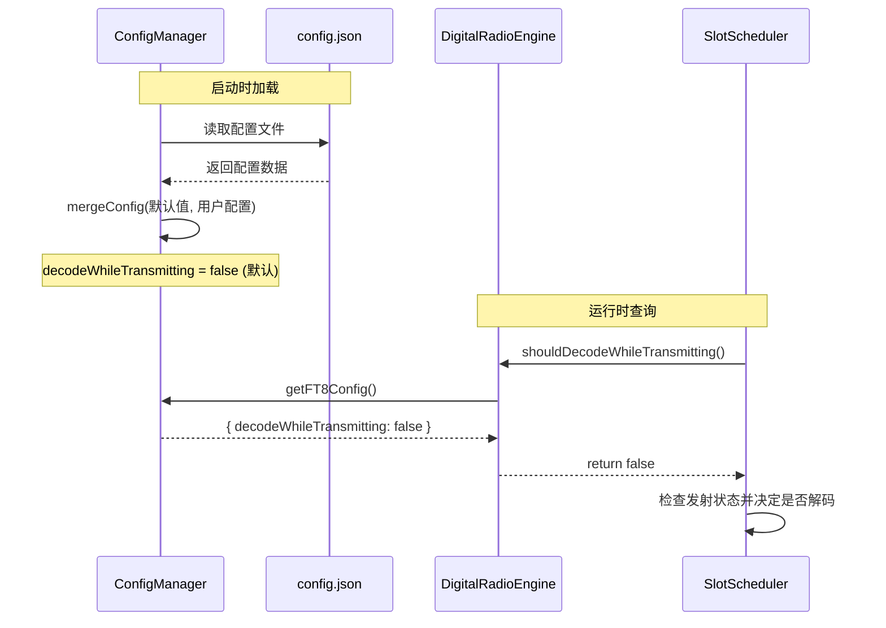
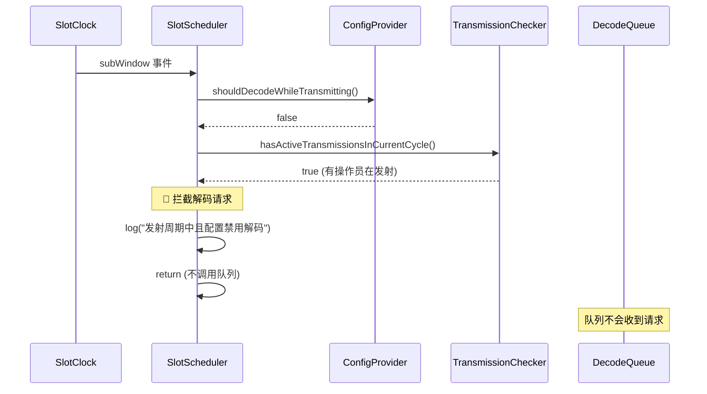
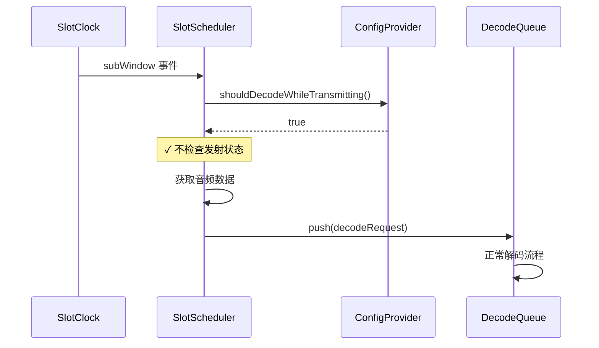
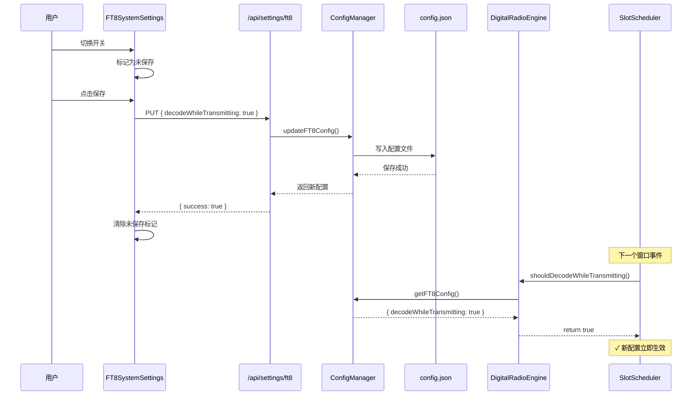

# 发射时解码控制功能设计与实施计划

本方案为 TX-5DR 添加全局配置项 `decodeWhileTransmitting`，控制在发射周期是否允许解码，解决误解码残留信号的问题。

---

## 1. 问题背景

### 1.1 现象描述
在发射周期中，解码队列 (`WSJTXDecodeWorkQueue`) 依然会处理音频数据并解码，导致：
- 错误地解码上一周期的残留信号
- 误认为是发射周期收到的信号
- 造成解码结果不准确

### 1.2 根本原因
当前实现中：
- `SlotScheduler` 已经有拦截机制（第85-89行）
- 通过 `transmissionChecker?.hasActiveTransmissionsInCurrentCycle()` 检查
- **但这个检查是强制执行的，没有配置开关**

### 1.3 期望行为
- **默认（推荐）**：任何操作员在发射周期时，停止所有解码，避免误解码
- **可选（高级）**：允许发射时继续解码，支持双周期异地收发等高级场景

---

## 2. 解决方案概述

### 2.1 核心策略
- 添加全局配置项：`ft8.decodeWhileTransmitting: boolean`
- 默认值：`false`（禁用发射时解码）
- 实现位置：**在 SlotScheduler 调度层拦截**（而非队列层）

### 2.2 架构决策

#### 方案对比

| 方案 | 拦截位置 | 优势 | 劣势 |
|------|---------|------|------|
| ❌ 队列层拦截 | `WSJTXDecodeWorkQueue.push()` | - | 队列层不应关心业务逻辑<br/>创建了无用的请求对象 |
| ✅ **调度层拦截** | `SlotScheduler.handleSubWindow()` | 职责清晰<br/>性能更好<br/>易于测试 | - |

**选择：调度层拦截**
- **职责分离**：调度层决定"做不做"，队列层负责"怎么做"
- **性能优化**：在外层拦截，避免创建和传递无用对象
- **代码复用**：利用现有的 `transmissionChecker` 机制

### 2.3 多操作员逻辑
根据用户选择：
- **只要有一个操作员在发射周期，就停止解码**
- 使用现有的 `RadioOperatorManager.hasActiveTransmissionsInCurrentCycle()` 方法

---

## 3. 详细设计

### 3.1 配置管理（ConfigManager）

#### 3.1.1 接口定义
**文件**: `packages/server/src/config/config-manager.ts`

```typescript
export interface AppConfig {
  ft8: {
    myCallsign: string;
    myGrid: string;
    frequency: number;
    transmitPower: number;
    autoReply: boolean;
    maxQSOTimeout: number;
    decodeWhileTransmitting: boolean; // 新增：发射时允许解码
  };
  // ...
}
```

#### 3.1.2 默认值
```typescript
const DEFAULT_CONFIG: AppConfig = {
  ft8: {
    // ... 现有字段
    decodeWhileTransmitting: false, // 默认关闭，避免误解码残留信号
  },
  // ...
};
```

#### 3.1.3 配置持久化
- 自动保存到 `config.json`
- 启动时通过 `mergeConfig()` 加载
- 老配置文件会自动合并默认值

---

### 3.2 调度层拦截（SlotScheduler）

#### 3.2.1 新增接口定义
**文件**: `packages/core/src/clock/SlotScheduler.ts`

```typescript
/**
 * 配置提供者接口 - 由 server 包实现
 */
export interface IConfigProvider {
  /**
   * 获取是否允许发射时解码
   * @returns true 允许发射时解码，false 发射时停止解码
   */
  shouldDecodeWhileTransmitting(): boolean;
}
```

#### 3.2.2 构造函数修改
```typescript
export class SlotScheduler {
  private slotClock: SlotClock;
  private decodeQueue: IDecodeQueue;
  private audioBufferProvider: AudioBufferProvider;
  private transmissionChecker?: ITransmissionChecker;
  private configProvider?: IConfigProvider; // 新增
  private isActive = false;

  constructor(
    slotClock: SlotClock,
    decodeQueue: IDecodeQueue,
    audioBufferProvider: AudioBufferProvider,
    transmissionChecker?: ITransmissionChecker,
    configProvider?: IConfigProvider // 新增
  ) {
    this.slotClock = slotClock;
    this.decodeQueue = decodeQueue;
    this.audioBufferProvider = audioBufferProvider;
    this.transmissionChecker = transmissionChecker;
    this.configProvider = configProvider; // 新增
  }
}
```

#### 3.2.3 拦截逻辑修改

**原有代码**（第85-89行）:
```typescript
// 检查当前周期是否有操作员准备发射
if (this.transmissionChecker?.hasActiveTransmissionsInCurrentCycle()) {
  console.log(`🚫 [SlotScheduler] 当前周期有操作员准备发射，暂停解码 窗口${windowIdx}`);
  return;
}
```

**修改后**:
```typescript
// 读取配置：是否允许发射时解码
const allowDecodeWhileTransmitting = this.configProvider?.shouldDecodeWhileTransmitting() ?? true;

// 只有在配置禁用发射时解码的情况下，才检查发射状态
if (!allowDecodeWhileTransmitting) {
  // 检查当前周期是否有操作员准备发射
  if (this.transmissionChecker?.hasActiveTransmissionsInCurrentCycle()) {
    console.log(`🚫 [SlotScheduler] 发射周期中且配置禁用解码，跳过窗口${windowIdx}`);
    return;
  }
}

// ... 原有的解码逻辑保持不变
```

**关键点**:
- 默认值 `?? true` 保证向后兼容（如果没有提供 configProvider）
- 日志清晰说明拦截原因
- 只在配置禁用时才检查发射状态

---

### 3.3 引擎集成（DigitalRadioEngine）

#### 3.3.1 实现 IConfigProvider 接口
**文件**: `packages/server/src/engine/DigitalRadioEngine.ts`

```typescript
import { IConfigProvider } from '@tx5dr/core';
import { ConfigManager } from '../config/config-manager.js';

export class DigitalRadioEngine implements IConfigProvider {
  // ... 现有字段

  /**
   * 实现 IConfigProvider 接口
   * 从配置管理器读取实时配置
   */
  shouldDecodeWhileTransmitting(): boolean {
    const configManager = ConfigManager.getInstance();
    const ft8Config = configManager.getFT8Config();
    return ft8Config.decodeWhileTransmitting ?? false;
  }

  // ...
}
```

#### 3.3.2 创建 SlotScheduler 时传入配置
找到创建 `SlotScheduler` 的地方（通常在初始化方法中），修改为：

```typescript
this.slotScheduler = new SlotScheduler(
  this.slotClock,
  this.decodeQueue,
  this.audioBufferProvider,
  this.operatorManager, // transmissionChecker
  this // configProvider（传入 this，因为 DigitalRadioEngine 实现了 IConfigProvider）
);
```

**说明**:
- SlotScheduler 每次窗口事件都会调用 `shouldDecodeWhileTransmitting()`
- 配置更新后下一个窗口立即生效，无需重启

---

### 3.4 API 接口（Server Routes）

#### 3.4.1 获取 FT8 配置
**端点**: `GET /api/settings/ft8`

```typescript
fastify.get('/api/settings/ft8', async (request, reply) => {
  try {
    const configManager = ConfigManager.getInstance();
    const ft8Config = configManager.getFT8Config();
    return {
      success: true,
      data: ft8Config
    };
  } catch (error) {
    return reply.code(500).send({
      success: false,
      error: error instanceof Error ? error.message : '获取配置失败'
    });
  }
});
```

#### 3.4.2 更新 FT8 配置
**端点**: `PUT /api/settings/ft8`

```typescript
fastify.put('/api/settings/ft8', async (request, reply) => {
  try {
    const configManager = ConfigManager.getInstance();
    const updates = request.body as Partial<{
      decodeWhileTransmitting: boolean;
      // ... 其他可更新的字段
    }>;

    await configManager.updateFT8Config(updates);

    return {
      success: true,
      data: configManager.getFT8Config()
    };
  } catch (error) {
    return reply.code(500).send({
      success: false,
      error: error instanceof Error ? error.message : '保存配置失败'
    });
  }
});
```

**文件位置**:
- 可能需要新建 `packages/server/src/routes/settings.ts`
- 或者添加到现有的路由文件中

---

### 3.5 前端设置组件

#### 3.5.1 SystemSettings 组件
**文件**: `packages/web/src/components/SystemSettings.tsx` (新建)

**功能**:
- 加载 FT8 配置
- 显示 `decodeWhileTransmitting` 开关
- 保存配置到服务器
- 未保存更改检测

**关键逻辑**:
```typescript
export const SystemSettings = forwardRef<SystemSettingsRef, SystemSettingsProps>(
  ({ onUnsavedChanges }, ref) => {
    const [decodeWhileTransmitting, setDecodeWhileTransmitting] = useState(false);
    const [originalValue, setOriginalValue] = useState(false);

    // 加载配置
    useEffect(() => {
      loadSettings();
    }, []);

    const loadSettings = async () => {
      const response = await fetch('/api/settings/ft8');
      const result = await response.json();
      const value = result.data.decodeWhileTransmitting ?? false;
      setDecodeWhileTransmitting(value);
      setOriginalValue(value);
    };

    const handleSave = async () => {
      await fetch('/api/settings/ft8', {
        method: 'PUT',
        headers: { 'Content-Type': 'application/json' },
        body: JSON.stringify({ decodeWhileTransmitting }),
      });
      setOriginalValue(decodeWhileTransmitting);
    };

    // 暴露接口给父组件
    useImperativeHandle(ref, () => ({
      hasUnsavedChanges: () => decodeWhileTransmitting !== originalValue,
      save: handleSave,
    }));

    return (
      <Switch
        isSelected={decodeWhileTransmitting}
        onValueChange={setDecodeWhileTransmitting}
      />
    );
  }
);
```

#### 3.5.2 UI 设计

**标题**: 发射时允许解码

**说明文案**:
```
关闭（推荐）：任何操作员发射时停止解码，避免误解码残留信号
开启（高级）：发射周期继续解码，支持双周期异地收发
⚠️ 默认关闭以避免解码错误
```

**视觉提示**:
- 关闭状态：绿色/成功色（推荐状态）
- 开启状态：橙色/警告色（高级功能）

---

### 3.6 集成到 SettingsModal

#### 3.6.1 添加新标签页
**文件**: `packages/web/src/components/SettingsModal.tsx`

**修改内容**:
1. 导入 `SystemSettings` 组件
2. 添加标签页类型: `'system'`
3. 添加 ref: `systemSettingsRef`
4. 更新 `checkUnsavedChanges()` 方法
5. 更新 `handleSave()` 方法
6. 更新 `getTabTitle()` 方法
7. 更新 `renderTabContent()` 方法
8. 在 `<Tabs>` 中添加标签

**标签页位置建议**:
- 插入到 `'logbook_sync'` 和 `'advanced'` 之间
- 标题: `⚙️ 系统设置`

---

## 4. 数据流与时序

### 4.1 配置加载流程



### 4.2 解码拦截流程

**配置关闭时（默认推荐）**:


**配置开启时（高级功能）**:


### 4.3 配置更新流程



---

## 5. 边缘情况处理

### 5.1 配置文件迁移
**场景**: 现有用户的 `config.json` 没有 `decodeWhileTransmitting` 字段

**处理**:
- `ConfigManager.mergeConfig()` 会自动合并默认值
- 老配置文件读取后会自动添加 `decodeWhileTransmitting: false`
- 下次保存时会写入完整配置

**测试**:
```typescript
// 老配置文件
{
  "ft8": {
    "myCallsign": "BG5DRB",
    "myGrid": "PL09"
    // 缺少 decodeWhileTransmitting
  }
}

// 加载后
{
  "ft8": {
    "myCallsign": "BG5DRB",
    "myGrid": "PL09",
    "decodeWhileTransmitting": false // 自动添加默认值
  }
}
```

### 5.2 中途切换配置
**场景**: 用户在发射周期中打开/关闭该配置

**处理**:
- 下一个 `subWindow` 事件立即读取新配置
- 当前正在解码的任务不受影响（已经在队列中）
- 新的解码请求按新配置处理

**时序**:
```
T0: 配置关闭, 发射周期, 解码被拦截
T1: 用户打开配置
T2: 下一个窗口事件, 读取新配置 (true)
T3: 即使在发射周期, 也继续解码 ✓
```

### 5.3 没有提供 configProvider
**场景**: SlotScheduler 创建时没有传入 `configProvider`

**处理**:
- 使用空值合并运算符: `?? true`
- 默认值为 `true` (允许解码)
- 保证向后兼容

**代码**:
```typescript
const allowDecodeWhileTransmitting = this.configProvider?.shouldDecodeWhileTransmitting() ?? true;
```

### 5.4 多操作员同时发射
**场景**: 两个操作员同时进入发射周期

**处理**:
- `hasActiveTransmissionsInCurrentCycle()` 会检查所有操作员
- 只要有**任意一个**操作员在发射周期, 返回 `true`
- 配置关闭时, 拦截所有解码请求

**实现**:
```typescript
// RadioOperatorManager.hasActiveTransmissionsInCurrentCycle()
hasActiveTransmissionsInCurrentCycle(): boolean {
  for (const [operatorId, operator] of this.operators) {
    if (!operator.isTransmitting) continue;

    const isTransmitCycle = CycleUtils.isOperatorTransmitCycle(
      operator.getTransmitCycles(),
      utcSeconds,
      currentMode.slotMs
    );

    if (isTransmitCycle) {
      return true; // 找到任意一个准备发射的操作员
    }
  }
  return false;
}
```

### 5.5 操作员停止发射
**场景**: 操作员停止发射后应该恢复解码

**处理**:
- 下一个窗口事件会重新检查 `hasActiveTransmissionsInCurrentCycle()`
- 如果没有操作员在发射周期, 返回 `false`
- 解码自动恢复, 无需手动操作

**时序**:
```
T0: 操作员A在发射周期, 解码被拦截
T1: 操作员A停止发射 (isTransmitting = false)
T2: 下一个窗口事件
    → hasActiveTransmissionsInCurrentCycle() = false
    → ✓ 解码恢复
```

### 5.6 配置保存失败
**场景**: 写入 `config.json` 失败（磁盘满、权限等）

**处理**:
- API 返回错误: `{ success: false, error: "错误信息" }`
- 前端显示错误提示
- 不更新 `originalValue`, 保持未保存状态
- 用户可以重试保存

**UI 反馈**:
```typescript
try {
  await handleSave();
  // 成功: 清除未保存标记
} catch (error) {
  // 失败: 显示错误提示
  setError('保存 FT8 设置失败: ' + error.message);
  // 保持未保存状态, 用户可以重试
}
```

---

## 6. 实施步骤

### 阶段 1: 后端配置基础（核心功能）
**优先级**: 🔴 高

1. **[ ] ConfigManager 修改**
   - 文件: `packages/server/src/config/config-manager.ts`
   - 添加 `decodeWhileTransmitting: boolean` 到 `AppConfig['ft8']`
   - 更新 `DEFAULT_CONFIG` 默认值为 `false`
   - 验证: 启动系统, 检查生成的 config.json

2. **[ ] SlotScheduler 接口定义**
   - 文件: `packages/core/src/clock/SlotScheduler.ts`
   - 添加 `IConfigProvider` 接口
   - 修改构造函数, 添加 `configProvider` 参数
   - 验证: TypeScript 编译通过

3. **[ ] SlotScheduler 拦截逻辑**
   - 文件: `packages/core/src/clock/SlotScheduler.ts`
   - 修改 `handleSubWindow()` 方法
   - 添加配置驱动的拦截逻辑
   - 验证: 日志输出正确的拦截信息

4. **[ ] DigitalRadioEngine 集成**
   - 文件: `packages/server/src/engine/DigitalRadioEngine.ts`
   - 实现 `IConfigProvider` 接口
   - 创建 SlotScheduler 时传入 `this`
   - 验证: 发射周期时解码被正确拦截

5. **[ ] 构建 core 包**
   ```bash
   yarn workspace @tx5dr/core build
   ```

6. **[ ] 构建 server 包**
   ```bash
   yarn workspace @tx5dr/server build
   ```

7. **[ ] 手动测试后端逻辑**
   - 启动系统
   - 启动操作员, 进入发射周期
   - 观察日志: 应该看到 "发射周期中且配置禁用解码，跳过窗口X"
   - 非发射周期: 解码正常进行

---

### 阶段 2: API 接口（用户体验）
**优先级**: 🟡 中

1. **[ ] 添加 settings 路由**
   - 文件: `packages/server/src/routes/settings.ts` (可能需要新建)
   - 实现 `GET /api/settings/ft8`
   - 实现 `PUT /api/settings/ft8`
   - 验证: Postman/curl 测试 API

2. **[ ] 注册路由**
   - 找到主路由注册文件（通常是 `server.ts` 或 `routes/index.ts`）
   - 注册 settings 路由
   - 验证: API 可以正常访问

3. **[ ] 构建 server 包**
   ```bash
   yarn workspace @tx5dr/server build
   ```

4. **[ ] API 集成测试**
   ```bash
   # 获取配置
   curl http://localhost:4000/api/settings/ft8

   # 更新配置
   curl -X PUT http://localhost:4000/api/settings/ft8 \
     -H "Content-Type: application/json" \
     -d '{"decodeWhileTransmitting": true}'

   # 验证更新
   curl http://localhost:4000/api/settings/ft8
   ```

---

### 阶段 3: 前端界面（完整功能）
**优先级**: 🟡 中

1. **[ ] 创建 SystemSettings 组件**
   - 文件: `packages/web/src/components/SystemSettings.tsx` (新建)
   - 实现加载配置逻辑
   - 实现保存配置逻辑
   - 实现未保存更改检测
   - 验证: 组件单独渲染正常

2. **[ ] 集成到 SettingsModal**
   - 文件: `packages/web/src/components/SettingsModal.tsx`
   - 添加导入和类型定义
   - 添加 ref 和状态管理
   - 更新所有相关方法
   - 添加标签页
   - 验证: 标签页显示正常

3. **[ ] 构建 web 包**
   ```bash
   yarn workspace @tx5dr/web build
   ```

4. **[ ] UI 集成测试**
   - 打开设置弹窗
   - 切换到 "⚙️ 系统设置" 标签页
   - 查看当前配置状态
   - 切换开关, 观察未保存提示
   - 保存配置, 验证成功
   - 刷新页面, 验证配置持久化

---

### 阶段 4: 端到端测试（质量保证）
**优先级**: 🟢 低

1. **[ ] 默认行为测试**
   - 全新安装, 验证默认值为 `false`
   - 启动操作员, 发射周期时解码被拦截
   - 非发射周期时解码正常

2. **[ ] 配置切换测试**
   - 打开配置 → 保存 → 观察发射周期继续解码
   - 关闭配置 → 保存 → 观察发射周期停止解码
   - 验证配置立即生效（下一个窗口）

3. **[ ] 多操作员测试**
   - 两个操作员, 不同发射周期
   - 操作员A发射时, 解码被拦截
   - 操作员A非发射周期, 操作员B发射时, 解码依然被拦截
   - 两个操作员都非发射周期, 解码正常

4. **[ ] 配置迁移测试**
   - 备份老的 config.json（删除 decodeWhileTransmitting）
   - 启动系统
   - 验证配置自动合并默认值
   - 检查日志无错误

5. **[ ] 错误处理测试**
   - 模拟 API 失败（停止服务器）
   - 尝试保存配置
   - 验证前端显示错误提示
   - 验证保持未保存状态

6. **[ ] 性能测试**
   - 高负载场景（多操作员、高频解码）
   - 验证拦截不影响性能
   - 验证日志输出合理（不过度）

---

## 7. 验收标准

### 7.1 功能正确性
- ✅ 默认配置为 `false`，发射周期时解码被拦截
- ✅ 配置改为 `true`，发射周期时继续解码
- ✅ 配置更新后立即生效（下一个窗口）
- ✅ 多操作员场景：任意一个发射即拦截
- ✅ 老配置文件自动迁移，添加默认值

### 7.2 用户体验
- ✅ 前端界面清晰，说明文案准确
- ✅ 未保存更改提示正确
- ✅ 保存成功/失败有明确反馈
- ✅ 配置持久化，重启后保持

### 7.3 代码质量
- ✅ 职责分离：调度层拦截，队列层处理
- ✅ 向后兼容：没有 configProvider 时使用默认值
- ✅ 类型安全：TypeScript 编译无错误
- ✅ 日志清晰：拦截原因明确

### 7.4 性能要求
- ✅ 拦截不增加明显延迟（<1ms）
- ✅ 配置读取高效（无频繁文件 I/O）
- ✅ 日志输出合理（不刷屏）

---

## 8. 文件清单

### 需要修改的文件（6个）
1. ✅ `packages/server/src/config/config-manager.ts`
   - 添加配置项到接口和默认值

2. ✅ `packages/core/src/clock/SlotScheduler.ts`
   - 添加 `IConfigProvider` 接口
   - 修改构造函数
   - 修改 `handleSubWindow()` 拦截逻辑

3. ✅ `packages/server/src/engine/DigitalRadioEngine.ts`
   - 实现 `IConfigProvider` 接口
   - 修改 SlotScheduler 创建代码

4. ✅ `packages/server/src/routes/settings.ts` (可能需要新建)
   - 添加 GET 和 PUT 端点

5. ✅ `packages/web/src/components/SettingsModal.tsx`
   - 集成 SystemSettings 组件

6. ✅ 主路由注册文件（如 `packages/server/src/server.ts`）
   - 注册 settings 路由

### 需要创建的文件（1个）
1. ✅ `packages/web/src/components/SystemSettings.tsx`
   - 新建系统设置组件

### 不需要修改的文件
- ❌ `packages/server/src/decode/WSJTXDecodeWorkQueue.ts` - 保持不变
- ❌ `packages/contracts/src/schema/*` - 使用 TypeScript 接口即可

---

## 9. 预期效果

### 9.1 配置关闭时（默认推荐）

**日志输出**:
```
📡 [SlotClock] 子窗口事件: 窗口0 @ 2025-10-18 12:34:56
🚫 [SlotScheduler] 发射周期中且配置禁用解码，跳过窗口0
```

**行为**:
- 解码队列不会收到请求
- 音频数据不会被处理
- 避免误解码残留信号
- 性能更优（减少无用计算）

**时序图**:
```
T0:     时隙开始
T0+780: 编码开始 → 操作员A判断在发射周期 → 加入发射队列
T0+1000: 子窗口0事件
         → shouldDecodeWhileTransmitting() = false
         → hasActiveTransmissionsInCurrentCycle() = true
         → 🚫 拦截，不调用 decodeQueue.push()
T0+1180: 发射开始 → 操作员A开始发射
T0+15000: 时隙结束
```

### 9.2 配置开启时（高级功能）

**日志输出**:
```
📡 [SlotClock] 子窗口事件: 窗口0 @ 2025-10-18 12:34:56
📡 [SlotScheduler] 生成解码请求: 时隙=..., 窗口=0
🔧 [解码队列] 解码完成: 时隙=..., 窗口=0, 找到 3 个信号
```

**行为**:
- 即使在发射周期也继续解码
- 支持双周期异地收发
- 支持接收其他频率的信号
- 适用于高级用户场景

**时序图**:
```
T0:     时隙开始
T0+780: 编码开始 → 操作员A判断在发射周期 → 加入发射队列
T0+1000: 子窗口0事件
         → shouldDecodeWhileTransmitting() = true
         → ✓ 不检查发射状态，直接解码
         → decodeQueue.push() → 正常解码流程
T0+1180: 发射开始 → 操作员A开始发射（同时解码其他信号）
T0+15000: 时隙结束
```

---

## 10. 常见问题 (FAQ)

### Q1: 为什么默认关闭解码？
**A**: 防止误解码残留信号。在发射周期中，音频缓冲区可能包含上一周期的残留数据，如果继续解码会产生错误的解码结果。

### Q2: 什么情况下应该开启？
**A**: 高级场景，例如：
- 双周期异地收发（一个操作员发射，另一个操作员接收）
- 多频率同时监听
- 特殊的实验和调试需求

### Q3: 配置更新后多久生效？
**A**: 立即生效。下一个 `subWindow` 事件（通常在毫秒级）就会读取新配置。

### Q4: 会影响性能吗？
**A**: 不会。在调度层拦截反而提升性能：
- 避免创建无用的请求对象
- 避免音频数据的复制和传递
- 避免解码队列的处理开销

### Q5: 老配置文件怎么办？
**A**: 自动迁移。`mergeConfig()` 会自动添加默认值，无需手动修改。

### Q6: 多操作员怎么处理？
**A**: 只要**任意一个**操作员在发射周期，就停止所有解码。这是最保守和安全的策略。

### Q7: 能否为每个操作员单独配置？
**A**: 当前是全局配置。如果未来需要，可以扩展为操作员级别的配置，但会增加复杂度。

### Q8: 如何验证功能是否生效？
**A**: 查看日志：
- 关闭状态：看到 "🚫 发射周期中且配置禁用解码，跳过窗口X"
- 开启状态：发射周期中依然看到 "📡 生成解码请求"

---

## 11. 后续优化方向

### 11.1 操作员级别配置（可选）
- 允许每个操作员单独设置是否发射时解码
- 需要修改 `RadioOperatorConfig` Schema
- 需要在 `hasActiveTransmissionsInCurrentCycle()` 中检查操作员配置

### 11.2 智能检测（可选）
- 检测音频缓冲区是否有残留信号
- 动态决定是否解码
- 需要音频分析算法

### 11.3 统计和监控（可选）
- 记录因发射而跳过的解码次数
- 提供统计信息给用户
- 帮助用户优化配置

### 11.4 WebSocket 通知（可选）
- 配置更新时通过 WebSocket 通知所有客户端
- 前端实时更新显示状态
- 提升用户体验

---

## 12. 参考资料

### 相关文件
- `packages/core/src/clock/SlotScheduler.ts` - 调度层拦截位置
- `packages/server/src/operator/RadioOperatorManager.ts` - 发射状态检查
- `packages/server/src/config/config-manager.ts` - 配置管理
- `packages/web/src/components/SettingsModal.tsx` - 设置界面

### 相关概念
- **SlotScheduler**: 时隙调度器，监听时隙事件并生成解码请求
- **TransmissionChecker**: 发射状态检查器，判断当前周期是否有操作员发射
- **ConfigProvider**: 配置提供者，为 SlotScheduler 提供实时配置
- **subWindow 事件**: 子窗口事件，触发解码请求的时机

---

## 13. 变更日志

### v1.0 (2025-10-18)
- 初始设计文档
- 确定在调度层拦截的方案
- 定义 `IConfigProvider` 接口
- 规划实施步骤和验收标准

---

## 附录 A: 代码片段参考

### A.1 ConfigManager 配置示例
```typescript
// packages/server/src/config/config-manager.ts

export interface AppConfig {
  ft8: {
    myCallsign: string;
    myGrid: string;
    frequency: number;
    transmitPower: number;
    autoReply: boolean;
    maxQSOTimeout: number;
    decodeWhileTransmitting: boolean; // 新增
  };
  // ...
}

const DEFAULT_CONFIG: AppConfig = {
  ft8: {
    myCallsign: '',
    myGrid: '',
    frequency: 14074000,
    transmitPower: 25,
    autoReply: false,
    maxQSOTimeout: 6,
    decodeWhileTransmitting: false, // 新增：默认关闭
  },
  // ...
};
```

### A.2 SlotScheduler 拦截逻辑示例
```typescript
// packages/core/src/clock/SlotScheduler.ts

private async handleSubWindow(slotInfo: SlotInfo, windowIdx: number): Promise<void> {
  if (!this.isActive) return;

  // 读取配置：是否允许发射时解码
  const allowDecodeWhileTransmitting = this.configProvider?.shouldDecodeWhileTransmitting() ?? true;

  // 只有在配置禁用发射时解码的情况下，才检查发射状态
  if (!allowDecodeWhileTransmitting) {
    // 检查当前周期是否有操作员准备发射
    if (this.transmissionChecker?.hasActiveTransmissionsInCurrentCycle()) {
      console.log(`🚫 [SlotScheduler] 发射周期中且配置禁用解码，跳过窗口${windowIdx}`);
      return;
    }
  }

  // ... 原有的解码逻辑
}
```

### A.3 DigitalRadioEngine 实现示例
```typescript
// packages/server/src/engine/DigitalRadioEngine.ts

import { IConfigProvider } from '@tx5dr/core';
import { ConfigManager } from '../config/config-manager.js';

export class DigitalRadioEngine implements IConfigProvider {
  // ...

  /**
   * 实现 IConfigProvider 接口
   */
  shouldDecodeWhileTransmitting(): boolean {
    const configManager = ConfigManager.getInstance();
    const ft8Config = configManager.getFT8Config();
    return ft8Config.decodeWhileTransmitting ?? false;
  }

  // 初始化方法中创建 SlotScheduler
  private initializeSlotScheduler(): void {
    this.slotScheduler = new SlotScheduler(
      this.slotClock,
      this.decodeQueue,
      this.audioBufferProvider,
      this.operatorManager, // transmissionChecker
      this // configProvider
    );
  }
}
```

### A.4 SystemSettings 组件示例
```typescript
// packages/web/src/components/SystemSettings.tsx

export const SystemSettings = forwardRef<SystemSettingsRef, SystemSettingsProps>(
  ({ onUnsavedChanges }, ref) => {
    const [decodeWhileTransmitting, setDecodeWhileTransmitting] = useState(false);
    const [originalValue, setOriginalValue] = useState(false);

    // 加载配置
    useEffect(() => {
      const loadSettings = async () => {
        const response = await fetch('/api/settings/ft8');
        const result = await response.json();
        const value = result.data.decodeWhileTransmitting ?? false;
        setDecodeWhileTransmitting(value);
        setOriginalValue(value);
      };
      loadSettings();
    }, []);

    // 保存配置
    const handleSave = async () => {
      await fetch('/api/settings/ft8', {
        method: 'PUT',
        headers: { 'Content-Type': 'application/json' },
        body: JSON.stringify({ decodeWhileTransmitting }),
      });
      setOriginalValue(decodeWhileTransmitting);
    };

    // 暴露接口
    useImperativeHandle(ref, () => ({
      hasUnsavedChanges: () => decodeWhileTransmitting !== originalValue,
      save: handleSave,
    }));

    return (
      <div className="flex items-start justify-between">
        <div className="flex flex-col">
          <span className="text-sm font-medium">发射时允许解码</span>
          <span className="text-xs text-default-500">
            关闭（推荐）：任何操作员发射时停止解码，避免误解码残留信号
            <br />
            开启（高级）：发射周期继续解码，支持双周期异地收发
            <br />
            <span className="text-warning-600">⚠️ 默认关闭以避免解码错误</span>
          </span>
        </div>
        <Switch
          isSelected={decodeWhileTransmitting}
          onValueChange={setDecodeWhileTransmitting}
        />
      </div>
    );
  }
);
```

---

**文档版本**: v1.0
**最后更新**: 2025-10-18
**作者**: Claude Code
**状态**: 待审核