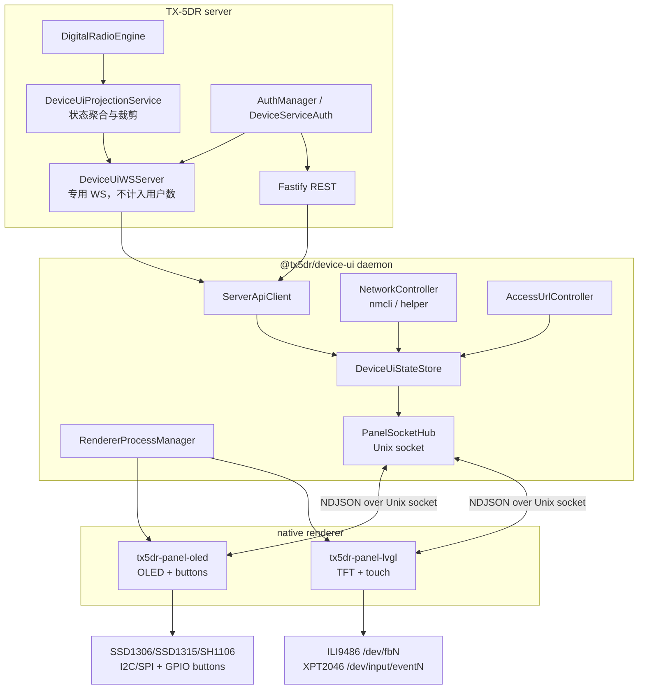
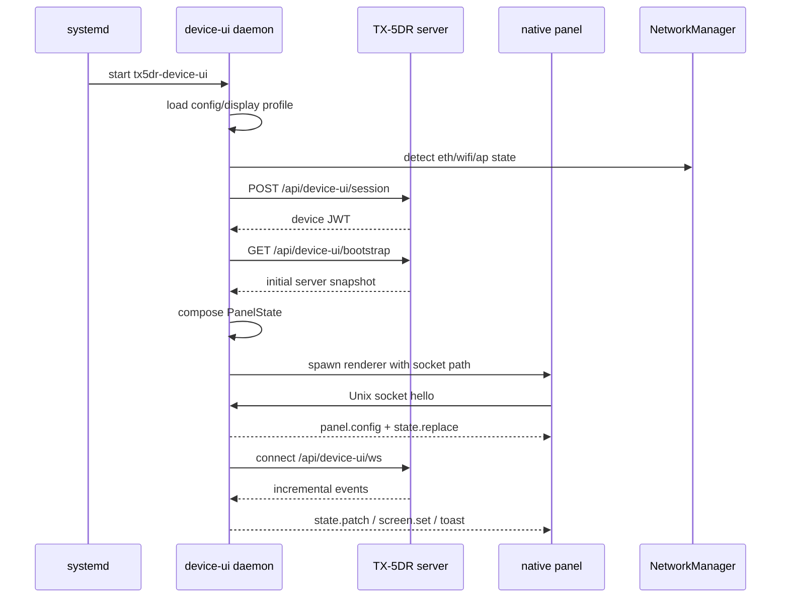
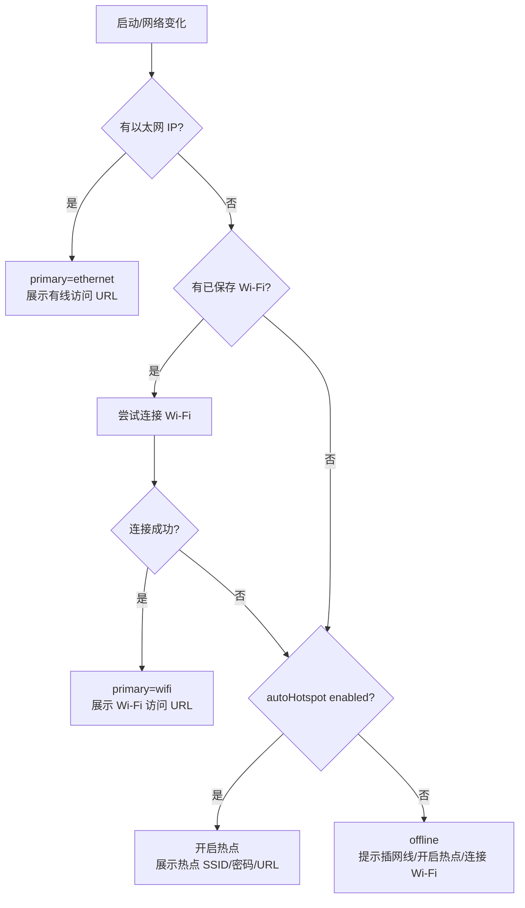
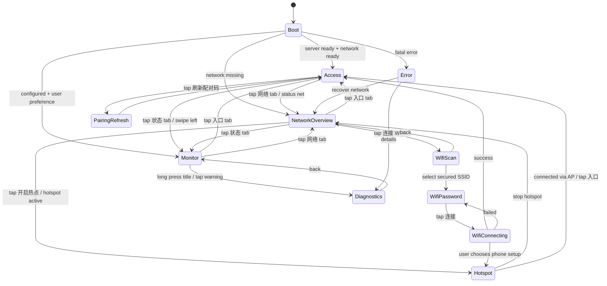
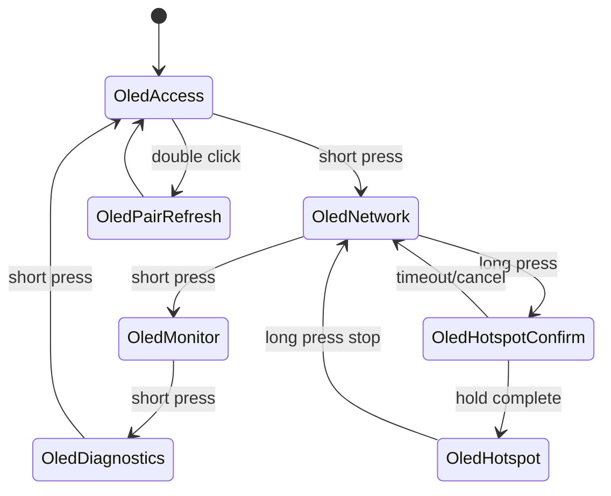
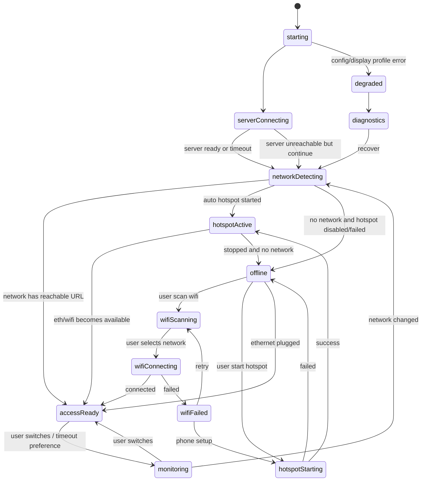
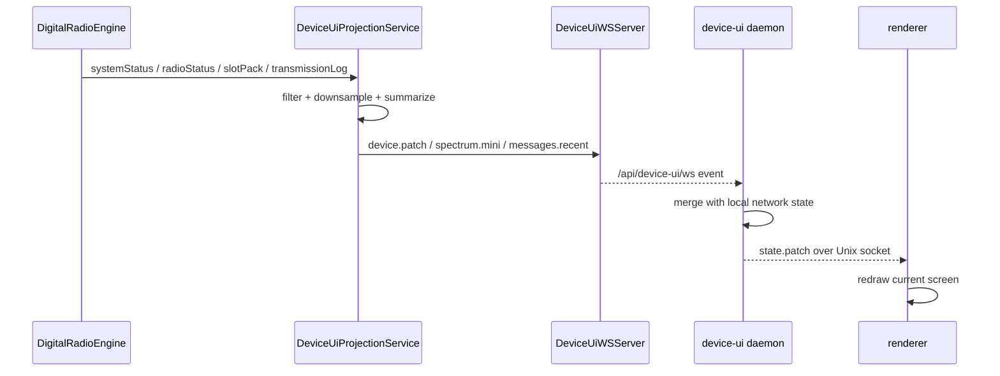
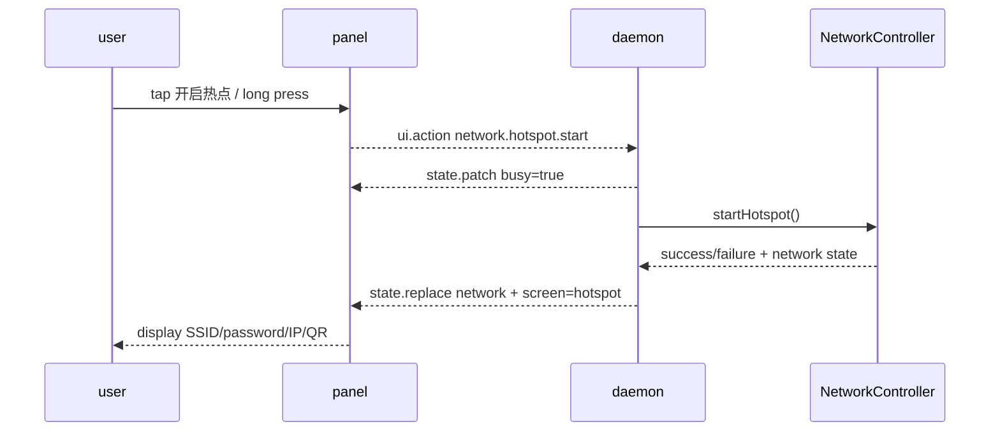
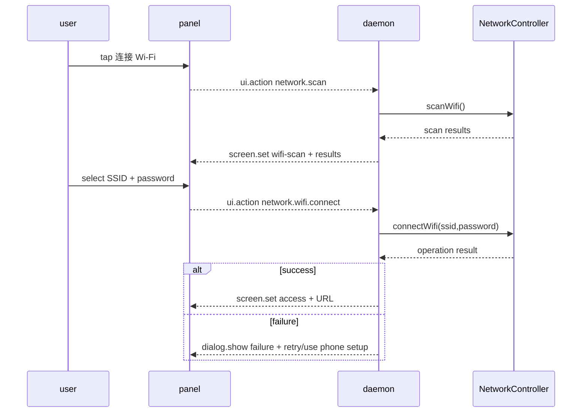
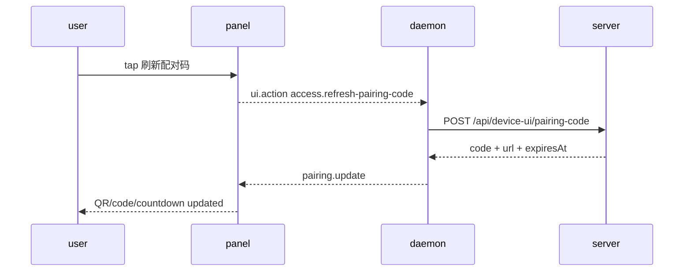

# Device UI 架构与交互设计方案

**适用范围**: Raspberry Pi 本机小屏引导与状态面板，计划新增 `packages/device-ui` 与两个 native 渲染后端。
**当前阶段**: 架构设计、可执行实施计划与首轮实现状态记录。
**核心目标**: 小屏不是完整 Web 前端，而是硬件产品的本机引导屏、网络配置入口、访问二维码入口和 TX-5DR 运行摘要屏。

## 0. 决策锁定

本节用于消除后续开发中的悬空决策。除非硬件 bring-up 证明某项不可行，否则实现阶段必须按下表执行；变更需要单独更新本文档。

### 0.1 架构与目录

| 主题 | 锁定决策 |
|---|---|
| Node 包 | 新增 workspace `packages/device-ui`，包名 `@tx5dr/device-ui`。 |
| Native 代码位置 | 放在 `packages/device-ui/native/*`，不放 repo 根目录，避免 native 构建散落。 |
| Renderer 数量 | MVP 同一时间只运行一个 renderer，由 `TX5DR_DEVICE_UI_PROFILE` 决定。多屏同时输出不进入 MVP。 |
| Renderer 通信 | daemon 是 Unix socket server；renderer 是 Unix socket client；socket 只接受一个 active renderer，新连接会替换旧连接。 |
| Server 接入 | 只能使用 `/api/device-ui/*` 和 `/api/device-ui/ws`，禁止复用普通 `/api/ws`。 |
| 状态模型 | renderer 只接收 `DeviceUiModel` 和 typed patch；renderer 不直接调用 server API。 |
| 构建入口 | `packages/device-ui` 提供 `build:ts`、`build:native`、`build` scripts；`build:native` 用 CMake 构建当前平台 renderer。MVP 不做交叉编译工具链，Linux arm64 包在 arm64 环境构建。 |

### 0.2 渲染后端

| 主题 | 锁定决策 |
|---|---|
| TFT MVP | `tx5dr-panel-lvgl`，C + LVGL v9.5.0，profile `tft-ili9486-320x480-touch`。 |
| TFT 方向 | MVP 只支持 `320x480` 竖屏；横屏 `480x320` 明确放到后续版本，不在 MVP 中实现。 |
| TFT dev 预览 | 必须先实现 SDL display/input backend，再接 fbdev/evdev。 |
| TFT 实机 | display 使用 `/dev/fb1` 默认值，可用 env 覆盖；input 使用显式 `TX5DR_DEVICE_UI_INPUT`，自动发现仅作为 fallback。 |
| TFT 字体 | MVP 使用 LVGL 内置 Montserrat 字体，不打包 CJK 字库。 |
| OLED MVP | `tx5dr-panel-oled`，C++ + U8g2，profile 默认 `oled-ssd1306-128x64-1btn`。 |
| OLED 控制器 | MVP 必须覆盖 SSD1306、SSD1315、SH1106 的 `128x64` I2C profile；默认 bus `i2c-1`、address `0x3C`；SSD1315 以 SSD1306 兼容初始化为默认，保留 controller override。 |
| SH1106 偏移 | `oled-sh1106-128x64-1btn` 默认 column offset 为 `2`；允许 env 覆盖为 `0..4`，但默认必须是 `2`。 |
| OLED 128x32 | 不作为 MVP 验收项；预留 profile 名称和布局约束，真实实现放到 MVP 后。 |
| OLED LVGL I1 | 不作为 MVP 路径；只有在 U8g2 无法满足页面需求时才另开后续设计。 |
| OLED 输入 | MVP 只支持 1 键 GPIO；3 键和旋钮不进入 MVP。macOS 预览用键盘模拟。 |
| OLED 字体 | MVP 使用 U8g2 ASCII 字体：正文 6x10，标题 8x13；不打包 CJK 字库。 |
| Native 依赖 | LVGL 固定 v9.5.0；U8g2、yyjson 以 source snapshot 放在 `packages/device-ui/native/vendor/*` 并记录 commit；构建阶段不得联网拉取。SDL2 只作为开发/预览系统依赖。 |

### 0.3 IPC 与可靠性

| 主题 | 锁定决策 |
|---|---|
| 格式 | NDJSON over Unix stream socket，UTF-8，每行一个 JSON object。 |
| 最大消息 | 单条最大 `64 KiB`；超限直接 `ipc.error` 并丢弃该消息。 |
| Patch 形式 | 不使用 RFC6902 JSON Patch；使用本文定义的 typed `state.patch`。 |
| 必须 ack | `daemon.hello`、`panel.config`、`state.replace`、`dialog.show`、`renderer.shutdown`。 |
| ack 超时 | 默认 `1500ms`；`dialog.show` 不限时，由用户动作完成。 |
| 高频丢帧 | `spectrum.update` 只保留最新一帧；renderer 繁忙时可丢弃旧帧。 |
| 状态重放 | renderer 连接或重连后，daemon 必须先发 `panel.config`，再发完整 `state.replace`。 |

### 0.4 Server API 与鉴权

| 主题 | 锁定决策 |
|---|---|
| Device token 文件 | 使用 `getConfigFilePath('.device-ui-token')`；Linux server 包默认解析为 `/var/lib/tx5dr/config/.device-ui-token`。不使用其他等价路径。 |
| Device ID | Linux 使用 `/etc/machine-id` 的 SHA-256 前 12 位；读取失败时用 hostname + config dir path hash。Device ID 只用于标识，不作为密钥。 |
| Device JWT | 单独的 `DeviceServiceJwtPayload`，带 `aud: 'tx5dr-device-ui'`；不复用普通 `JWTPayloadSchema`，不产生 `UserRole`。 |
| Health API | `GET /api/device-ui/health` 公开，只返回 `{ status, service, time }`，不含任何网络、token、operator 或 radio 信息。 |
| Bootstrap/API | 除 health/session 外，所有 `/api/device-ui/*` 都必须使用 device JWT。 |
| Device WS | `/api/device-ui/ws?token=<device-jwt>`，不接受普通用户 JWT，不发送或处理 `clientHandshake`。 |
| 用户数统计 | Device WS 连接不得改变普通 `clientCountChanged.count`；这是测试必须覆盖的硬性约束。 |
| Browser client count | `DeviceUiProjectionService` 可读取普通浏览器握手数作为 `browserClientCount`，但该数字必须排除 device WS。 |
| Pairing code | 6 位数字，TTL 5 分钟，一次性使用，默认兑换临时 viewer browser session，有效期 30 分钟。 |
| Pairing 权限 | pairing code 不授予 admin/operator；admin/operator 仍需普通登录 token 或密码。 |
| Pairing session | 使用 `pairing-session-*` 临时 `tokenId`，由 `PairingCodeService` 内存管理；不写入 `auth.json`，不出现在 `/api/auth/tokens`。`authPlugin` 必须能识别该临时 session 并返回 viewer 权限。 |
| Access URL scheme | MVP 局域网入口固定使用 HTTP：`http://<ip>:<webPort>`。不在小屏展示 HTTPS URL；公网/HTTPS 引导仍交给 Web UI。 |

### 0.5 网络控制

| 主题 | 锁定决策 |
|---|---|
| 网络后端 | MVP 使用 NetworkManager + `nmcli`。不实现 D-Bus 直连。 |
| 权限模型 | `tx5dr-device-ui.service` 以 `tx5dr` 用户运行；真实网络变更必须通过 root `tx5dr-network-helper` 执行。daemon 不使用 `sudo`。 |
| Helper socket | helper 监听 `/run/tx5dr/network-helper.sock`，socket 权限 `0660 root:tx5dr`。 |
| Helper 范围 | helper 只接受 allowlist 操作：status、scan、connect、disconnect、forget、hotspot start、hotspot stop。 |
| Helper 缺失 | 只允许只读网络展示；Wi-Fi 连接和热点按钮置灰，并显示“网络控制 helper 未安装”。 |
| 网络优先级 | Ethernet > Wi-Fi > Hotspot > Offline。 |
| 默认热点 | SSID `TX5DR-<设备短ID>`；密码为 12 位 Crockford Base32，格式 `XXXX-XXXX-XXXX`，持久化到 `/var/lib/tx5dr/device-ui/hotspot.json`。 |

### 0.6 UI 默认行为

| 主题 | 锁定决策 |
|---|---|
| 默认页面 | 有网络时默认 `access`；无网络默认 `network-overview`；热点刚开启默认 `hotspot`。 |
| Idle 返回 | TFT/OLED 无操作默认回 `access`；只有 PTT/TX active 时自动留在或切到 `monitor`。 |
| 状态栏 | TFT 必须有状态栏；OLED 第一行作为压缩状态栏。 |
| Monitor 频谱 | TFT 固定 64 bins，最高 5Hz；OLED `128x64` 固定 16 bins，最高 2Hz。 |
| 最近消息 | TFT 显示 5 条，OLED 显示 1 条；相关性规则见 Monitor 章节。 |
| Wi-Fi 密码输入 | 仅 TFT 支持；OLED 不支持输入密码，只能提示开启热点后用手机配置。 |
| UI 语言 | MVP renderer 固定使用 ASCII English 短文案，避免 OLED 字库和中文字体体积问题；多语言另开后续版本。 |

## 1. 设计目标

### 1.1 必须实现

1. 在 Raspberry Pi 本机运行一个独立的 `@tx5dr/device-ui` daemon。
2. 初期支持两类显示后端：
   - **TFT 彩屏触摸后端**: ILI9486 `320x480` SPI TFT + XPT2046 触摸，使用 LVGL + SDL/fbdev/evdev。
   - **OLED 单色后端**: SSD1306 / SSD1315 / SH1106 `128x64` 单色点阵 OLED，使用 U8g2 + SDL/PNG/I2C，MVP 不实现 LVGL I1。
3. 两类显示后端都必须支持 macOS/PC 本机预览模式，不能把真实屏幕作为 UI 开发的前置条件。
4. `device-ui` 与 native 渲染进程通过 **Unix domain socket** 传递状态、命令和事件。
5. 应用层实现基础网络能力：
   - 网线连接兜底展示；
   - Wi-Fi 扫描、连接、已保存网络重连；
   - 热点开启/关闭、热点凭据展示；
   - 已联网后展示局域网访问 URL、二维码或 pairing code。
6. 展示 TX-5DR 运行摘要：
   - server/engine 状态；
   - 电台连接状态、频率、模式、PTT/TX 状态；
   - 当前发射内容；
   - slot 倒计时；
   - 最近几条与当前操作员/本机呼号相关的 FT8 消息；
   - 简化频谱条或瀑布摘要。
7. 与 server 后端通信必须使用专用 device API / device WebSocket，不能被视为普通浏览器用户，也不能计入现有 `clientCountChanged` 用户数。
8. 二维码不直接暴露长期 admin token；最多展示短期 pairing code 或普通访问 URL。

### 1.2 明确不做

1. 不在小屏实时渲染 `@tx5dr/web` React 页面。
2. 不把小屏做成完整操作台；初期不提供复杂电台控制和完整日志本操作。
3. 不在 Node.js 中直接维护 ILI9486 / XPT2046 SPI 协议；优先依赖 Linux 驱动暴露的 `/dev/fb*` 和 `/dev/input/event*`。
4. 不让 native 渲染进程直接访问 TX-5DR server API；native 进程只通过 Unix socket 和 `@tx5dr/device-ui` 通信。

## 2. 总体架构



### 2.1 分层职责

| 层 | 固定模块 | 负责 | 不负责 |
|---|---|---|---|
| Server device API | `packages/server/src/device-ui/*` | 认证 device daemon、输出裁剪后的状态、生成 pairing code、推送 TX-5DR 摘要事件 | 管理本机 Wi-Fi、绘制 UI、读取触摸 |
| Device daemon | `packages/device-ui` | 本机状态机、网络管理、访问 URL 选择、server API client、渲染进程生命周期、Unix socket 协议 | 直接绘制 framebuffer、直接处理 LVGL widget |
| Native renderer | `packages/device-ui/native/tx5dr-panel-lvgl` / `packages/device-ui/native/tx5dr-panel-oled` | 渲染、触摸/按键输入、页面动画、局部刷新 | 连接 TX-5DR server、执行 nmcli、持久化业务配置 |
| Hardware drivers | Linux kernel / overlay / udev | `/dev/fb*`、`/dev/input/event*`、I2C/SPI/GPIO 设备 | TX-5DR 业务逻辑 |

### 2.2 为什么需要专用 device API

现有主 WebSocket `/api/ws` 由 `WSServer.addConnection()` 管理，并在 `clientHandshake` 完成后通过 `broadcastClientCount()` 统计已握手客户端数量。device panel 如果复用普通 WebSocket 并完成握手，会被误统计为用户。

因此初期设计必须采用：

1. 新增 `/api/device-ui/ws`，由新的 `DeviceUiWSServer` 管理，不调用 `WSServer.addConnection()`。
2. 新增 `/api/device-ui/*` REST，使用 `requireDeviceServiceAuth`，不使用普通 `UserRole` 作为身份。
3. Device WebSocket 不发送 `clientHandshake`，不进入 `clientInstanceConnections`，不参与 `CLIENT_COUNT_CHANGED`。
4. 若为了复用现有事件投影，需要从 `DigitalRadioEngine` 或新的 `DeviceUiProjectionService` 订阅事件，而不是伪装成普通 WS 客户端。

## 3. 固定仓库结构

```text
packages/device-ui/
  package.json
  tsconfig.json
  src/
    index.ts
    config.ts
    app/DeviceUiDaemon.ts
    app/DeviceUiStateStore.ts
    app/stateMachine.ts
    server/ServerApiClient.ts
    server/DeviceServerEventMapper.ts
    network/NetworkController.ts
    network/NmcliNetworkController.ts
    network/NetworkHelperClient.ts
    network/tx5drNetworkHelper.ts
    access/AccessUrlController.ts
    panel/PanelSocketHub.ts
    panel/RendererProcessManager.ts
    panel/messages.ts
    profiles/displayProfiles.ts
    system/SystemdNotify.ts
    utils/rateLimit.ts
  native/
    vendor/
      lvgl/
      u8g2/
      yyjson/
      versions.lock
    tx5dr-panel-lvgl/
      CMakeLists.txt
      src/main.c
      src/ipc.c
      src/ui_boot.c
      src/ui_network.c
      src/ui_access.c
      src/ui_monitor.c
      src/ui_theme.c
    tx5dr-panel-oled/
      CMakeLists.txt
      src/main.cpp
      src/ipc.cpp
      src/oled_driver.cpp
      src/pages.cpp

packages/contracts/src/schema/device-ui.schema.ts

packages/server/src/device-ui/
  deviceUiRoutes.ts
  DeviceUiWSServer.ts
  DeviceUiProjectionService.ts
  DeviceServiceAuth.ts
  PairingCodeService.ts
```

## 4. 进程模型

### 4.1 固定运行方式

```text
tx5dr.service
  - 运行 server 后端

NetworkManager.service
  - 管理 eth/wlan/ap

tx5dr-network-helper.service
  - root 运行，只处理 allowlist nmcli 操作
  - 通过 `/run/tx5dr/network-helper.sock` 接收 device-ui 请求

tx5dr-device-ui.service
  - 运行 packages/device-ui dist/index.js
  - 启动后 spawn 一个 native renderer
  - renderer 崩溃时按 1s, 2s, 5s, 10s, 30s 退避重启，之后固定 30s
```

### 4.2 进程启动顺序



### 4.3 故障隔离

| 故障 | 处理 |
|---|---|
| server 未启动 | daemon 继续显示本机网络和“TX-5DR 服务连接中”，按 2s, 5s, 15s, 30s 退避重连，之后固定 30s |
| renderer 崩溃 | daemon 保留状态，重启 renderer，连接后发送完整 `state.replace` |
| Unix socket 断开 | daemon 不退出；清理 socket 文件并等待 renderer 重连 |
| NetworkManager 不可用 | 显示“网络管理不可用”，仍展示已知 IP 和 server 状态 |
| 屏幕设备不存在 | renderer 退出并报告错误；daemon 保持服务存活但不自动切 mock；只有显式 `--renderer=mock` 才启用 mock |
| 触摸设备不存在 | TFT 后端进入只读模式，提示“触摸不可用”；不自动启用 GPIO 兜底，GPIO 兜底另开 profile |

## 5. Display Profile 与两种初期渲染后端

### 5.1 通用 DisplayProfile

```ts
interface DisplayProfile {
  id: string;
  family: 'tft-touch' | 'oled-mono';
  width: number;
  height: number;
  color: 'rgb565' | 'mono1';
  input: 'touch' | 'buttons' | 'none';
  supportsQr: boolean;
  supportsWifiPasswordEntry: boolean;
  maxRecentMessages: number;
  preferredRefreshHz: number;
  burnInProtection: boolean;
}
```

MVP 固定 profile 列表：

| profileId | renderer | 尺寸 | 输入 | 说明 |
|---|---|---|---|---|
| `tft-ili9486-320x480-touch` | `tx5dr-panel-lvgl` | `320x480` | touch | 默认 TFT profile |
| `oled-ssd1306-128x64-1btn` | `tx5dr-panel-oled` | `128x64` | 1 button | 默认 OLED profile |
| `oled-ssd1315-128x64-1btn` | `tx5dr-panel-oled` | `128x64` | 1 button | SSD1306 兼容初始化 |
| `oled-sh1106-128x64-1btn` | `tx5dr-panel-oled` | `128x64` | 1 button | 处理 SH1106 列偏移 |

### 5.2 TFT 后端：`tx5dr-panel-lvgl`

| 项 | 设计 |
|---|---|
| 目标硬件 | ILI9486 `320x480` SPI TFT，XPT2046 触摸 |
| 渲染框架 | LVGL v9.5.0 |
| 显示接入 | Linux fbdev，默认 `/dev/fb1`，可配置 |
| 输入接入 | Linux evdev，默认使用 `TX5DR_DEVICE_UI_INPUT`；未配置时才自动发现 XPT2046/ADS7846 event 设备 |
| 布局方向 | MVP 固定竖屏 `320x480`；横屏 profile 不在 MVP 中实现 |
| 刷新策略 | 状态变化立即刷新；slot tick 1Hz；频谱 5Hz；动画不超过 15Hz |
| 交互 | 触摸、大按钮、列表滚动、虚拟键盘、底部 tab、左右滑动切页 |
| 二维码 | 支持访问 URL QR、pairing QR、Wi-Fi QR |
| 校准 | 支持触摸坐标旋转、scale、offset；配置保存在 `/var/lib/tx5dr/device-ui/calibration.json` |

### 5.3 OLED 后端：`tx5dr-panel-oled`

| 项 | 设计 |
|---|---|
| 目标硬件 | SSD1306 / SSD1315 / SH1106 `128x64` OLED |
| 渲染框架 | U8g2；MVP 不实现 LVGL I1 backend |
| 显示接入 | I2C；默认 I2C 地址 `0x3C`，允许配置为 `0x3D`；SPI OLED 不进入 MVP |
| 输入接入 | 1 个 GPIO 按键；3 键和旋钮不进入 MVP |
| 刷新策略 | 状态页 1Hz；slot 倒计时 1Hz；频谱 2Hz 内；错误/网络变化立即刷新 |
| 交互 | 短按切页，长按热点开关，双击刷新/重新显示 pairing code |
| 二维码 | `128x64` 不展示 QR，只展示短码/主机名/IP；`128x128` 以后另开 profile |
| 防烧屏 | 默认 5 分钟后降亮度；固定元素做 1px 周期偏移或页面轮换 |

### 5.4 统一业务模型，不统一像素 UI

TFT 和 OLED 共用 `DeviceUiModel`，但不同 profile 自行决定展示密度：

| 信息 | TFT `320x480` | OLED `128x64` |
|---|---|---|
| URL | 完整 URL + QR | host/IP + pairing code |
| Wi-Fi 扫描 | 列表 + RSSI + 安全图标 | 不展示完整列表，提示用手机配置或按钮启动热点 |
| 密码输入 | 触摸虚拟键盘 | 不支持；通过热点配置页输入 |
| 状态监控 | 频率、TX、slot、频谱、最近 5 条消息 | 频率短文本、TX、slot、最近 1 条消息、16 段频谱 |
| 错误信息 | 标题 + 详情 + 建议 | 错误代码 + 简短提示 |

## 6. macOS/PC 本机预览设计

### 6.1 预览目标

UI 开发不能依赖实际 Raspberry Pi 和屏幕。渲染后端必须在开发机上提供可交互预览，以便完成布局、文案、页面状态、异常流程和截图回归。

预览分三层：

| 层 | 目标 | 覆盖内容 | 不覆盖内容 |
|---|---|---|---|
| 状态预览 | Node daemon + mock renderer | server API、Unix socket、状态机、网络状态 fixture | 像素级 UI、真实触摸 |
| TFT 像素预览 | LVGL + SDL | `320x480` 页面布局、触摸交互、二维码、状态栏、Monitor 页 | ILI9486 颜色顺序、SPI 刷新速度、XPT2046 校准 |
| OLED 像素预览 | 1-bit buffer + SDL/PNG | `128x64` 点阵排版、按键交互、截图测试 | SSD1315/SH1106 初始化、真实亮度、列偏移 |

固定开发比例：

```text
macOS/PC 预览与 fixture 开发 80%
PNG/snapshot 回归 10%
Raspberry Pi 实机验证 10%
```

### 6.2 RendererPlatform 抽象

native renderer 内部必须拆分 UI 页面和平台后端。页面代码不允许直接访问 `/dev/fb*`、`/dev/input/event*`、I2C、SPI 或 GPIO。

```ts
interface RendererPlatform {
  display:
    | 'sdl'
    | 'fbdev'
    | 'i2c-oled'
    | 'spi-oled'
    | 'png';
  input:
    | 'sdl-pointer'
    | 'evdev-touch'
    | 'keyboard'
    | 'gpio-buttons'
    | 'none';
  profileId: string;
  width: number;
  height: number;
  scale?: number;
  rotation?: 0 | 90 | 180 | 270;
}
```

固定 native renderer 目录拆分：

```text
packages/device-ui/native/tx5dr-panel-lvgl/src/
  ui/
    page_access.c
    page_network.c
    page_monitor.c
    page_diagnostics.c
    theme.c
  platform/
    platform_sdl.c
    platform_fbdev.c
    platform_evdev.c
    platform_none.c

packages/device-ui/native/tx5dr-panel-oled/src/
  ui/
    oled_pages.cpp
    oled_fonts.cpp
  platform/
    display_sdl.cpp
    display_png.cpp
    display_i2c.cpp
    display_spi.cpp
    input_keyboard.cpp
    input_gpio.cpp
```

### 6.3 TFT LVGL SDL 预览

TFT 后端使用同一套 LVGL 页面代码，通过不同 platform 初始化在 macOS/PC 和 Raspberry Pi 间切换：

```text
同一套 UI:
  ui/page_access.c
  ui/page_network.c
  ui/page_monitor.c
  ui/theme.c

macOS/PC:
  platform_sdl.c      -> SDL window + mouse/touch simulation

Raspberry Pi:
  platform_fbdev.c    -> /dev/fb1
  platform_evdev.c    -> /dev/input/eventX
```

开发机预览命令设计：

```bash
tx5dr-panel-lvgl \
  --backend=sdl \
  --profile=tft-ili9486-320x480 \
  --socket=/tmp/tx5dr-device-ui-panel.sock
```

实机命令设计：

```bash
tx5dr-panel-lvgl \
  --backend=fbdev \
  --profile=tft-ili9486-320x480 \
  --fb=/dev/fb1 \
  --input=/dev/input/event0 \
  --socket=/run/tx5dr/device-ui-panel.sock
```

TFT 预览必须支持：

| 功能 | macOS/PC 行为 |
|---|---|
| 触摸 | 鼠标左键模拟单点触摸 |
| 滑动 | 鼠标拖拽模拟左右切页/列表滚动 |
| 长按 | 鼠标按住超过阈值 |
| 二维码 | 真实 QR widget，必须可被手机扫开发机窗口 |
| 分辨率 | 默认 `320x480`，可用 `--scale=2` 放大窗口 |
| 截图 | 快捷键或命令导出当前帧 PNG |

### 6.4 OLED SDL/PNG 预览

OLED 后端的核心输出是 1-bit framebuffer，例如 `128x64` 只有 `1024` bytes。预览后端应复用同一个 framebuffer：

```text
OLED page logic
  -> 1-bit framebuffer
     -> SDL preview, scaled 4x/6x/8x
     -> PNG snapshot
     -> SSD1306/SSD1315/SH1106 I2C/SPI driver
```

开发机预览命令设计：

```bash
tx5dr-panel-oled \
  --backend=sdl \
  --profile=oled-ssd1306-128x64 \
  --scale=6 \
  --socket=/tmp/tx5dr-device-ui-panel.sock
```

PNG snapshot 命令设计：

```bash
tx5dr-panel-oled \
  --backend=png \
  --profile=oled-ssd1306-128x64 \
  --snapshot=/tmp/tx5dr-oled.png \
  --socket=/tmp/tx5dr-device-ui-panel.sock
```

实机命令设计：

```bash
tx5dr-panel-oled \
  --backend=i2c \
  --driver=sh1106 \
  --bus=i2c-1 \
  --address=0x3C \
  --button-next-gpio=17 \
  --socket=/run/tx5dr/device-ui-panel.sock
```

OLED 预览按键映射：

| 键盘 | 模拟输入 |
|---|---|
| `Space` | 短按，切换下一页 |
| `Enter` | 双击，刷新 pairing code 或网络状态 |
| `H` | 长按热点开关 |
| `D` | 进入诊断页 |
| `Left` / `Right` | 三键模式下左右切换 |
| `S` | 导出当前 PNG snapshot |

### 6.5 Device daemon 预览模式

`@tx5dr/device-ui` 必须支持无硬件开发模式：

```bash
yarn workspace @tx5dr/device-ui dev \
  --renderer=tft-sdl \
  --server=http://127.0.0.1:8076
```

OLED 预览：

```bash
yarn workspace @tx5dr/device-ui dev \
  --renderer=oled-sdl \
  --profile=oled-ssd1306-128x64
```

Fixture 模式：

```bash
yarn workspace @tx5dr/device-ui dev \
  --renderer=tft-sdl \
  --fixture=monitor-tx-active
```

固定内置 fixtures：

| Fixture | 用途 |
|---|---|
| `boot-server-connecting` | server 未启动/连接中 |
| `access-wifi-ready` | Wi-Fi 已连接，展示 URL + pairing code |
| `access-hotspot-ready` | 热点已开启，展示热点凭据和 URL |
| `network-wifi-scan` | Wi-Fi 扫描列表 |
| `network-wifi-failed` | Wi-Fi 连接失败 |
| `monitor-idle` | TX-5DR 空闲监控页 |
| `monitor-tx-active` | 正在发射，显示 TX/PTT/current message |
| `monitor-radio-error` | 电台断开/重连错误 |
| `oled-access` | OLED 入口页布局验证 |
| `oled-monitor-tx` | OLED 发射状态布局验证 |

### 6.6 预览验收标准

| 项 | 验收 |
|---|---|
| TFT SDL | macOS 上能打开 `320x480` 窗口，鼠标点击触发同一套 `ui.action` |
| TFT QR | Access 页二维码可被手机扫码 |
| TFT screenshot | 每个主页面可导出 PNG |
| OLED SDL | `128x64` 以整数倍放大显示，像素边界清晰 |
| OLED PNG | fixture 可生成 deterministic PNG，用于 snapshot 对比 |
| Unix socket | 预览 renderer 使用同一套 NDJSON socket 协议 |
| Fixture | 不启动 TX-5DR server 也能预览所有页面 |
| Server live | 连接本地 server 时能显示真实 monitor 状态 |

### 6.7 仍需实机验证的内容

macOS/PC 预览不能替代以下验证：

1. ILI9486 的 RGB/BGR、byte order、旋转方向。
2. SPI TFT 的真实刷新速度、撕裂、亮度、视角。
3. XPT2046 触摸校准、抖动、边缘误差。
4. SH1106 的列偏移、SSD1315 初始化兼容性。
5. OLED 真实亮度、对比度、烧屏策略。
6. NetworkManager / `nmcli` 真实 Wi-Fi/热点行为。
7. 二维码在实际屏幕上的扫码成功率。

## 7. Unix Socket IPC 设计

### 7.1 Socket 路径与所有权

| 环境 | 路径 |
|---|---|
| Linux runtime | `/run/tx5dr/device-ui-panel.sock` |
| dev/mock | `${TMPDIR}/tx5dr-device-ui-panel.sock` |

由 `@tx5dr/device-ui` 作为 Unix socket server：

1. daemon 启动时创建 socket server。
2. daemon spawn native renderer，并通过参数传入 socket path。
3. renderer 作为 client 连接 socket。
4. socket 只接受一个 active renderer；如果已有 renderer 连接，新连接通过握手后替换旧连接，旧连接收到 `renderer.replaced` 后关闭。
5. renderer 断开时 daemon 保留最后状态，等待重连或重启 renderer。

### 7.2 传输格式

使用 **NDJSON over Unix stream socket**：每行一个 JSON object，UTF-8 编码。

约束：

- 单条消息最大 `64 KiB`；超过则返回 `ipc.error`。
- 每条消息必须带 `v`、`t`、`ts`。
- 需要响应的请求带 `id`；响应使用同一 `id`。
- `daemon.hello`、`panel.config`、`state.replace`、`dialog.show`、`renderer.shutdown` 必须带 `id`。
- 除 `dialog.show` 外，ack 超时固定 `1500ms`；超时后 daemon 记录错误并重发一次，第二次超时重启 renderer。
- 高频数据可丢弃旧帧：`spectrum.patch`、`clock.tick`、`metrics`。
- 关键状态不可丢：`state.replace`、`network.changed`、`screen.set`、`error.show`。

### 7.3 通用 envelope

```ts
interface PanelIpcEnvelope<T = unknown> {
  v: 1;
  id?: string;
  seq?: number;
  t: string;
  ts: number;
  payload?: T;
}
```

### 7.4 daemon -> renderer 消息

| 类型 | 用途 | 是否需要响应 |
|---|---|---|
| `daemon.hello` | daemon 首次问候，包含协议版本 | 是 |
| `panel.config` | 下发 profile、theme、rotation、device path | 是 |
| `state.replace` | 完整替换当前 UI 状态 | 是，必须响应 `renderer.applied` |
| `state.patch` | 增量更新局部状态 | 否 |
| `screen.set` | 请求切换页面 | 否 |
| `toast.show` | 显示短提示 | 否 |
| `dialog.show` | 显示确认框/错误详情 | 是，用户操作后响应 action |
| `pairing.update` | 刷新 pairing code / QR 内容 | 否 |
| `spectrum.update` | 下发简化频谱 bins | 可丢帧 |
| `renderer.shutdown` | 请求 renderer 优雅退出 | 是 |

`state.patch` 使用 typed patch，不使用 RFC6902 JSON Patch：

```ts
type DeviceUiPatch =
  | { path: 'statusBar'; value: DeviceStatusBar }
  | { path: 'network'; value: DeviceNetworkState }
  | { path: 'access'; value: DeviceAccessState }
  | { path: 'tx5dr'; value: DeviceTx5drState }
  | { path: 'monitor'; value: DeviceMonitorState }
  | { path: 'ui.busy'; value: boolean; text?: string }
  | { path: 'ui.toast'; value: DeviceToast | null }
  | { path: 'screen'; value: DeviceScreen };
```

示例：

```json
{"v":1,"seq":18,"t":"state.replace","ts":1778080000000,"payload":{"screen":"access","network":{"primary":"wifi","ssid":"BG5DRB","ip":"192.168.1.23"},"access":{"url":"http://192.168.1.23:8076","pairingCode":"483921","expiresAt":1778080300000},"tx5dr":{"server":"ready","engine":"running","mode":"FT8"}}}
```

### 7.5 renderer -> daemon 消息

| 类型 | 用途 |
|---|---|
| `renderer.hello` | renderer 连接后声明 backend、尺寸、输入能力 |
| `renderer.ready` | 已完成初始化，可以接收状态 |
| `ui.action` | 用户触摸/按键触发的语义化动作 |
| `ui.navigate` | renderer 内部导航事件，通知 daemon 当前页面 |
| `input.raw` | 调试模式下发送原始触摸/按键事件 |
| `renderer.error` | 显示或输入后端错误 |
| `renderer.metrics` | FPS、flush cost、dropped frames、touch count |
| `renderer.applied` | 已应用指定 `seq` 的状态 |

示例：

```json
{"v":1,"id":"act-42","t":"ui.action","ts":1778080001200,"payload":{"action":"network.hotspot.start","source":"touch","screen":"network"}}
```

### 7.6 UI Action 枚举

```ts
type DeviceUiAction =
  | 'nav.access'
  | 'nav.network'
  | 'nav.monitor'
  | 'nav.back'
  | 'network.scan'
  | 'network.wifi.select'
  | 'network.wifi.connect'
  | 'network.wifi.cancel'
  | 'network.wifi.forget'
  | 'network.hotspot.start'
  | 'network.hotspot.stop'
  | 'network.hotspot.show-credentials'
  | 'access.refresh-pairing-code'
  | 'access.toggle-qr-kind'
  | 'monitor.toggle-spectrum-source'
  | 'error.dismiss'
  | 'system.show-diagnostics'
  | 'system.restart-renderer';
```

原则：renderer 不发送“坐标点击业务按钮”，只发送语义化 action；daemon 决定是否允许、如何执行。

## 8. DeviceUiModel 数据模型

### 8.1 面向 renderer 的完整状态

```ts
interface DeviceUiModel {
  meta: {
    schemaVersion: 1;
    generatedAt: number;
    deviceId: string;
    profileId: string;
  };
  screen: DeviceScreen;
  statusBar: DeviceStatusBar;
  network: DeviceNetworkState;
  access: DeviceAccessState;
  tx5dr: DeviceTx5drState;
  monitor: DeviceMonitorState;
  ui: {
    busy: boolean;
    busyText?: string;
    toast?: DeviceToast;
    dialog?: DeviceDialog;
    diagnosticsVisible: boolean;
  };
}
```

### 8.2 Screen 枚举

```ts
type DeviceScreen =
  | 'boot'
  | 'access'
  | 'network-overview'
  | 'wifi-scan'
  | 'wifi-password'
  | 'hotspot'
  | 'monitor'
  | 'diagnostics'
  | 'error';
```

### 8.3 状态栏模型

```ts
interface DeviceStatusBar {
  networkKind: 'ethernet' | 'wifi' | 'hotspot' | 'offline' | 'unknown';
  networkLabel: string;
  ip?: string;
  server: 'connecting' | 'ready' | 'error';
  engine: 'idle' | 'starting' | 'running' | 'stopping' | 'unknown';
  mode?: 'FT8' | 'FT4' | 'VOICE' | string;
  slotRemainingMs?: number;
  ptt: boolean;
  warningLevel: 'none' | 'info' | 'warn' | 'alert';
}
```

### 8.4 网络状态模型

```ts
interface DeviceNetworkState {
  primary: 'ethernet' | 'wifi' | 'hotspot' | 'offline';
  ethernet: {
    connected: boolean;
    interfaceName?: string;
    ip?: string;
    url?: string;
  };
  wifi: {
    supported: boolean;
    interfaceName?: string;
    state: 'disabled' | 'disconnected' | 'scanning' | 'connecting' | 'connected' | 'failed';
    ssid?: string;
    ip?: string;
    signalPercent?: number;
    savedNetworks: string[];
    scanResults?: WifiNetworkSummary[];
    lastError?: string;
  };
  hotspot: {
    active: boolean;
    ssid?: string;
    password?: string;
    ip?: string;
    url?: string;
    clients?: number;
  };
}
```

### 8.5 TX-5DR 摘要模型

```ts
interface DeviceTx5drState {
  server: 'connecting' | 'ready' | 'auth-error' | 'unreachable' | 'error';
  version?: string;
  webPort?: number;
  webUrls: string[];
  browserClientCount: number;
  authMode: 'disabled' | 'enabled';
  publicViewingAllowed?: boolean;
  engine: {
    isRunning: boolean;
    state?: 'idle' | 'starting' | 'running' | 'stopping';
    mode?: string;
    currentRadioMode?: string;
    nextSlotInMs?: number;
    audioStarted?: boolean;
  };
  radio: {
    connected: boolean;
    status?: string;
    frequencyHz?: number;
    frequencyLabel?: string;
    band?: string;
    ptt: boolean;
    operatorIdsInPtt: string[];
  };
  clock: {
    state: 'ok' | 'warn' | 'alert' | 'stale' | 'failed' | 'never' | 'unknown';
    offsetMs?: number;
  };
}
```

### 8.6 监控页模型

```ts
interface DeviceMonitorState {
  selectedOperatorId?: string;
  operators: Array<{
    id: string;
    callsign: string;
    active: boolean;
    transmitting: boolean;
    inActivePtt: boolean;
    txAudioHz?: number;
    targetCall?: string;
    strategyState?: string;
    currentMessage?: string;
    transmitCycles?: number[];
  }>;
  currentTx?: {
    operatorId: string;
    callsign?: string;
    message: string;
    frequencyHz: number;
    startedAt?: number;
  };
  recentMessages: Array<{
    timeMs: number;
    direction: 'rx' | 'tx';
    operatorId?: string;
    callsign?: string;
    message: string;
    snr?: number;
    audioHz?: number;
    related: boolean;
  }>;
  spectrum: {
    available: boolean;
    kind?: 'audio' | 'radio-sdr' | 'openwebrx-sdr';
    bins: number[];
    minDb?: number;
    maxDb?: number;
    updatedAt?: number;
  };
  warnings: Array<{ code: string; message: string; severity: 'info' | 'warn' | 'alert' }>;
}
```

## 9. Server API 与鉴权设计

### 9.1 身份类型

新增 device service 身份，不复用普通用户身份：

```ts
interface DeviceServiceJwtPayload {
  aud: 'tx5dr-device-ui';
  sub: string; // deviceId，Linux 为 /etc/machine-id SHA-256 前 12 位
  tokenId: string;
  capabilities: Array<'device-ui:read' | 'device-ui:pairing' | 'device-ui:diagnostics'>;
  iat: number;
  exp: number;
}
```

实现规则：

1. server 初始化时由 `DeviceServiceAuth` 确保存在 `getConfigFilePath('.device-ui-token')`；Linux server 包默认路径是 `/var/lib/tx5dr/config/.device-ui-token`。
2. device daemon 本机读取该 token。
3. daemon 调用 `POST /api/device-ui/session`，用 `X-TX5DR-Device-Token` 换取短期 device JWT。
4. 后续 REST 使用 `Authorization: Bearer <device-jwt>`。
5. WebSocket 使用 `/api/device-ui/ws?token=<device-jwt>`，避免浏览器 WebSocket header 限制。
6. 该 JWT 不进入普通 `JWTPayloadSchema`，不产生 `UserRole`，不赋予普通 API 权限。
7. device auth 与普通用户 auth 开关独立；即使 `AuthManager.isAuthEnabled() === false`，`/api/device-ui/*` 仍要求 device token/JWT。

### 9.2 REST endpoints

| Method | Path | 鉴权 | 用途 |
|---|---|---|---|
| `POST` | `/api/device-ui/session` | `X-TX5DR-Device-Token` | 换取短期 device JWT |
| `GET` | `/api/device-ui/bootstrap` | device JWT | 获取完整初始状态摘要 |
| `GET` | `/api/device-ui/access` | device JWT | 获取 server 认为可展示的访问入口、端口、hostname、auth 状态 |
| `POST` | `/api/device-ui/pairing-code` | device JWT + `device-ui:pairing` | 生成短期 pairing code / URL |
| `DELETE` | `/api/device-ui/pairing-code/:id` | device JWT | 主动撤销未使用 pairing code |
| `GET` | `/api/device-ui/diagnostics` | device JWT + `device-ui:diagnostics` | 返回精简诊断信息，不含敏感 token |
| `GET` | `/api/device-ui/health` | 公开 | 健康检查，只返回 `{ status, service, time }` |

Pairing code 兑换不属于 device daemon API，而是浏览器扫码后的公开 auth flow：

| Method | Path | 鉴权 | 用途 |
|---|---|---|---|
| `POST` | `/api/auth/pairing/consume` | 公开 + pairing code | 消耗一次性 code，返回临时 viewer browser JWT |

### 9.3 WebSocket endpoint

`GET /api/device-ui/ws?token=<device-jwt>`

特点：

1. 专用 `DeviceUiWSServer`。
2. 不调用 `WSServer.addConnection()`。
3. 不要求/不接受 `clientHandshake`。
4. 不广播 `CLIENT_COUNT_CHANGED`，也不被 `clientCountChanged` 统计。
5. 只输出裁剪后的只读摘要事件。
6. 初期不接受会改变电台状态的命令；如需刷新 pairing code，走 REST 或专用 device command。

### 9.4 Server -> device WS 消息

| 类型 | 触发 | payload |
|---|---|---|
| `device.snapshot` | 连接后、重大状态变化 | `DeviceServerSnapshot` 完整快照 |
| `device.patch` | 局部变化 | typed patch |
| `server.status` | `systemStatus`、engine state 变化 | engine/audio/mode/slot 摘要 |
| `radio.status` | `radioStatusChanged`、`frequencyChanged`、`pttStatusChanged` | radio/frequency/PTT 摘要 |
| `operator.summary` | `operatorsList`、`operatorStatusUpdate` | 当前允许展示的 operator 摘要 |
| `messages.recent` | `slotPackUpdated`、`transmissionLog` | 最近相关消息列表 |
| `spectrum.mini` | 频谱帧到达后降采样 | TFT 64 bins；OLED `128x64` 16 bins |
| `clock.status` | NTP 状态变化 | offset/indicator |
| `access.changed` | 端口/hostname/auth 变化 | 访问入口摘要 |
| `error.notice` | decode/radio/server 错误 | 小屏友好错误 |

### 9.5 DeviceServerSnapshot

```ts
interface DeviceServerSnapshot {
  server: {
    ready: boolean;
    version?: string;
    webPort: number;
    hostname: string;
    browserClientCount: number;
    auth: {
      enabled: boolean;
      publicViewingAllowed: boolean;
    };
  };
  engine: {
    isRunning: boolean;
    isDecoding: boolean;
    engineState?: string;
    mode: string;
    engineMode: 'digital' | 'voice';
    nextSlotInMs?: number;
    audioStarted: boolean;
  };
  radio: {
    connected: boolean;
    connectionStatus?: string;
    frequencyHz?: number;
    mode?: string;
    band?: string;
    ptt: boolean;
  };
  operators: DeviceOperatorSummary[];
  recentMessages: DeviceRecentMessage[];
  spectrumMini?: DeviceSpectrumMini;
  warnings: DeviceWarning[];
}
```

### 9.6 Pairing code 安全策略

1. 默认二维码展示普通访问 URL：`http://<ip>:8076`。
2. 如果用户点击“显示配对码”，daemon 调用 `POST /api/device-ui/pairing-code`。
3. pairing code 默认 6 位数字，5 分钟有效，一次性使用。
4. 二维码内容可以是：`http://<ip>:8076/pair?code=<code>`。
5. code 兑换后只创建临时 viewer browser session，有效期 30 分钟。
6. 临时 session 使用 `pairing-session-*` tokenId，由 `PairingCodeService` 维护在内存中；server 重启后全部失效。
7. `authPlugin` 必须在普通 token 校验前识别 `pairing-session-*`，并构建 viewer-only ability。
8. code 不创建持久 auth token，不写入 `auth.json`，不出现在 `/api/auth/tokens` 列表中。
9. code 不授予 admin/operator；admin/operator 仍需普通登录 token 或密码。
10. `/api/auth/pairing/consume` 按 IP 和 code 双维度限流：同一 IP 每分钟最多 10 次，同一 code 最多失败 5 次后作废。
11. 屏幕上永不展示 `.admin-token`、JWT、device token。
12. pairing code 过期后 UI 自动降级为普通 URL + “刷新配对码”按钮。

### 9.7 不被统计为普通用户的验收标准

1. device daemon 连上 `/api/device-ui/ws` 后，已有 Web 客户端收到的 `clientCountChanged.count` 不变化。
2. device daemon 不会出现在 `WSServer.getStats().active` 中。
3. server 日志中 device 连接显示为 `DeviceUiWSServer`，不是 `WebSocket client connected` 普通客户端。
4. device JWT 无法访问 `/api/operators`、`/api/radio` 等普通 REST 路由，除非专门增加 device route。
5. 普通用户 token 无法访问 `/api/device-ui/ws`。

## 10. 网络控制设计

### 10.1 NetworkController 职责

`NetworkController` 在 `packages/device-ui` 内实现，server 不负责本机网络管理。

```ts
interface NetworkController {
  getStatus(): Promise<DeviceNetworkState>;
  scanWifi(): Promise<WifiNetworkSummary[]>;
  connectWifi(input: { ssid: string; password?: string; hidden?: boolean }): Promise<NetworkOperationResult>;
  disconnectWifi(): Promise<NetworkOperationResult>;
  forgetWifi(ssid: string): Promise<NetworkOperationResult>;
  startHotspot(options?: Partial<HotspotOptions>): Promise<NetworkOperationResult>;
  stopHotspot(): Promise<NetworkOperationResult>;
}
```

### 10.2 NetworkManager / nmcli 策略

MVP 固定使用 NetworkManager + `nmcli`，不实现 D-Bus 直连。`@tx5dr/device-ui` daemon 以 `tx5dr` 用户运行，不直接执行需要 root 权限的网络变更；真实网络变更必须通过 root `tx5dr-network-helper` 执行。

| 操作 | helper allowlist 命令 | 实际实现 |
|---|---|
| 获取设备 | `status` | `nmcli -t -f DEVICE,TYPE,STATE device` + `ip -j addr` |
| Wi-Fi 扫描 | `scan` | `nmcli -t -f SSID,BSSID,SIGNAL,SECURITY device wifi list --rescan yes` |
| 连接 Wi-Fi | `connect` | `nmcli device wifi connect <ssid> password <password>` |
| 断开 Wi-Fi | `disconnect` | `nmcli device disconnect <wlan>` |
| 忘记 Wi-Fi | `forget` | `nmcli connection delete <connection>`，只能删除 Wi-Fi 类型连接 |
| 启动热点 | `hotspot-start` | `nmcli device wifi hotspot ifname <wlan> ssid <ssid> password <password>` |
| 停止热点 | `hotspot-stop` | 删除/关闭 helper 创建的热点 connection |

helper 规则：

1. helper 只接受 JSON request，不接受任意 shell 字符串。
2. helper 对 SSID、interface、connection id 做 allowlist/长度校验。
3. helper 不把 Wi-Fi 密码写入日志。
4. helper 缺失时，daemon 仍展示只读网络状态，但 Wi-Fi 连接和热点按钮必须置灰。
5. helper 操作超时固定为：status `3s`、scan `12s`、connect `45s`、disconnect `10s`、forget `10s`、hotspot start `20s`、hotspot stop `10s`。
6. 任一操作超时后必须返回结构化错误 `{ code, message, userMessage }`，daemon 不解析 stderr 文案决定 UI。

### 10.3 网络优先级



### 10.4 热点策略

1. 默认 SSID：`TX5DR-<设备短ID>`。
2. 默认密码随机生成 12 位 Crockford Base32，显示为 `XXXX-XXXX-XXXX`，并保存在 `/var/lib/tx5dr/device-ui/hotspot.json`。
3. 若已连接以太网，允许热点继续运行作为配置入口，但 UI 必须明确显示“访问 TX-5DR 请使用有线 IP”。
4. MVP 默认假设 Wi-Fi 网卡不支持 AP+STA 同时运行；从热点页连接 Wi-Fi 时，必须先提示“热点会临时关闭”，确认后停止热点再连接 Wi-Fi。
5. 如果第 4 步 Wi-Fi 连接失败，daemon 必须自动恢复原热点 SSID/密码，并回到 Hotspot 页显示失败原因。
6. 热点启动失败时展示具体原因：helper 缺失、权限不足、wlan 不存在、NetworkManager 不可用、密码不合规。

## 11. 交互设计总则

### 11.1 产品定位

小屏负责“让用户成功进入 TX-5DR”，其次才是“看一眼运行状态”。设计优先级：

1. 用户是否知道设备有没有启动；
2. 用户是否知道该连哪个网络；
3. 用户是否能快速拿到手机/电脑访问地址；
4. 用户是否能看懂 TX-5DR 是否正在工作、是否正在发射；
5. 用户是否能恢复网络连接或开启热点。

本文交互图为了说明使用中文描述；MVP 实际 renderer 文案固定为 ASCII English，例如 `Open TX-5DR`、`Network`、`Status`、`Start Hotspot`、`Code`。

### 11.2 全局导航原则

TFT：

- 常驻顶部状态栏，高度约 `28px`。
- 常驻底部 tab，高度约 `52px`：`入口` / `网络` / `状态`。
- 左右滑动可在三个主页面间切换。
- 状态栏网络区域可点击进入 `网络`；PTT/模式区域可点击进入 `状态`。
- 弹窗和密码输入页可临时隐藏底部 tab，但必须保留返回入口。

OLED：

- 单按钮短按循环页面：`入口 -> 网络 -> 状态 -> 诊断 -> 入口`。
- 长按 2 秒：开启/关闭热点，先显示 3 秒倒计时确认。
- 双击：刷新 pairing code 或网络状态。
- 10 秒无操作返回 `入口`；如果 PTT/TX active，则返回或停留在 `状态`。

### 11.3 状态栏固定规则

需要。TFT 上状态栏是避免用户迷路的关键：

```text
┌────────────────────────────────┐
│ WiFi BG5DRB 192.168.1.23 | FT8 08s | TX ● │
└────────────────────────────────┘
```

状态栏展示：

- 网络：`ETH` / `WiFi` / `AP` / `OFF`，优先显示 IP 或 SSID。
- server：连接中时显示小 spinner；错误时显示 `!`。
- 模式与 slot：`FT8 08s`、`FT4 03s`、`VOICE`。
- TX/PTT：空闲灰色，发射红色，调谐黄色。

OLED 上状态栏压缩为第一行：

```text
WIFI FT8 08 TX
```

## 12. TFT 页面设计

### 12.1 页面总图



### 12.2 Boot 启动页

展示内容：

- TX-5DR logo / 产品名。
- 当前启动步骤：`检查屏幕`、`检查网络`、`连接 TX-5DR 服务`、`同步状态`。
- 小号诊断：display backend、server URL、network primary。
- 若超过 15 秒未连上 server，仍进入 `NetworkOverview` 或 `Access`，但状态栏显示 server connecting。

交互：

- 无需操作。
- 长按 logo 5 秒进入 `Diagnostics`。

### 12.3 Access 入口页

这是用户开机后最常看到的页面。

TFT 固定布局：

```text
┌────────────────────────────────┐
│ WiFi BG5DRB 192.168.1.23 | FT8 08s │
├────────────────────────────────┤
│          Open TX-5DR           │
│                                │
│        [  large QR  ]          │
│        [  210x210   ]          │
│                                │
│ http://192.168.1.23:8076       │
│ Pair code: 483921   04:52      │
│                                │
│ [刷新配对码] [切换 Wi-Fi QR]   │
├────────────────────────────────┤
│   入口        网络        状态  │
└────────────────────────────────┘
```

展示优先级：

1. 如果有 Ethernet IP，优先显示有线 IP。
2. 否则显示 Wi-Fi IP。
3. 如果只有热点，显示热点网关 IP 和热点 SSID/密码入口。
4. mDNS 不作为主入口；只有 daemon 检测到 hostname 解析可用时，才作为次要文本显示 `http://tx5dr.local:8076`，二维码仍使用 IP URL。
5. auth 开启时展示 pairing code 的剩余时间；auth 关闭时不显示 code 区域。

交互：

| 操作 | 结果 |
|---|---|
| 点击 QR | 放大 QR，全屏显示，隐藏其他元素 |
| 点击 URL 区域 | 显示“请在手机/电脑浏览器输入此地址”提示 |
| 点击刷新配对码 | 请求新 code，失败时 toast |
| 点击切换 Wi-Fi QR | 在“访问 URL QR”和“Wi-Fi 加入 QR”间切换，仅热点 active 时显示 |
| 点击网络 tab | 进入 NetworkOverview |
| 点击状态 tab | 进入 Monitor |

### 12.4 NetworkOverview 网络总览页

```text
┌────────────────────────────────┐
│ AP TX5DR-A1B2 10.42.0.1 | TX idle │
├────────────────────────────────┤
│ 网络连接                       │
│                                │
│ [ETH] 未连接                    │
│ [WiFi] 未连接                   │
│ [热点] TX5DR-A1B2  已开启       │
│                                │
│ [连接 Wi-Fi]                   │
│ [关闭热点]                     │
│ [刷新网络状态]                 │
├────────────────────────────────┤
│   入口        网络        状态  │
└────────────────────────────────┘
```

展示内容：

- Ethernet: connected/disconnected、IP、接口名。
- Wi-Fi: connected/connecting/failed、SSID、IP、信号。
- Hotspot: active/inactive、SSID、IP、已连接客户端数量。
- 当前推荐动作：`扫码访问`、`插入网线`、`开启热点`、`重新连接 Wi-Fi`。

交互：

| 操作 | 结果 |
|---|---|
| 连接 Wi-Fi | 进入 WifiScan |
| 开启热点 | 进入 Hotspot，后台执行 `startHotspot` |
| 关闭热点 | 显示确认，确认后关闭 |
| 刷新网络状态 | 重新读取 NetworkManager/IP |
| Ethernet 卡片 | 显示有线详情和访问 URL |
| Wi-Fi 卡片 | 已连接时显示详情/忘记网络；未连接时进入扫描 |
| Hotspot 卡片 | 进入 Hotspot 凭据页 |

### 12.5 WifiScan Wi-Fi 列表页

展示内容：

- 扫描中状态。
- SSID 列表：名称、信号、加密、是否已保存。
- `隐藏网络`、`刷新`、`用手机配置`。

交互细节：

| 场景 | 行为 |
|---|---|
| 选择开放网络 | 直接确认连接 |
| 选择已保存网络 | 显示“连接 / 忘记 / 取消” |
| 选择加密新网络 | 进入 WifiPassword |
| SSID 为空 | 显示 `<隐藏 SSID>`，需手动输入 SSID |
| 扫描失败 | toast + 显示“开启热点，用手机配置”按钮 |

### 12.6 WifiPassword 密码页

触摸屏输入密码是高摩擦操作，必须提供替代方案。

布局：

- 顶部显示 SSID。
- 大号密码输入框，支持显示/隐藏。
- 大键盘，按 `abc` / `ABC` / `123` / `符号` 分页。
- 主按钮：`连接`。
- 次按钮：`用手机配置`，会开启热点并在手机配置页输入 Wi-Fi。

交互：

| 操作 | 结果 |
|---|---|
| 连接 | 进入 WifiConnecting，禁用重复提交 |
| 显示密码 | 切换明文，10 秒后自动隐藏 |
| 用手机配置 | 开启热点，进入 Hotspot |
| 返回 | 回到 WifiScan，保留已输入密码直到离开网络流程 |

### 12.7 Hotspot 热点页

展示内容：

- SSID、密码、热点 IP。
- Wi-Fi QR：让手机加入热点。
- 访问 URL：`http://10.42.0.1:8076` 或实际地址。
- 若 server 未 ready，显示“已开启热点，TX-5DR 服务启动中”。

交互：

| 操作 | 结果 |
|---|---|
| 切换 QR | Wi-Fi 加入 QR / 访问 URL QR |
| 停止热点 | 如果没有其他网络，弹出确认：“停止后可能无法访问设备” |
| 连接已有 Wi-Fi | 进入 WifiScan；若硬件不支持 AP+STA，提示会临时关闭热点 |
| 入口 tab | 进入 Access，以热点地址为主 URL |

### 12.8 Monitor TX-5DR 状态页

这是运行监控页，不是完整操作页。

TFT 固定布局：

```text
┌────────────────────────────────┐
│ WiFi BG5DRB 192.168.1.23 | FT8 08s | TX● │
├────────────────────────────────┤
│ 14.074 MHz  FT8        Radio OK │
│ Slot: ███████░░░  08.2s         │
│                                │
│ TX  BG5DRB  CQ BG5DRB PL09     │
│ Audio: 1500 Hz   Cycle: Even    │
│                                │
│ Spectrum                       │
│ ▁▂▃▂▅▇▆▃▂▁▁▃▆▅▂▁              │
│                                │
│ Recent                         │
│ 12:01 RX JA1ABC BG5DRB -10     │
│ 12:01 TX JA1ABC BG5DRB R-08    │
│ 12:02 RX JA1ABC BG5DRB RR73    │
│                                │
│ Warn: Clock offset +320ms      │
├────────────────────────────────┤
│   入口        网络        状态  │
└────────────────────────────────┘
```

必须展示：

1. 当前频率和模式：如 `14.074 MHz FT8`。
2. Radio 连接状态：`Radio OK` / `Radio reconnecting` / `No radio`。
3. Engine 状态：running/idle/starting/stopping。
4. Slot 倒计时：FT8/FT4 数字模式显示，VOICE 模式不显示。
5. TX/PTT：当前是否发射、哪个 operator、发射消息。
6. 最近消息：至少 3 条，优先“与我有关”和 TX 记录。
7. 简化频谱：默认音频 spectrum，无法获取时隐藏并显示 `No spectrum`。
8. 告警：clock/radio/audio/decode/server 错误，只展示最重要一条。

最近消息相关性规则固定为：

1. 优先显示本机 TX 记录，即 `transmissionLog`。
2. 其次显示消息文本包含任一已配置 operator `myCall` 的 RX 帧。
3. 再显示消息文本包含当前 operator `targetCall` 的 RX 帧。
4. 若 10 分钟内没有相关消息，显示最新全局 RX 帧，并标记为 `unrelated`，TFT 置灰，OLED 可省略。
5. daemon 内部保留最近 20 条，renderer 按 profile 截断：TFT 5 条，OLED 1 条。

不展示或后续再做：

- 完整瀑布图；
- 复杂操作员配置；
- 日志本编辑；
- 手动点选对方呼号发起 QSO；
- 任意电台控制。

交互：

| 操作 | 结果 |
|---|---|
| 点击 Recent | 展开最近 8 条消息，只读 |
| 点击 Spectrum | 切换 `audio` / `radio-sdr` / `openwebrx-sdr` 可用源 |
| 点击告警 | 进入 Diagnostics 详情 |
| 点击入口 tab | 回到 Access |
| 点击网络 tab | 进入 NetworkOverview |
| 长按标题 | 进入 Diagnostics |

### 12.9 Diagnostics 诊断页

展示内容：

- device-ui daemon version。
- renderer backend / fbdev / evdev / OLED driver。
- server URL、device WS 状态。
- NetworkManager 状态。
- 最近 5 条错误。
- 当前 profile、rotation、calibration。

交互：

- `重启渲染进程`。
- `重新连接 server`。
- `重新检测触摸`。
- `返回`。

## 13. OLED 页面设计

### 13.1 页面循环



### 13.2 OLED Access 页

`128x64`：

```text
TX-5DR  WIFI OK
Open:
192.168.1.23:8076
Code: 483921 04m
Btn: Net/Status
```

`128x32` 未来 profile 草案，不属于 MVP：

```text
TX5DR WIFI
192.168.1.23
Code 483921
```

### 13.3 OLED Network 页

```text
NET WIFI BG5DRB
IP 192.168.1.23
ETH none
Hold: Hotspot
```

热点 active：

```text
AP TX5DR-A1B2
Pass 8K2M-4P7Q
IP 10.42.0.1
Hold: Stop AP
```

### 13.4 OLED Monitor 页

```text
FT8 14.074 TX
Slot 08s █████░
CQ BG5DRB PL09
RX JA1ABC -10
```

频谱可替换最后一行：

```text
▁▂▃▅▇▅▃▁▁▂▆▅▂▁
```

### 13.5 OLED 输入映射

| 输入 | 1 键模式 | 3 键模式 |
|---|---|---|
| 短按 | 下一页 | select |
| 双击 | 刷新 pairing code / 网络状态 | 中键双击刷新 |
| 长按 2s | 热点开关确认 | 中键长按确认 |
| 长按 8s | 显示重置网络倒计时，不默认执行 | 左+右长按进入诊断 |

## 14. 状态机设计

### 14.1 Device daemon 顶层状态



### 14.2 页面自动选择策略

| 条件 | 默认页面 |
|---|---|
| 首次启动且无网络 | `network-overview` |
| 热点刚开启 | `hotspot` |
| 有网络且 server ready | `access` |
| 有网络但 server 连接中 | `access`，状态栏显示连接中 |
| 用户手动进入 monitor | 保持 monitor，除非网络完全断开 |
| 2 分钟无操作且 TX 正在发射 | `monitor` |
| 2 分钟无操作且没有 Web 用户 | `access` |
| OLED 无操作 | 默认 `access`；如果 PTT/TX active，则 `monitor` |

## 15. 事件和数据流

### 15.1 Server 状态流



### 15.2 用户操作流：开启热点



### 15.3 用户操作流：连接 Wi-Fi



### 15.4 用户操作流：刷新配对码



## 16. 实施阶段计划

### Phase 0: 硬件 bring-up 与约束确认

目标：确认目标屏幕在系统层可访问。

验收：

- TFT: `cat /proc/fb` 能看到 ILI9486 对应 framebuffer。
- TFT: `evtest /dev/input/eventX` 能读到 XPT2046/ADS7846 触摸坐标。
- OLED: `i2cdetect -y 1` 能看到 `0x3C/0x3D`；SPI OLED 不作为 MVP bring-up 目标。
- NetworkManager 可用，`nmcli device status` 正常。

### Phase 1: Contracts 与 server device API

新增：

- `packages/contracts/src/schema/device-ui.schema.ts`
- `packages/server/src/device-ui/DeviceServiceAuth.ts`
- `packages/server/src/device-ui/deviceUiRoutes.ts`
- `packages/server/src/device-ui/DeviceUiWSServer.ts`
- `packages/server/src/device-ui/DeviceUiProjectionService.ts`
- `packages/server/src/device-ui/PairingCodeService.ts`

验收：

- device JWT 与普通 JWT 分离。
- `/api/device-ui/ws` 连接不改变 `clientCountChanged.count`。
- `GET /api/device-ui/bootstrap` 返回裁剪后的状态摘要。
- `POST /api/device-ui/pairing-code` 不泄漏 admin token。
- 单元测试覆盖 auth 成功/失败、用户数不变、pairing code 过期。

### Phase 2: `@tx5dr/device-ui` daemon 和 mock renderer

新增：

- `packages/device-ui`
- Unix socket server。
- StateStore。
- ServerApiClient。
- NetworkController mock。
- Renderer mock：输出状态到日志或 PNG，不接硬件。
- 预览启动参数：`--renderer=tft-sdl`、`--renderer=oled-sdl`、`--fixture=<name>`。
- Fixture 数据集：覆盖 Access、Network、Monitor、Error、OLED 关键状态。

验收：

- 可在 macOS/Linux 开发机启动，不需要真实屏幕。
- 能连接本地 TX-5DR server device API。
- 能生成 `DeviceUiModel` 并通过 socket 发给 mock renderer。
- renderer 断开重连后收到完整 `state.replace`。
- 不启动 TX-5DR server 时，fixture 模式仍可预览所有主页面。

### Phase 3: TFT LVGL 后端

新增：

- `native/tx5dr-panel-lvgl`
- SDL display/input backend，用于 macOS/PC 预览。
- fbdev display backend 与 evdev touch backend，用于 Raspberry Pi 实机。
- Boot / Access / NetworkOverview / WifiScan / WifiPassword / Hotspot / Monitor / Diagnostics 页面。
- fbdev 显示配置、evdev 触摸配置、rotation/calibration。

验收：

- macOS 上可打开 `320x480` SDL 预览窗口，鼠标可操作完整页面流程。
- 每个主页面可导出 PNG snapshot。
- 在 `320x480` framebuffer 上可读、可触摸。
- Access QR 可扫码。
- Wi-Fi 扫描列表可滚动。
- 触摸按钮高度不低于 `56px`。
- Monitor 页 1Hz slot 更新、5Hz 以内频谱更新不卡顿。

### Phase 4: OLED 后端

新增：

- `native/tx5dr-panel-oled`
- U8g2 driver selection。
- SDL preview backend 与 PNG snapshot backend。
- Access / Network / Monitor / Diagnostics 四类页面。
- GPIO button input。

验收：

- macOS 上可打开整数倍放大的 `128x64` OLED 预览窗口。
- Fixture 可输出 deterministic PNG，用于 snapshot 对比。
- SSD1306、SSD1315、SH1106 的 `128x64` I2C profile 都有对应构造器；实机至少验证 SSD1306 和 SH1106，SSD1315 可在无硬件时通过兼容 profile + 文档记录风险。
- 1 键交互可完成页面切换、热点开关、刷新 pairing code。
- `128x64` 页面文字不截断关键字段。
- 防烧屏策略生效。

### Phase 5: NetworkController 真实实现

新增：

- `NmcliNetworkController`。
- root `tx5dr-network-helper`，只接受 allowlist JSON 请求。
- 热点凭据持久化。

验收：

- 无网线、无 Wi-Fi 时可开启热点。
- 有网线时优先显示有线 URL。
- Wi-Fi 连接失败能回到密码页并显示原因。
- 关闭热点前若没有其他网络，必须确认。

### Phase 6: 打包和服务化

新增：

- `tx5dr-device-ui.service`。
- 默认配置 `/etc/tx5dr/device-ui.env`。
- udev/polkit/group 文档。
- deb/rpm packaging 集成。

验收：

- `tx5dr start` 或安装脚本可启用/禁用 device UI。
- service crash 自动重启。
- 日志进入 TX-5DR 统一 logs 目录。
- 未接屏幕时 server 不受影响。

## 17. 测试矩阵

| 类型 | 场景 | 预期 |
|---|---|---|
| Auth | device token 错误 | `/api/device-ui/session` 401 |
| Auth | 普通用户 JWT 访问 device WS | 拒绝 |
| Auth | device WS 连接 | 不增加 `clientCountChanged.count` |
| Pairing | code 过期 | QR 自动降级或提示刷新 |
| Pairing | consume 成功 | 返回 `pairing-session-*` viewer JWT，普通 viewer API 可读，admin/operator API 禁止 |
| Pairing | consume 失败过多 | code 作废，后续请求返回 410/429 |
| Network | Ethernet 插入 | 入口页优先显示 Ethernet IP |
| Network | Wi-Fi 密码错误 | 返回密码页，显示错误 |
| Network | 无网络 | 自动热点或提示开启热点 |
| TFT | 触摸坐标旋转 | 四角点击命中正确 |
| TFT | renderer 崩溃 | daemon 重启 renderer 并恢复页面 |
| OLED | SH1106 列偏移 | 文本居中无裁切 |
| OLED | 长时间显示 | 降亮度/轻微位移生效 |
| Performance | 频谱高频事件 | 只保留最新帧，不阻塞关键状态 |
| Recovery | server 重启 | device-ui 保持网络页，server 恢复后自动更新 |

## 18. 安全与隐私约束

1. 屏幕永不显示 admin token、JWT、device service token。
2. device service token 文件权限必须为 `0640 root:tx5dr`；`tx5dr-device-ui.service` 运行用户必须属于 `tx5dr` 组。
3. Pairing code 默认 viewer 权限；若未来允许 operator/admin，必须要求本机触摸确认并缩短有效期。
4. 日志中不得打印 Wi-Fi 密码、热点密码、pairing code 完整值；最多打印 hash 或末 2 位。
5. Unix socket 文件权限应为 `0660`，目录为 `0750`。
6. native renderer 不执行 shell 命令，不读取 server token。
7. Network helper 必须 allowlist 操作，不接受任意 shell command。

## 19. 配置项固定默认值

```env
TX5DR_DEVICE_UI_PROFILE=tft-ili9486-320x480-touch
TX5DR_DEVICE_UI_RENDERER=native
TX5DR_DEVICE_UI_FB=/dev/fb1
TX5DR_DEVICE_UI_INPUT=/dev/input/by-path/platform-fe204000.spi-cs-1-event
TX5DR_DEVICE_UI_SOCKET=/run/tx5dr/device-ui-panel.sock
TX5DR_DEVICE_UI_CALIBRATION=/var/lib/tx5dr/device-ui/calibration.json
TX5DR_NETWORK_HELPER_SOCKET=/run/tx5dr/network-helper.sock
TX5DR_SERVER_URL=http://127.0.0.1:8076
TX5DR_CONFIG_DIR=/var/lib/tx5dr/config
```

OLED 示例：

```env
TX5DR_DEVICE_UI_PROFILE=oled-ssd1306-128x64
TX5DR_DEVICE_UI_RENDERER=/usr/lib/tx5dr/tx5dr-panel-oled
TX5DR_DEVICE_UI_OLED_DRIVER=ssd1306
TX5DR_DEVICE_UI_OLED_BUS=i2c-1
TX5DR_DEVICE_UI_OLED_ADDRESS=0x3C
TX5DR_DEVICE_UI_BUTTON_NEXT_GPIO=17
```

## 20. 开发注意事项

1. 先做 mock renderer，再做真实硬件后端，避免硬件阻塞业务状态机开发。
2. Server device API 必须先完成，否则 device daemon 不应复用普通 `/api/ws`。
3. 频谱必须下采样后再给小屏；不要把完整 WebGL 频谱数据搬到 panel。
4. Wi-Fi 密码输入是 TFT 的“可用但不舒适”能力，必须保留“手机配置/热点配置”替代路径。
5. OLED 不应承担 Wi-Fi 密码输入，应该以热点配置作为主路径。
6. 所有 UI 页面都必须在 server 离线时仍可渲染本机网络状态。
7. UI 文案优先短句，英文也要可适配 OLED 宽度。
8. 彩屏按钮尺寸按手指触摸设计，不按鼠标点击设计。

## 21. 首轮 PR 拆分

1. **PR 1: Device UI contracts + server auth skeleton**
   - schema、device auth、空 bootstrap、测试“不计用户数”。
2. **PR 2: DeviceUiProjectionService**
   - 映射 system/radio/operator/message/spectrum mini。
3. **PR 3: packages/device-ui daemon + Unix socket mock renderer**
   - state store、socket 协议、mock 输出、fixture 模式。
4. **PR 4: NetworkController nmcli + network state UI model**
   - 不接真实屏幕，先用 mock 测流程。
5. **PR 5: TFT LVGL renderer**
   - SDL 预览优先，随后接 fbdev/evdev；Access/Network/Monitor MVP。
6. **PR 6: OLED renderer**
   - SDL/PNG 预览优先，随后接 I2C/SPI/GPIO；Access/Network/Monitor MVP。
7. **PR 7: packaging/systemd/docs**
   - 安装、权限、配置、诊断。

## 22. 最小可用版本定义

MVP 完成时必须满足：

1. 插上网线后，TFT 展示 `http://<eth-ip>:8076` 和可扫码入口；OLED 展示 `eth-ip:8076` 与 pairing code。
2. 没有网线时，可以在 TFT 上开启热点，OLED 上可以长按开启热点。
3. 热点页展示 SSID、密码、访问地址。
4. TX-5DR server 启动后，Monitor 页显示 engine/radio/PTT/current TX/recent messages。
5. device panel 接入不会改变普通用户在线数。
6. renderer 崩溃或 server 重启不影响 TX-5DR 主服务。
7. 屏幕不泄漏长期 token。

## 23. 首轮实现状态记录

记录时间：2026-05-07。当前分支：`codex/device-ui-implementation`。

### 23.1 已落地

| 范围 | 状态 |
|---|---|
| Workspace | 已新增 `packages/device-ui`，包含 TS daemon、fixture preview、IPC hub、renderer process manager、network helper client、native CMake 入口。 |
| Contracts | 已新增 `packages/contracts/src/schema/device-ui.schema.ts`，覆盖 device model、patch、device JWT、session、pairing、health、server event schema。 |
| Server API | 已新增 `/api/device-ui/health`、`/session`、`/bootstrap`、`/access`、`/pairing-code`、`/pairing-code/:id`、`/diagnostics`。除 health/session 外均使用 device JWT。 |
| Device WS | 已新增 `/api/device-ui/ws` 与 `DeviceUiWSServer`，不复用普通 `/api/ws`，不发送 `clientHandshake`，不计入普通 browser client count。 |
| Pairing | 已实现 6 位 code、5 分钟 TTL、一次性 consume、30 分钟 viewer-only `pairing-session-*`。 |
| Daemon IPC | 已实现 Unix socket server、单 active renderer、连接 replay、64 KiB 限制、ack timeout/retry、renderer replacement。 |
| Server event mapping | daemon 已支持 server `DeviceUiWSServer` 的 `{ type, data }` 事件和旧 `{ t, payload }` 事件，避免 live WS 增量状态被忽略。 |
| Network helper | 已实现 `tx5dr-network-helper` 可执行入口、Unix socket JSON 协议、allowlist operation、`nmcli` status/scan/connect/disconnect/forget/hotspot start/stop 调用、热点凭据持久化基础逻辑。 |
| Display profiles | 已实现 TFT profile 与 SSD1306/SSD1315/SH1106 `128x64` OLED profiles。 |
| Native build | 已实现 `tx5dr-panel-lvgl` 与 `tx5dr-panel-oled` C/C++ native binaries，可通过 CMake 在 macOS 与 Linux 编译。 |
| macOS preview | 已验证 daemon fixture + Unix socket + native PNG renderer，可生成 `320x480` TFT PNG 与 `128x64` OLED PNG。 |
| Tests | 已新增 contracts/server/device-ui package 单元测试，覆盖 schema、routes、WS、projection、pairing、IPC、server event mapper、network helper parser。 |
| TFT LVGL | 已替换 skeleton，链接 LVGL v9.5.0 与 yyjson；支持 PNG snapshot、SDL preview、Linux fbdev `/dev/fb1`、evdev touch、长连接 IPC、Access/Network/Monitor/Diagnostics 页面。 |
| Packaging/systemd | 已新增 device-ui 与 network-helper systemd 示例，并在 Linux package staging 中带上 unit、env 示例和默认校准文件。 |

### 23.2 当前仍不是完整硬件 MVP 的限制

| 限制 | 当前状态 | 后续落地点 |
|---|---|---|
| OLED U8g2 | native binary 当前是 simulator skeleton，尚未链接真实 U8g2，也未接 I2C/GPIO。 | `packages/device-ui/native/tx5dr-panel-oled/src/ui/*` 与 `platform/*`。 |
| Native vendor | LVGL v9.5.0 与 yyjson 已 vendored；U8g2 仍是 planned source snapshot。 | OLED 实机阶段补齐 U8g2。 |
| 真实硬件 | 已确认 Raspberry Pi 暴露 `/dev/fb1` 与 ADS7846 event；当前仍处 vendor `rotate=90 / 480x320` 桌面模式，尚未切换 `rotate=0` 产品模式。 | 用户确认后修改 boot config、重启并跑 fbdev/touch 实机验收。 |
| Pixel UI | TFT PNG/LVGL pipeline 可跑通；真实二维码扫码、触摸四角校准、热点 AP+STA 恢复仍需实机验收。 | Snapshot tests + 实机扫码/触摸。 |
| Server projection | 当前 projection 仍是安全裁剪 MVP 骨架，尚未完整订阅 engine/radio/operator/recent message/spectrum 事件。 | `DeviceUiProjectionService` 深度接入业务事件。 |
| Network runtime | helper 已有 allowlist nmcli 调用代码，但尚未通过 root systemd、真实 NetworkManager、AP+STA 失败恢复流程验证。 | `tx5dr-network-helper.service` + Raspberry Pi 网络测试。 |
| Packaging | package staging 已复制 device-ui 文件；postinstall 只创建用户/组/目录并安装 unit，不默认启用 device-ui，以免非产品主机自动接管网络/小屏。 | 产品镜像安装脚本中 enable `tx5dr-network-helper` 与 `tx5dr-device-ui`。 |

### 23.3 当前通过的最小验证

```sh
yarn workspace @tx5dr/contracts build
yarn workspace @tx5dr/server build
yarn workspace @tx5dr/device-ui build
yarn workspace @tx5dr/contracts test -- device-ui.schema
yarn workspace @tx5dr/server test src/device-ui/__tests__/PairingCodeService.test.ts src/device-ui/__tests__/DeviceUiProjectionService.test.ts src/device-ui/__tests__/DeviceUiWSServer.test.ts src/device-ui/__tests__/deviceUiRoutes.test.ts
yarn workspace @tx5dr/device-ui test
yarn workspace @tx5dr/server lint
```

macOS PNG smoke：

```sh
node packages/device-ui/dist/fixtures/preview.js --fixture=monitor-tx-active --renderer=mock --profile=tft-ili9486-320x480-touch --socket=/tmp/tx5dr-tft-smoke.sock --watch
packages/device-ui/native/build/tx5dr-panel-lvgl/tx5dr-panel-lvgl --backend=png --socket=/tmp/tx5dr-tft-smoke.sock --snapshot=/tmp/tx5dr-tft-smoke.png --once-ms=1200

node packages/device-ui/dist/fixtures/preview.js --fixture=oled-monitor-tx --renderer=mock --profile=oled-ssd1306-128x64-1btn --socket=/tmp/tx5dr-oled-smoke.sock --watch
packages/device-ui/native/build/tx5dr-panel-oled/tx5dr-panel-oled --backend=png --socket=/tmp/tx5dr-oled-smoke.sock --snapshot=/tmp/tx5dr-oled-smoke.png --once-ms=1200
```

### 23.4 TFT35A / LCD-show 实机路径更新

记录时间：2026-05-07。`boybook@192.168.31.234` 已运行 vendor `~/coding/LCD-show/LCD35-show` 并确认真实硬件路径：

| 项 | 结果 |
|---|---|
| Display | `/dev/fb1`，driver `fb_ili9486`，当前 vendor 桌面模式 `480x320`，`16bpp RGB565`。 |
| Touch | `/dev/input/event0`，`ADS7846 Touchscreen`，即 XPT2046 兼容触摸。 |
| SPI | `spi0.0 -> fb_ili9486`，`spi0.1 -> ads7846`。 |
| Overlay | vendor 使用 `dtoverlay=tft35a:rotate=90` 与 X11/fbturbo/fbcp 展示桌面。 |

TX-5DR product mode 不复用 vendor 桌面镜像路径。产品路径锁定为 device-ui 独占 `/dev/fb1`，使用 `dtoverlay=tft35a:rotate=0` 得到竖屏 `320x480`。如果实测仍为 `480x320`，native renderer 必须拒绝进入 fbdev product mode 并提示修正 overlay/rotation。

落地文件：

- `docs/device-ui-tft35a-bringup.md`：专用 bring-up 与恢复文档。
- `packages/device-ui/examples/device-ui.env`：产品环境变量示例。
- `packages/device-ui/examples/calibration.tft35a-rotate0.json`：来自 LCD-show `99-calibration.conf-35-0` 的初始触摸校准。
- `packages/device-ui/systemd/tx5dr-device-ui.service` 与 `tx5dr-network-helper.service`：systemd 示例。
