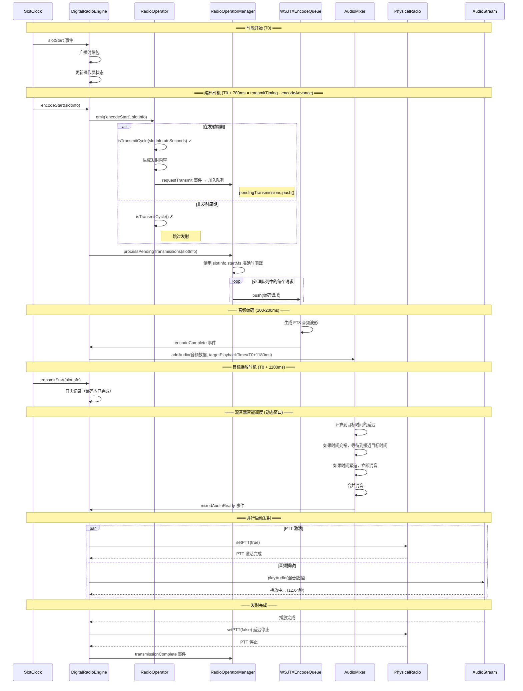

# CLAUDE.md - Server

TX-5DR 数字电台核心后端：Fastify + 数字电台引擎 + 音频处理 + FT8 解码 + WebSocket。

## 核心架构

### DigitalRadioEngine (单例)
系统控制器，管理生命周期：配置 → 音频设备 → 解码队列 → WebSocket，支持优雅关闭和错误恢复。

### 发射时序系统 ⭐

**核心原则**:
1. **音频居中播放**: 通过 `transmitTiming` 配置使12.64秒的FT8音频在15秒时隙中居中
2. **提前编码**: 通过 `encodeAdvance` 提前触发编码，补偿编码+混音时间(~400ms)
3. **周期判断**: RadioOperator 在 `encodeStart` 事件中判断周期并加入队列
4. **发射执行**: RadioOperatorManager 处理队列，使用 slotInfo 的准确时间戳
5. **智能调度**: AudioMixer 根据目标播放时间动态调整混音窗口

#### 时间线图解



#### 时序配置参数 (mode.schema.ts)

**FT8 模式**:
- `slotMs: 15000` - 时隙长度15秒
- `transmitTiming: 1180` - 音频播放起始点，使12.64秒音频居中 ((15000-12640)/2)
- `encodeAdvance: 400` - 提前400ms开始编码，补偿编码+混音时间
- **实际时间线**: T0 → T0+780ms(编码开始) → T0+1180ms(目标播放) → T0+13820ms(播放结束) → T0+15000ms(时隙结束)

**FT4 模式**:
- `slotMs: 7500` - 时隙长度7.5秒
- `transmitTiming: 550` - 音频播放起始点，使6.4秒音频居中 ((7500-6400)/2)
- `encodeAdvance: 300` - 提前300ms开始编码

**调优建议**:
- 如果经常出现编码超时告警，增大 `encodeAdvance` (如改为500ms)
- 如果音频播放偏早/偏晚，微调 `transmitTiming` (±50ms)
- TransmissionTracker 会记录详细时序统计，用于性能分析

#### 关键事件流

**1. 正常周期发射** (偶数周期操作员在偶数时隙发射)

```
SlotClock.encodeStart (T0 + 780ms)
    ↓
DigitalRadioEngine.emit('encodeStart', slotInfo)
    ↓
RadioOperator.onEncodeStart(slotInfo)
    ├─ 计算周期: isTransmitCycle(slotInfo.utcSeconds)
    ├─ ✓ 是发射周期
    └─ emit('requestTransmit', { operatorId, transmission })
        ↓
RadioOperatorManager.pendingTransmissions.push(request)
    ↓
RadioOperatorManager.processPendingTransmissions(slotInfo)
    ├─ 使用 slotInfo.startMs (准确时间戳)
    ├─ 计算 targetTime = slotInfo.startMs + 1180ms
    ├─ 处理队列中所有请求
    └─ encodeQueue.push() → 开始编码
        ↓
编码完成 (通常100-200ms后)
    ↓
AudioMixer.addAudio(audioData, targetPlaybackTime)
    ├─ 计算到目标时间的延迟
    ├─ 如果距离目标>100ms: 等待到目标时间-50ms
    └─ 如果距离目标<100ms: 立即混音
        ↓
混音完成 → 在目标时间 (T0+1180ms) 准确播放
```

**2. 非发射周期** (奇数周期操作员在偶数时隙)

```
SlotClock.encodeStart (T0 + 780ms)
    ↓
RadioOperator.onEncodeStart(slotInfo)
    ├─ 计算周期: isTransmitCycle(slotInfo.utcSeconds)
    ├─ ✗ 不是发射周期
    └─ 输出日志，不发射 requestTransmit
        ↓
RadioOperatorManager.processPendingTransmissions(slotInfo)
    └─ 队列为空，无操作
```

**3. 多操作员同周期发射** (2个操作员都在偶数周期)

```
encodeStart 事件 (T0 + 780ms)
    ↓
RadioOperator A → requestTransmit → 加入队列
RadioOperator B → requestTransmit → 加入队列
    ↓
processPendingTransmissions()
    ├─ 处理 Operator A 请求 → encodeQueue (目标时间: T0+1180ms)
    ├─ 处理 Operator B 请求 → encodeQueue (目标时间: T0+1180ms)
    └─ 两个编码并行进行
        ↓
AudioMixer 智能调度
    ├─ 第一个编码完成 → addAudio(A, targetTime)
    ├─ 等待第二个或超时 (基于targetTime计算)
    ├─ 第二个编码完成 → addAudio(B, targetTime)
    ├─ 触发混音窗口结束
    └─ 合并两路音频 → 单次 PTT 发射混音结果
```

**4. 时隙中间切换** (用户手动切换发射内容)

```
用户操作 (切换槽位/修改内容/改变周期)
    ↓
operatorSlotChanged / operatorSlotContentChanged / operatorTransmitCyclesChanged
    ↓
RadioOperatorManager.checkAndTriggerTransmission(operatorId)
    ├─ 检查当前是否在发射周期
    ├─ ✓ 是 → 立即生成发射内容
    └─ processPendingTransmissions(基于当前时隙startMs)
        └─ 统一入队并消费，正确计算 timeSinceSlotStartMs（标记中途发射/重新混音）
```

#### 时间戳一致性保证

**核心要点**: 所有时间计算使用同一个 `slotInfo.startMs`（中途触发时由管理器基于当前时隙计算得到），避免跨时隙边界错误；队列在消费层统一清空，防止请求残留导致下一个非发射周期误发。

```
    transmitStart(slotInfo) 触发 → processPendingTransmissions(slotInfo)
        ↓
    使用 slotInfo.startMs (事件产生时的准确时间)
        ↓
    所有操作基于同一时间戳
        ↓
    周期判断准确无误
```

### 音频链路
- **AudioStreamManager**: naudiodon2 低延迟 I/O，多设备动态切换，实时状态监控
- **AudioMixer**: 多操作员混音，独立音量控制，PTT 逻辑
- **SpectrumAnalyzer**: WebWorker 并行 FFT，瀑布图数据，自适应调度

### 解码链路
- **WSJTXDecodeWorkQueue**: Piscina 多进程并行解码，12kHz 重采样，结果验证
- **WSJTXEncodeWorkQueue**: 文本编码为 FT8 音频，标准波形生成，15秒时序控制

### 时隙系统
- **SlotPackManager**: 解码去重，频率分析，日志本集成，实时统计
- **SlotPackPersistence**: 按日期存储，增量更新，历史数据压缩

### WebSocket 系统
- **WSServer**: 多客户端管理，消息广播，连接生命周期
- **WSConnection**: 操作员过滤，定制数据生成，错误隔离

### API 路由
模块化设计：audio(设备/音量) | radio(状态/频率) | operators(管理/传输) | logbooks(查询/QSO) | slotpack(数据/统计) | mode(切换) | storage(存储)

## 开发规范

### API 端点
1. 对应路由文件添加处理器
2. contracts Schema 验证请求
3. 更新 WebSocket 事件
4. 错误处理

### WebSocket 事件标准流程

**⚠️ 重要坑点**: 添加新的WebSocket事件时，必须同时更新三个地方，否则前端无法接收到事件！

#### 1. 定义消息类型 (contracts)
```typescript
// packages/contracts/src/schema/websocket.schema.ts
export enum WSMessageType {
  NEW_EVENT = 'newEvent',  // 添加新事件类型
}
```

#### 2. 服务器端发送事件 (server)
```typescript
// packages/server/src/websocket/WSServer.ts
private setupEngineEventListeners(): void {
  this.digitalRadioEngine.on('newEventName', (data) => {
    console.log('📡 [WSServer] 收到新事件:', data);
    this.broadcast(WSMessageType.NEW_EVENT, data);  // 广播事件
  });
}
```

#### 3. 前端事件映射 (core) **⚠️ 经常被遗忘的地方！**
```typescript
// packages/core/src/websocket/WSMessageHandler.ts
export const WS_MESSAGE_EVENT_MAP: Record<string, string> = {
  [WSMessageType.NEW_EVENT]: 'newEvent',  // 添加映射关系
  // ... 其他映射
};
```

#### 4. 前端接收处理 (web)
```typescript
// packages/web/src/services/radioService.ts
this.wsClient.onWSEvent('newEvent', (data: any) => {
  console.log('📱 收到新事件:', data);
  this.eventListeners.newEvent?.forEach(listener => listener(data));
});
```

#### 5. 构建更新
```bash
# 修改core包后必须重新构建
yarn workspace @tx5dr/core build
```

### 常见问题排查

#### 问题：前端收不到WebSocket事件
**原因**: `WSMessageHandler.ts` 中缺少事件映射
**解决**: 检查 `WS_MESSAGE_EVENT_MAP` 是否包含新事件
**调试**: 服务器有发送日志但前端无接收日志 = 映射缺失

#### 问题：事件数据格式错误
**原因**: 服务器发送的数据结构与前端期望不符
**解决**: 在contracts中定义统一的数据类型
**调试**: 对比服务器发送和前端接收的数据结构

### WebSocket 命令
```typescript
private commandHandlers = {
  new_command: async (connection: WSConnection, data: any) => {
    await this.broadcastToAll('event_name', result);
  }
};
```

### 最佳实践
- 音频：缓冲区管理，错误恢复，性能监控
- 解码：工作池配置，内存管理，异常重启
- WebSocket：始终同步更新contracts、server、core三处代码

## 运维

### 环境变量
`NODE_ENV` (环境) | `PORT` (端口，默认4000) | `EMBEDDED` (Electron模式)

### 监控
- 日志：应用/音频/WebSocket/解码
- 性能：CPU/内存/网络/音频延迟

## 命令
`yarn dev` (开发) | `yarn build` (构建) | `yarn start` (启动)

## 依赖
依赖: @tx5dr/contracts + naudiodon2 + fastify + piscina
