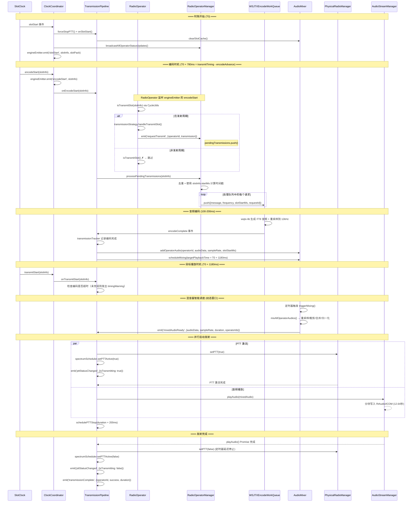

# CLAUDE.md - Server

TX-5DR 数字电台核心后端：Fastify + 数字电台引擎 + 音频处理 + FT8 解码 + WebSocket。

## 核心架构

### DigitalRadioEngine (单例 Facade)
系统控制器 Facade，所有领域逻辑已拆分至子系统 (`src/subsystems/`)。对外 API 完全不变（WSServer、路由、index.ts 零改动）。

启动/电台链路的职责边界与时序，优先参考 `docs/server-startup-architecture.md`。

#### 子系统架构

| 子系统 | 文件 | 职责 |
|--------|------|------|
| `TransmissionPipeline` | `subsystems/TransmissionPipeline.ts` | encode→mix→PTT→play 全流程、编码跟踪 |
| `RadioBridge` | `subsystems/RadioBridge.ts` | 电台事件转发、频率同步、断线恢复、健康检查 |
| `ClockCoordinator` | `subsystems/ClockCoordinator.ts` | 时钟/解码/频谱/SlotPack 事件桥接、PSKReporter 转发 |
| `AudioVolumeController` | `subsystems/AudioVolumeController.ts` | 音量读写 + ConfigManager 持久化 + 事件广播 |
| `EngineLifecycle` | `subsystems/EngineLifecycle.ts` | 资源注册、XState 引擎状态机、doStart/doStop、状态标志 |
| `ListenerManager` | `subsystems/ListenerManager.ts` | 监听器注册/批量精确清理工具类 |

#### 事件注册位置

- **永久监听器**（整个引擎生命周期）：RadioBridge（电台事件）、RadioOperatorManager（操作员事件）
- **start/stop 循环监听器**：ClockCoordinator.setup/teardown()（时钟/解码/频谱）、TransmissionPipeline.setup/teardown()（编码/混音）
- **高频数据**（spectrum/meter）：走 `globalEventBus` 直达 WSServer，不经过引擎

#### 添加新功能指南

- 发射相关逻辑 → `TransmissionPipeline`
- 电台连接/断线处理 → `RadioBridge`
- 新的时钟/解码事件 → `ClockCoordinator`
- 音量控制 → `AudioVolumeController`
- 资源启停顺序/资源蓝图 → `EngineLifecycle.rebuildResourcePlan()`
- 连接成功后的一次性 radio bootstrap → `PhysicalRadioManager.bootstrapConnectedSession()`
- Profile 管理 → `config/ProfileManager.ts`
- 状态机逻辑 → `state-machines/engineStateMachine.ts` / `radioStateMachine.ts`
- 对外 API（路由/WSServer 调用）→ `DigitalRadioEngine` Facade 委托方法

#### Radio I/O 规则

- 连接类负责“底层协议 + 串行化”，不要把并发控制分散到路由、subsystem 或 manager 外层
- `PhysicalRadioManager` 负责 bootstrap、能力状态、缓存与编排；不要下沉协议细节
- 关键操作只有频率、模式、PTT；都必须通过连接层 critical queue 执行
- 复合切换必须走 `applyOperatingState(...)`，不要在上层手写 `setFrequency()` 后紧跟 `setMode()`
- meter / capability / frequency monitoring 一律视为低优先级观察流，关键操作期间允许跳过
- 观察流失败默认不打断连接；只有关键控制链路失败才进入健康状态机
- `startBackgroundTasks()` 只能在连接完成且保守 bootstrap 结束后调用

### 电台连接与状态机

详细架构见根目录 `CLAUDE.md` 的「双状态机架构」和「电台连接层」章节。
启动 phase、bootstrap/activation 分界、接入 checklist 见 `docs/server-startup-architecture.md`。

**关键文件导航**:
```
config/
  ├─ ProfileManager.ts         ← Profile CRUD + 激活流程
  └─ config-manager.ts         ← 配置持久化
radio/connections/
  ├─ IRadioConnection.ts       ← 统一连接接口
  ├─ RadioConnectionFactory.ts ← 工厂（按 HamlibConfig.type 创建）
  ├─ HamlibConnection.ts       ← Hamlib 网络/串口实现
  ├─ IcomWlanConnection.ts     ← ICOM WLAN 实现
  └─ NullConnection.ts         ← 空对象模式
radio/
  ├─ PhysicalRadioManager.ts   ← 编排器（驱动电台状态机）
  └─ FrequencyManager.ts       ← 频率管理
state-machines/
  ├─ types.ts                  ← EngineState/RadioState 枚举 + Context/Event 类型
  ├─ engineStateMachine.ts     ← 引擎状态机 (IDLE↔STARTING→RUNNING→STOPPING)
  └─ radioStateMachine.ts      ← 电台状态机 (DISCONNECTED↔CONNECTING↔CONNECTED↔RECONNECTING)
routes/
  └─ profiles.ts               ← Profile REST API
```

### 发射时序系统 ⭐

**核心原则**:
1. **音频居中播放**: 通过 `transmitTiming` 配置使12.64秒的FT8音频在15秒时隙中居中
2. **提前编码**: 通过 `encodeAdvance` 提前触发编码，补偿编码+混音时间(~400ms)
3. **周期判断**: RadioOperator 在 `encodeStart` 事件中判断周期并加入队列
4. **子系统编排**: ClockCoordinator 桥接时钟事件，TransmissionPipeline 编排发射管线
5. **智能调度**: AudioMixer 根据目标播放时间动态调整混音窗口

#### 时间线图解


```mermaid
sequenceDiagram
    participant Clock as SlotClock
    participant Coord as ClockCoordinator
    participant Pipeline as TransmissionPipeline
    participant Operator as RadioOperator
    participant Manager as RadioOperatorManager
    participant EncQueue as WSJTXEncodeWorkQueue
    participant Mixer as AudioMixer
    participant PTT as PhysicalRadioManager
    participant Audio as AudioStreamManager

    Note over Clock,Audio: ═══ 时隙开始 (T0) ═══
    Clock->>Coord: slotStart 事件
    Coord->>Pipeline: forceStopPTT() + onSlotStart()
    Pipeline->>Mixer: clearSlotCache()
    Coord->>Manager: broadcastAllOperatorStatusUpdates()
    Coord->>Coord: engineEmitter.emit('slotStart', slotInfo, slotPack)

    Note over Clock,Audio: ═══ 编码时机 (T0 + 780ms = transmitTiming - encodeAdvance) ═══
    Clock->>Coord: encodeStart(slotInfo)
    Coord->>Coord: engineEmitter.emit('encodeStart', slotInfo)
    Coord->>Pipeline: onEncodeStart(slotInfo)

    Note over Operator,Manager: RadioOperator 监听 engineEmitter 的 encodeStart
    Operator->>Operator: isTransmitSlot(slotInfo) via CycleUtils

    alt 在发射周期
        Operator->>Operator: transmissionStrategy.handleTransmitSlot()
        Operator->>Manager: emit('requestTransmit', {operatorId, transmission})
        Note right of Manager: pendingTransmissions.push()
    else 非发射周期
        Operator->>Operator: isTransmitSlot() ✗ → 跳过
    end

    Pipeline->>Manager: processPendingTransmissions(slotInfo)
    Manager->>Manager: 去重 + 使用 slotInfo.startMs 计算时间戳

    loop 处理队列中的每个请求
        Manager->>EncQueue: push({message, frequency, slotStartMs, requestId})
    end

    Note over Clock,Audio: ═══ 音频编码 (100-200ms) ═══
    EncQueue->>EncQueue: wsjtx-lib 生成 FT8 音频 + 重采样到 12kHz
    EncQueue->>Pipeline: encodeComplete 事件
    Pipeline->>Pipeline: transmissionTracker 记录编码完成
    Pipeline->>Mixer: addOperatorAudio(operatorId, audioData, sampleRate, slotStartMs)
    Pipeline->>Mixer: scheduleMixing(targetPlaybackTime = T0 + 1180ms)

    Note over Clock,Audio: ═══ 目标播放时机 (T0 + 1180ms) ═══
    Clock->>Coord: transmitStart(slotInfo)
    Coord->>Pipeline: onTransmitStart(slotInfo)
    Pipeline->>Pipeline: 检查编码是否超时（未完成则发出 timingWarning）

    Note over Clock,Audio: ═══ 混音器智能调度 (动态窗口) ═══
    Mixer->>Mixer: 定时器触发 triggerMixing()
    Mixer->>Mixer: mixAllOperatorAudios() → 重采样/裁剪/合并/归一化
    Mixer->>Pipeline: emit('mixedAudioReady', {audioData, sampleRate, duration, operatorIds})

    Note over Clock,Audio: ═══ 并行启动发射 ═══
    par PTT 激活
        Pipeline->>PTT: setPTT(true)
        Pipeline->>Pipeline: spectrumScheduler.setPTTActive(true)
        Pipeline->>Pipeline: emit('pttStatusChanged', {isTransmitting: true})
        PTT-->>Pipeline: PTT 激活完成
    and 音频播放
        Pipeline->>Audio: playAudio(mixedAudio)
        Audio-->>Audio: 分块写入 RtAudio/ICOM (12.64秒)
    end
    Pipeline->>Pipeline: schedulePTTStop(duration + 200ms)

    Note over Clock,Audio: ═══ 发射完成 ═══
    Audio-->>Pipeline: playAudio() Promise 完成
    Pipeline->>PTT: setPTT(false) (定时器延迟停止)
    Pipeline->>Pipeline: spectrumScheduler.setPTTActive(false)
    Pipeline->>Pipeline: emit('pttStatusChanged', {isTransmitting: false})
    Pipeline->>Pipeline: emit('transmissionComplete', {operatorId, success, duration})
```

#### 时序配置参数 (mode.schema.ts)

**FT8 模式**:
- `slotMs: 15000` - 时隙长度15秒
- `transmitTiming: 1180` - 音频播放起始点，使12.64秒音频居中 ((15000-12640)/2)
- `encodeAdvance: 400` - 提前400ms开始编码，补偿编码+混音时间
- **实际时间线**: T0 → T0+780ms(编码开始) → T0+1180ms(目标播放) → T0+13820ms(播放结束) → T0+15000ms(时隙结束)

**FT4 模式**:
- `slotMs: 7500` - 时隙长度7.5秒
- `transmitTiming: 550` - 音频播放起始点，使6.4秒音频居中 ((7500-6400)/2)
- `encodeAdvance: 300` - 提前300ms开始编码

**调优建议**:
- 如果经常出现编码超时告警，增大 `encodeAdvance` (如改为500ms)
- 如果音频播放偏早/偏晚，微调 `transmitTiming` (±50ms)
- TransmissionTracker 会记录详细时序统计，用于性能分析

#### 关键事件流

**1. 正常周期发射** (偶数周期操作员在偶数时隙发射)

```
SlotClock.encodeStart (T0 + 780ms)
    ↓
DigitalRadioEngine.emit('encodeStart', slotInfo)
    ↓
RadioOperator.onEncodeStart(slotInfo)
    ├─ 计算周期: isTransmitCycle(slotInfo.utcSeconds)
    ├─ ✓ 是发射周期
    └─ emit('requestTransmit', { operatorId, transmission })
        ↓
RadioOperatorManager.pendingTransmissions.push(request)
    ↓
RadioOperatorManager.processPendingTransmissions(slotInfo)
    ├─ 使用 slotInfo.startMs (准确时间戳)
    ├─ 计算 targetTime = slotInfo.startMs + 1180ms
    ├─ 处理队列中所有请求
    └─ encodeQueue.push() → 开始编码
        ↓
编码完成 (通常100-200ms后)
    ↓
AudioMixer.addAudio(audioData, targetPlaybackTime)
    ├─ 计算到目标时间的延迟
    ├─ 如果距离目标>100ms: 等待到目标时间-50ms
    └─ 如果距离目标<100ms: 立即混音
        ↓
混音完成 → 在目标时间 (T0+1180ms) 准确播放
```

**2. 非发射周期** (奇数周期操作员在偶数时隙)

```
SlotClock.encodeStart (T0 + 780ms)
    ↓
RadioOperator.onEncodeStart(slotInfo)
    ├─ 计算周期: isTransmitCycle(slotInfo.utcSeconds)
    ├─ ✗ 不是发射周期
    └─ 输出日志，不发射 requestTransmit
        ↓
RadioOperatorManager.processPendingTransmissions(slotInfo)
    └─ 队列为空，无操作
```

**3. 多操作员同周期发射** (2个操作员都在偶数周期)

```
encodeStart 事件 (T0 + 780ms)
    ↓
RadioOperator A → requestTransmit → 加入队列
RadioOperator B → requestTransmit → 加入队列
    ↓
processPendingTransmissions()
    ├─ 处理 Operator A 请求 → encodeQueue (目标时间: T0+1180ms)
    ├─ 处理 Operator B 请求 → encodeQueue (目标时间: T0+1180ms)
    └─ 两个编码并行进行
        ↓
AudioMixer 智能调度
    ├─ 第一个编码完成 → addAudio(A, targetTime)
    ├─ 等待第二个或超时 (基于targetTime计算)
    ├─ 第二个编码完成 → addAudio(B, targetTime)
    ├─ 触发混音窗口结束
    └─ 合并两路音频 → 单次 PTT 发射混音结果
```

**4. 时隙中间切换** (用户手动切换发射内容)

```
用户操作 (切换槽位/修改内容/改变周期)
    ↓
operatorSlotChanged / operatorSlotContentChanged / operatorTransmitCyclesChanged
    ↓
RadioOperatorManager.checkAndTriggerTransmission(operatorId)
    ├─ 检查当前是否在发射周期
    ├─ ✓ 是 → 立即生成发射内容
    └─ processPendingTransmissions(基于当前时隙startMs)
        └─ 统一入队并消费，正确计算 timeSinceSlotStartMs（标记中途发射/重新混音）
```

#### 时间戳一致性保证

**核心要点**: 所有时间计算使用同一个 `slotInfo.startMs`（中途触发时由管理器基于当前时隙计算得到），避免跨时隙边界错误；队列在消费层统一清空，防止请求残留导致下一个非发射周期误发。

```
    transmitStart(slotInfo) 触发 → processPendingTransmissions(slotInfo)
        ↓
    使用 slotInfo.startMs (事件产生时的准确时间)
        ↓
    所有操作基于同一时间戳
        ↓
    周期判断准确无误
```

### 音频链路
- **AudioStreamManager**: Audify (RtAudio) 低延迟 I/O，多设备动态切换，实时状态监控
- **AudioMixer**: 多操作员混音，独立音量控制，PTT 逻辑
- **SpectrumAnalyzer**: WebWorker 并行 FFT，瀑布图数据，自适应调度

### 解码链路
- **WSJTXDecodeWorkQueue**: Piscina 多进程并行解码，12kHz 重采样，结果验证
- **WSJTXEncodeWorkQueue**: 文本编码为 FT8 音频，标准波形生成，15秒时序控制

### 时隙系统
- **SlotPackManager**: 解码去重，频率分析，日志本集成，实时统计
- **SlotPackPersistence**: 按日期存储，增量更新，历史数据压缩

### WebSocket 系统
- **WSServer**: 多客户端管理，消息广播，连接生命周期
- **WSConnection**: 操作员过滤，定制数据生成，错误隔离

### API 路由
模块化设计：audio(设备/音量) | radio(状态/频率) | operators(管理/传输) | logbooks(查询/QSO) | slotpack(数据/统计) | mode(切换) | storage(存储)

## 权限系统 (CASL)

`src/auth/ability.ts` 构建 CASL Ability，`authPlugin.ts` 注入 `request.ability` 并提供中间件。

### REST 路由权限检查

```typescript
import { requireAbility, requireAbilityFor, requireOperatorAbility } from '../auth/authPlugin.js';

// 简单权限
fastify.post('/action', { preHandler: [requireAbility('execute', 'Subject')] }, handler);

// 带条件（如频率限制）
fastify.post('/frequency', {
  preHandler: [requireAbilityFor('execute', 'RadioFrequency', (r) => ({ frequency: (r.body as any).frequency }))],
}, handler);

// 操作员访问（自动校验 operatorId 条件）
fastify.put('/operators/:id', {
  preHandler: [requireOperatorAbility((req) => req.params.id)],
}, handler);
```

### WebSocket 命令权限

在 `WSServer.ts` 的 `COMMAND_ABILITIES` 映射中添加：
```typescript
[WSMessageType.NEW_COMMAND]: { action: 'execute', subject: 'NewSubject' },
```
需要 operatorId 条件检查的命令，同时加入 `OPERATOR_DATA_COMMANDS` 集合。

**禁止**：新路由不要用 `requireRole()`，统一使用 `requireAbility*` 中间件。`requireRole` 仅保留用于 `/api/auth/*` 管理路由。

## 开发规范

### API 端点
1. 对应路由文件添加处理器
2. contracts Schema 验证请求
3. 更新 WebSocket 事件
4. 错误处理

### WebSocket 事件标准流程

**⚠️ 重要坑点**: 添加新的WebSocket事件时，必须同时更新三个地方，否则前端无法接收到事件！

#### 1. 定义消息类型 (contracts)
```typescript
// packages/contracts/src/schema/websocket.schema.ts
export enum WSMessageType {
  NEW_EVENT = 'newEvent',  // 添加新事件类型
}
```

#### 2. 服务器端发送事件 (server)
```typescript
// packages/server/src/websocket/WSServer.ts
private setupEngineEventListeners(): void {
  this.digitalRadioEngine.on('newEventName', (data) => {
    console.log('📡 [WSServer] 收到新事件:', data);
    this.broadcast(WSMessageType.NEW_EVENT, data);  // 广播事件
  });
}
```

#### 3. 前端事件映射 (core) **⚠️ 经常被遗忘的地方！**
```typescript
// packages/core/src/websocket/WSMessageHandler.ts
export const WS_MESSAGE_EVENT_MAP: Record<string, string> = {
  [WSMessageType.NEW_EVENT]: 'newEvent',  // 添加映射关系
  // ... 其他映射
};
```

#### 4. 前端接收处理 (web)

**方式 A：在 RadioProvider 中订阅**（全局状态管理）
```typescript
// packages/web/src/store/radioStore.tsx
useEffect(() => {
  const wsClient = radioService.wsClientInstance;

  const handleNewEvent = (data: NewEventData) => {
    console.log('📱 收到新事件:', data);
    radioDispatch({ type: 'UPDATE_EVENT', payload: data });
  };

  wsClient.onWSEvent('newEvent', handleNewEvent);

  return () => {
    wsClient.offWSEvent('newEvent', handleNewEvent);
  };
}, [radioService]);
```

**方式 B：在组件中直接订阅**（局部 UI 更新）
```typescript
// packages/web/src/components/MyComponent.tsx
import { useConnection } from '../store/radioStore';

function MyComponent() {
  const connection = useConnection();

  useEffect(() => {
    const radioService = connection.state.radioService;
    if (!radioService) return;

    const wsClient = radioService.wsClientInstance;

    const handleNewEvent = (data: NewEventData) => {
      console.log('📱 收到新事件:', data);
      // 本地状态更新
    };

    wsClient.onWSEvent('newEvent', handleNewEvent);

    return () => {
      wsClient.offWSEvent('newEvent', handleNewEvent);
    };
  }, [connection.state.radioService]);

  return <div>...</div>;
}
```

#### 5. 构建更新
```bash
# 修改core包后必须重新构建
yarn workspace @tx5dr/core build
```

### 常见问题排查

#### 问题：前端收不到WebSocket事件
**原因**: `WSMessageHandler.ts` 中缺少事件映射
**解决**: 检查 `WS_MESSAGE_EVENT_MAP` 是否包含新事件
**调试**: 服务器有发送日志但前端无接收日志 = 映射缺失

#### 问题：事件数据格式错误
**原因**: 服务器发送的数据结构与前端期望不符
**解决**: 在contracts中定义统一的数据类型
**调试**: 对比服务器发送和前端接收的数据结构

### WebSocket 命令
```typescript
private commandHandlers = {
  new_command: async (connection: WSConnection, data: any) => {
    await this.broadcastToAll('event_name', result);
  }
};
```

### 最佳实践
- 音频：缓冲区管理，错误恢复，性能监控
- 解码：工作池配置，内存管理，异常重启
- WebSocket：始终同步更新contracts、server、core三处代码

---

## 日志规范

**禁止裸 `console.log`，使用 `createLogger`。日志消息必须为英文，不含 emoji。**

```typescript
import { createLogger } from '../utils/logger.js';
const logger = createLogger('MyModule');

logger.debug('frequency changed', { freq }); // 高频 → 生产静默
logger.info('operator created', { id });      // 生命周期
logger.warn('reconnect failed', err);
logger.error('PTT failed', err);
```

- `LOG_LEVEL=debug|info|warn|error`（production 默认 warn，development 默认 info）
- 高频路径（每时隙/每 WS 事件/每次编解码）→ `logger.debug`
- 生命周期（启动/停止/连接/断开）→ `logger.info`
- `ConsoleLogger` 通过 console 覆盖拦截所有输出写入日志文件，`createLogger` 做级别过滤后调用 `console.*`
- `broadcastTextMessage` 必须带 `key`（`ServerMessageKey` 枚举），AUTH/ERROR 消息用英文 code

## 运维

### 环境变量
`NODE_ENV` (环境) | `PORT` (端口，默认4000) | `EMBEDDED` (Electron模式)

### 监控
- 日志：应用/音频/WebSocket/解码
- 性能：CPU/内存/网络/音频延迟

## 命令
`yarn dev` (开发) | `yarn build` (构建) | `yarn start` (启动)

## 依赖
依赖: @tx5dr/contracts + audify + fastify + piscina
