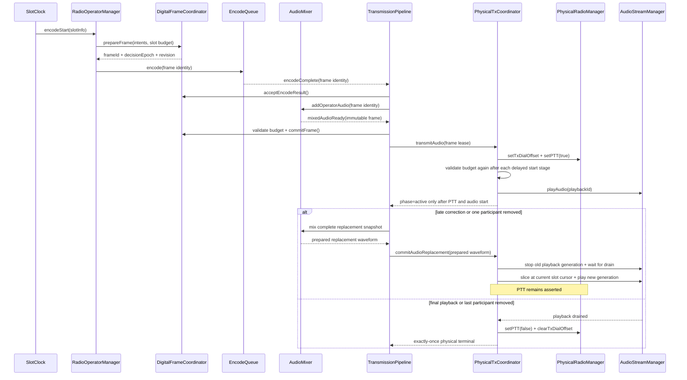

# CLAUDE.md - Server

TX-5DR 数字电台核心后端：Fastify + 数字电台引擎 + 音频处理 + FT8 解码 + WebSocket。

## 核心架构

### DigitalRadioEngine (单例 Facade)
系统控制器 Facade，所有领域逻辑已拆分至子系统 (`src/subsystems/`)。对外 API 完全不变（WSServer、路由、index.ts 零改动）。

启动/电台链路的职责边界与时序，优先参考 `docs/server-startup-architecture.md`。

#### 子系统架构

| 子系统 | 文件 | 职责 |
|--------|------|------|
| `TransmissionPipeline` | `subsystems/TransmissionPipeline.ts` | 数字帧事件适配、编码/混音结果路由、终态事件 |
| `DigitalFrameCoordinator` | `transmission/DigitalFrameCoordinator.ts` | FT8/FT4 intent、epoch、整帧替换与时隙预算 |
| `PhysicalTxCoordinator` | `transmission/PhysicalTxCoordinator.ts` | 唯一物理 PTT/audio lease、drain、硬中断与迟到操作 fence |
| `RadioBridge` | `subsystems/RadioBridge.ts` | 电台事件转发、频率同步、断线恢复、健康检查 |
| `ClockCoordinator` | `subsystems/ClockCoordinator.ts` | 时钟/解码/频谱/SlotPack 事件桥接、PSKReporter 转发 |
| `AudioVolumeController` | `subsystems/AudioVolumeController.ts` | 音量读写 + ConfigManager 持久化 + 事件广播 |
| `EngineLifecycle` | `subsystems/EngineLifecycle.ts` | 资源注册、XState 引擎状态机、doStart/doStop、状态标志 |
| `RadioPowerController` | `radio/RadioPowerController.ts` | 电台物理电源 on/off/standby/operate 编排、可选引擎联动 |
| `ListenerManager` | `subsystems/ListenerManager.ts` | 监听器注册/批量精确清理工具类 |

#### 事件注册位置

- **永久监听器**（整个引擎生命周期）：RadioBridge（电台事件）、RadioOperatorManager（操作员事件）
- **start/stop 循环监听器**：ClockCoordinator.setup/teardown()（时钟/解码/频谱）、TransmissionPipeline.setup/teardown()（编码/混音）
- **高频数据**（spectrum/meter）：走 `globalEventBus` 直达 WSServer，不经过引擎

#### 添加新功能指南

- 数字帧生命周期 → `DigitalFrameCoordinator`；物理 PTT/播放生命周期 → `PhysicalTxCoordinator`
- encode/mix 事件适配 → `TransmissionPipeline`；插件只提交高层 intent
- 电台连接/断线处理 → `RadioBridge`
- 新的时钟/解码事件 → `ClockCoordinator`
- 音量控制 → `AudioVolumeController`
- 资源启停顺序/资源蓝图 → `EngineLifecycle.rebuildResourcePlan()`
- 电台物理电源管理 → `RadioPowerController`（power 不代表 TX-5DR 引擎启停）
- 连接成功后的一次性 radio bootstrap → `PhysicalRadioManager.bootstrapConnectedSession()`
- Profile 管理 → `config/ProfileManager.ts`
- 状态机逻辑 → `state-machines/engineStateMachine.ts` / `radioStateMachine.ts`
- 对外 API（路由/WSServer 调用）→ `DigitalRadioEngine` Facade 委托方法

#### Radio I/O 规则

- 连接类负责“底层协议 + 串行化”，不要把并发控制分散到路由、subsystem 或 manager 外层
- `PhysicalRadioManager` 负责 bootstrap、能力状态、缓存与编排；不要下沉协议细节
- 关键操作只有频率、模式、PTT；都必须通过连接层 critical queue 执行
- 复合切换必须走 `applyOperatingState(...)`，不要在上层手写 `setFrequency()` 后紧跟 `setMode()`
- meter / capability / frequency monitoring 一律视为低优先级观察流，关键操作期间允许跳过
- 观察流失败默认不打断连接；只有关键控制链路失败才进入健康状态机
- `startBackgroundTasks()` 只能在连接完成且保守 bootstrap 结束后调用
- 物理电台电源、CAT 连接、TX-5DR 引擎是三条轴线；只有 `RadioPowerController` 可做显式联动
- `operate` 是 Hamlib physical powerstat 目标，不得当作“停止引擎/关机”

### 电台连接与状态机

详细架构见根目录 `CLAUDE.md` 的「双状态机架构」和「电台连接层」章节。
启动 phase、bootstrap/activation 分界、接入 checklist 见 `docs/server-startup-architecture.md`。

**关键文件导航**:
```
config/
  ├─ ProfileManager.ts         ← Profile CRUD + 激活流程
  └─ config-manager.ts         ← 配置持久化
radio/connections/
  ├─ IRadioConnection.ts       ← 统一连接接口
  ├─ RadioConnectionFactory.ts ← 工厂（按 HamlibConfig.type 创建）
  ├─ HamlibConnection.ts       ← Hamlib 网络/串口实现
  ├─ IcomWlanConnection.ts     ← ICOM WLAN 实现
  └─ NullConnection.ts         ← 空对象模式
radio/
  ├─ PhysicalRadioManager.ts   ← 编排器（驱动电台状态机）
  ├─ RadioPowerController.ts   ← 物理电台电源事务
  └─ FrequencyManager.ts       ← 频率管理
state-machines/
  ├─ types.ts                  ← EngineState/RadioState 枚举 + Context/Event 类型
  ├─ engineStateMachine.ts     ← 引擎状态机 (IDLE↔STARTING→RUNNING→STOPPING)
  └─ radioStateMachine.ts      ← 电台状态机 (DISCONNECTED↔CONNECTING↔CONNECTED↔RECONNECTING)
routes/
  └─ profiles.ts               ← Profile REST API
```

### 发射时序系统

发射控制分成数字帧与物理发射两层。`DigitalFrameCoordinator` 管理 intent、frame epoch、不可变混音快照和晚到纠正；`PhysicalTxCoordinator` 是唯一可操作共享 PTT 和播放生命周期的 owner。日志写入、同步和插件 completion 不得控制物理 lease。


```mermaid
sequenceDiagram
    participant Clock as SlotClock
    participant Manager as RadioOperatorManager
    participant Frame as DigitalFrameCoordinator
    participant Encode as EncodeQueue
    participant Mixer as AudioMixer
    participant Pipeline as TransmissionPipeline
    participant Physical as PhysicalTxCoordinator
    participant Radio as PhysicalRadioManager
    participant Audio as AudioStreamManager

    Clock->>Manager: encodeStart(slotInfo)
    Manager->>Frame: prepareFrame(intents, slot budget)
    Frame-->>Manager: frameId + decisionEpoch + revision
    Manager->>Encode: encode(frame identity)
    Encode-->>Pipeline: encodeComplete(frame identity)
    Pipeline->>Frame: acceptEncodeResult()
    Pipeline->>Mixer: addOperatorAudio(frame identity)
    Mixer-->>Pipeline: mixedAudioReady(immutable frame)
    Pipeline->>Frame: validate budget + commitFrame()
    Pipeline->>Physical: transmitAudio(frame lease)
    Physical->>Radio: setTxDialOffset + setPTT(true)
    Physical->>Physical: validate budget again after each delayed start stage
    Physical->>Audio: playAudio(playbackId)
    Physical-->>Pipeline: phase=active only after PTT and audio start
    alt late correction or one participant removed
        Pipeline->>Mixer: mix complete replacement snapshot
        Mixer-->>Pipeline: prepared replacement waveform
        Pipeline->>Physical: commitAudioReplacement(prepared waveform)
        Physical->>Audio: stop old playback generation + wait for drain
        Physical->>Audio: slice at current slot cursor + play new generation
        Note over Physical,Radio: PTT remains asserted
    else final playback or last participant removed
        Audio-->>Physical: playback drained
        Physical->>Radio: setPTT(false) + clearTxDialOffset
        Physical-->>Pipeline: exactly-once physical terminal
    end
```

生命周期固定为 `requested -> encoding -> ready -> committed -> on_air -> draining -> terminal`。普通策略停止、日志失败和插件异常只能取消 commit 前的 frame 或阻止下一次自动化；只有人工强停、设备断连和 shutdown 可以调用 `forceInterrupt()`。

晚到解码或人工编辑在 commit 前替换并 tombstone 旧 encode callback；已 on-air 时，重新编码完成后在同一个物理 PTT lease 内停止旧音频 generation、等待输出收敛，再按当前时隙位置播放新 generation，不能通过 `setPTT(false/true)` 实现内容替换。若剩余预算不足以容纳完整剩余波形和 tail hold，intent 延期到下一合法 TX cycle。

多操作员始终生成新的不可变 mixed frame：显式移除一个操作员时复用其他操作员的原始编码音频并重混，PTT 保持开启；只有参与者集合变空时才释放 PTT。连续纠正和连续移除通过 playback generation fence 串行切换，旧播放 Promise 只能结束旧 frame，不能释放当前 lease。

所有启动阶段都可能迟到：pre-start cleanup、dial offset、PTT ACK 后都必须重新检查完整帧预算。超时的 PTT stop、音频 cleanup 或 CAT cleanup 会留下 operation fence；底层 Promise 真正 settlement 前不得建立新 lease，防止旧 `PTT(false)` 或旧播放收尾关闭新发射。

模式切换先进入 transmission maintenance gate，撤销所有未提交 candidate 和旧 decision，再硬中断当前物理 lease；只有 Coordinator 明确回到 `idle` 后才允许修改模式、频率和 SlotClock，`unknown` 必须拒绝切换。

UI 的 `on_air` 只来自 `PhysicalTxCoordinator` 的 `active` phase；`starting`、`committed` 不能显示为正在发射，`unknown` 不能显示为 RX。`transmissionComplete` 每个 frame/operator 只发一次，并携带 `frameId`、`physicalConfirmed` 与 terminal reason。

### 音频链路
- **AudioStreamManager**: Audify (RtAudio) 低延迟 I/O，多设备动态切换，实时状态监控
- **AudioMixer**: 按不可变 frame identity 进行多操作员混音，不控制 PTT 或播放停止
- **SpectrumAnalyzer**: WebWorker 并行 FFT，瀑布图数据，自适应调度

### 解码链路
- **WSJTXDecodeWorkQueue**: Piscina 多进程并行解码，12kHz 重采样，结果验证
- **WSJTXEncodeWorkQueue**: 文本编码为 FT8 音频，标准波形生成，15秒时序控制

### 时隙系统
- **SlotPackManager**: 解码去重，频率分析，日志本集成，实时统计
- **SlotPackPersistence**: 按日期存储，增量更新，历史数据压缩

### WebSocket 系统
- **WSServer**: 多客户端管理，消息广播，连接生命周期
- **WSConnection**: 操作员过滤，定制数据生成，错误隔离

### API 路由
模块化设计：audio(设备/音量) | radio(状态/频率) | operators(管理/传输) | logbooks(查询/QSO) | slotpack(数据/统计) | mode(切换) | storage(存储)

## 权限系统 (CASL)

`src/auth/ability.ts` 构建 CASL Ability，`authPlugin.ts` 注入 `request.ability` 并提供中间件。

### REST 路由权限检查

```typescript
import { requireAbility, requireAbilityFor, requireOperatorAbility } from '../auth/authPlugin.js';

// 简单权限
fastify.post('/action', { preHandler: [requireAbility('execute', 'Subject')] }, handler);

// 带条件（如频率限制）
fastify.post('/frequency', {
  preHandler: [requireAbilityFor('execute', 'RadioFrequency', (r) => ({ frequency: (r.body as any).frequency }))],
}, handler);

// 操作员访问（自动校验 operatorId 条件）
fastify.put('/operators/:id', {
  preHandler: [requireOperatorAbility((req) => req.params.id)],
}, handler);
```

### WebSocket 命令权限

在 `WSServer.ts` 的 `COMMAND_ABILITIES` 映射中添加：
```typescript
[WSMessageType.NEW_COMMAND]: { action: 'execute', subject: 'NewSubject' },
```
需要 operatorId 条件检查的命令，同时加入 `OPERATOR_DATA_COMMANDS` 集合。

**禁止**：新路由不要用 `requireRole()`，统一使用 `requireAbility*` 中间件。`requireRole` 仅保留用于 `/api/auth/*` 管理路由。

## 开发规范

### API 端点
1. 对应路由文件添加处理器
2. contracts Schema 验证请求
3. 更新 WebSocket 事件
4. 错误处理

### WebSocket 事件标准流程

**⚠️ 重要坑点**: 添加新的WebSocket事件时，必须同时更新三个地方，否则前端无法接收到事件！

#### 1. 定义消息类型 (contracts)
```typescript
// packages/contracts/src/schema/websocket.schema.ts
export enum WSMessageType {
  NEW_EVENT = 'newEvent',  // 添加新事件类型
}
```

#### 2. 服务器端发送事件 (server)
```typescript
// packages/server/src/websocket/WSServer.ts
private setupEngineEventListeners(): void {
  this.digitalRadioEngine.on('newEventName', (data) => {
    console.log('📡 [WSServer] 收到新事件:', data);
    this.broadcast(WSMessageType.NEW_EVENT, data);  // 广播事件
  });
}
```

#### 3. 前端事件映射 (core) **⚠️ 经常被遗忘的地方！**
```typescript
// packages/core/src/websocket/WSMessageHandler.ts
export const WS_MESSAGE_EVENT_MAP: Record<string, string> = {
  [WSMessageType.NEW_EVENT]: 'newEvent',  // 添加映射关系
  // ... 其他映射
};
```

#### 4. 前端接收处理 (web)

**方式 A：在 RadioProvider 中订阅**（全局状态管理）
```typescript
// packages/web/src/store/radioStore.tsx
useEffect(() => {
  const wsClient = radioService.wsClientInstance;

  const handleNewEvent = (data: NewEventData) => {
    console.log('📱 收到新事件:', data);
    radioDispatch({ type: 'UPDATE_EVENT', payload: data });
  };

  wsClient.onWSEvent('newEvent', handleNewEvent);

  return () => {
    wsClient.offWSEvent('newEvent', handleNewEvent);
  };
}, [radioService]);
```

**方式 B：在组件中直接订阅**（局部 UI 更新）
```typescript
// packages/web/src/components/MyComponent.tsx
import { useConnection } from '../store/radioStore';

function MyComponent() {
  const connection = useConnection();

  useEffect(() => {
    const radioService = connection.state.radioService;
    if (!radioService) return;

    const wsClient = radioService.wsClientInstance;

    const handleNewEvent = (data: NewEventData) => {
      console.log('📱 收到新事件:', data);
      // 本地状态更新
    };

    wsClient.onWSEvent('newEvent', handleNewEvent);

    return () => {
      wsClient.offWSEvent('newEvent', handleNewEvent);
    };
  }, [connection.state.radioService]);

  return <div>...</div>;
}
```

#### 5. 构建更新
```bash
# 修改core包后必须重新构建
yarn workspace @tx5dr/core build
```

### 常见问题排查

#### 问题：前端收不到WebSocket事件
**原因**: `WSMessageHandler.ts` 中缺少事件映射
**解决**: 检查 `WS_MESSAGE_EVENT_MAP` 是否包含新事件
**调试**: 服务器有发送日志但前端无接收日志 = 映射缺失

#### 问题：事件数据格式错误
**原因**: 服务器发送的数据结构与前端期望不符
**解决**: 在contracts中定义统一的数据类型
**调试**: 对比服务器发送和前端接收的数据结构

### WebSocket 命令
```typescript
private commandHandlers = {
  new_command: async (connection: WSConnection, data: any) => {
    await this.broadcastToAll('event_name', result);
  }
};
```

### 最佳实践
- 音频：缓冲区管理，错误恢复，性能监控
- 解码：工作池配置，内存管理，异常重启
- WebSocket：始终同步更新contracts、server、core三处代码

---

## 日志规范

**禁止裸 `console.log`，使用 `createLogger`。日志消息必须为英文，不含 emoji。**

```typescript
import { createLogger } from '../utils/logger.js';
const logger = createLogger('MyModule');

logger.debug('frequency changed', { freq }); // 高频 → 生产静默
logger.info('operator created', { id });      // 生命周期
logger.warn('reconnect failed', err);
logger.error('PTT failed', err);
```

- `LOG_LEVEL=debug|info|warn|error`（production 默认 info，development 默认 debug）
- 高频路径（每时隙/每 WS 事件/每次编解码）→ `logger.debug`
- 生命周期（启动/停止/连接/断开）→ `logger.info`
- `ConsoleLogger` 通过 console 覆盖拦截所有输出写入日志文件，`createLogger` 做级别过滤后调用 `console.*`
- `broadcastTextMessage` 必须带 `key`（`ServerMessageKey` 枚举），AUTH/ERROR 消息用英文 code

## 运维

### 环境变量
`NODE_ENV` (环境) | `PORT` (端口，默认4000) | `EMBEDDED` (Electron模式)

### 监控
- 日志：应用/音频/WebSocket/解码
- 性能：CPU/内存/网络/音频延迟

## 命令
`yarn dev` (开发) | `yarn build` (构建) | `yarn start` (启动)

## 依赖
依赖: @tx5dr/contracts + audify + fastify + piscina
